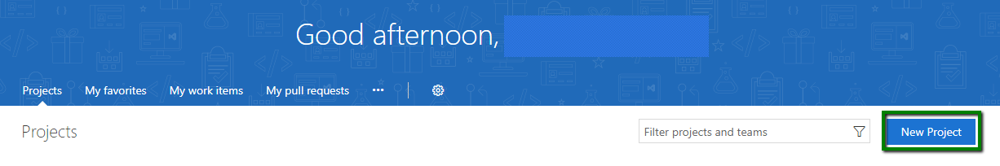
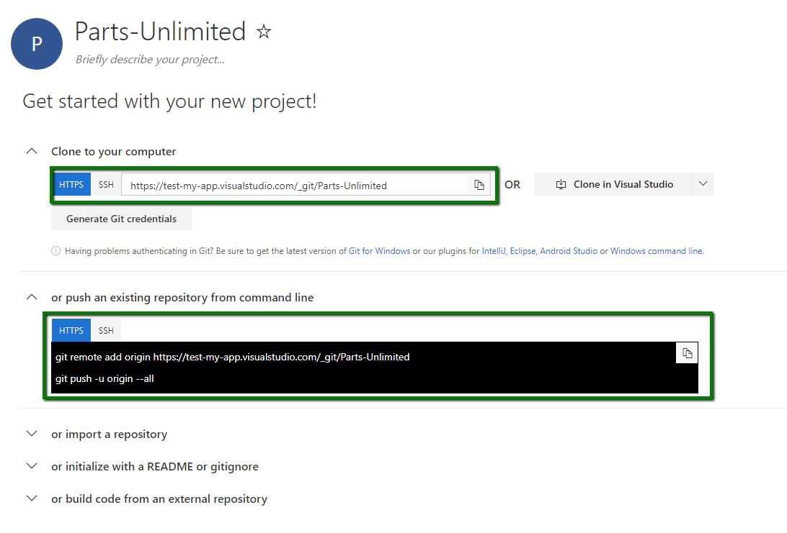

---
layout: page
title:  CI and CD with VSTS Quickstart
category: PandP
order: 2
---

<h1>DevOps200.1x: DevOps Principles and Practices</h1>
============================================================

<h2>CI and CD Quickstart with VSTS Lab</h2>

In this lab we have an application called PartsUnlimited. We want to set up Continuous Integration (CI) and Continuous Deployment (CD) with Visual Studio Team Services (VSTS). Continuous Integration builds the app and runs unit tests whenever code is pushed to the master branch. After CI step succeeds it will trigger a deployment to a `dev` deployment slot. The `staging` slot and `production` will require an approver before the app is deployed into them. Once the approver confirms that `staging` slot is stable, the app will be deployed to the production site.

<h3> Pre-requisites:</h3>

- An active Visual Studio Team Services account

- Project Admin rights to the Visual Studio Team Services account

- An account in Azure

<h3> Lab Tasks:</h3>

**1. Import Source Code into your VSTS Account with Git:** In this step you will download the PartsUnlimited source code, and then push it to your own Visual Studio Team Services account.

**2. Setting up Service Endpoint in VSTS:** In this step you will set up Service Endpoint in VSTS for Continues Deployment be able to deploy to Azure.

**3. Continuous Integration:** In this step you will import Build definition template and configure it for your repository.

**4. Continuous Deployment:** In this step you will import Release definition template and configure it for your build definition.

**5. Export Build and Release Definitions from VSTS:** In this step you will export Build and Release Definitions into your local repository.

**6. Confirming successful deployment to Azure:** In this step you will confirm the status of your deployment in VSTS and Azure.

## Tasks
### Task 1: Import Source Code into your VSTS Account with Git ###
In order to use VSTS Build, your VSTS must contain source code for the application. For this lab we are using the VSTS Git project. The next couple of steps will allow you to add the PartUnlimited source to the Git master repository.

**Step 1.** If you haven't already, create a new team project in your Visual Studio Team Services account that uses Git for source control. Click on "New", enter project name, select "git" for "Version control" and click on "Create project" button.

**Step 2.** Clone the repository to a local directory.

* Open a command line (one that supports Git) and navigate to the directory where you want to store your local repositories. For example in a Windows OS, you can create and navigate to `C:\Source\Repos`.

* Clone the repository with the following command:

		git clone https://github.com/Microsoft/PartsUnlimited.git
	> After a few seconds of downloading, all of the code should now be on your local machine.

* Move into the repository directory that was just created. In a Windows OS, you can use this command:

		cd PartsUnlimited

**Step 3.** Remove the link to GitHub.

* The Git repo you just downloaded currently has a remote called _origin_ that points to the GitHub repo.  Since we won't be using it any longer, we can delete the reference. To delete the GitHub remote, use:

		git remote remove origin

**Step 4.** Add the link to VSTS and push to your local Git repo.

* Navigate to your VSTS and click on "Code" tab. Copy and execute the commands in your command line.

	

Congratulations, your code should now be in VSTS.

### Task 2: Setting up Service Endpoint in VSTS
 Deploying [ARM Templates](https://azure.microsoft.com/en-us/documentation/articles/resource-group-authoring-templates/)
to Azure from Release Management requires an organizational account or a Service Principal. MSA Accounts and certificate-based connections are not supported. 
For this HOL, you will use a Service Principal. Follow these instructions to quickly set it up: [Create Azure Service Principal for VSTS](http://blog.jstroheker.com/2016/10/11/SPNAzure/)
>**IMPORTANT:** For the following CD template to work, `Connection Name` must be `Azure For PartsUnlimited`.

### Task 3: Continuous Integration
**Step 1.** Navigate to `Export/Import Build Definition` extension's [link ](https://marketplace.visualstudio.com/items?itemName=onlyutkarsh.ExportImportBuildDefinition). Click on "Install", select VSTS instance you want to add this extension to and click "Confirm".

**Step 2.** Navigate to the "Build & Release" tab and click on "Builds". If you already have at least one build definition then skip to the next step, otherwise we are going to create one very quickly to get an import build option.

* Click on the "+ Import" button.

**Step 3.** Click on "Browse" and select `PartsUnlimited-CI.json` file in `templates\build definitions` of your repository. Then click on "Import" button.

**Step 4.** Once the import has done you will need to update some information. Click on the "process" heading and in the agent queue select hosted VS2017 in the hosted section. If this is already filled in please select the option with the VS logo beside it.

**Step 5.** Select the "Get Sources" bar.

**Step 6.** Make that that the branch that has been selected is "master" and it is using this project. 

**Step 7.** Now just "Save & queue".

### Task 4: Continuous Deployment:

**Step 1.** Navigate to the "Build & Release" tab and click on "Releases". If you already have at least one release definition then skip to the next step, otherwise we are going to create one very quickly to get an import release option.

* Click on the "+ New definition" button and select "Empty" definition. This will create an empty release definition with default settings. Click on "Save" and "OK".

	

	

**Step 2.** Navigate to the Releases heading, to import a release template click on "+" button and select "Import release definition".

**Step 3.** Click on "Browse" and select `Deployment.json` file in `templates\release definitions` of your repository. Then click on "Import" button.

**Step 4.** Firstly you need to check on that the artifact has been found and utilized properly. First select Part-Unlimited-CI-Import under artifacts. 

**Step 4A.** If at the bottom of the artifact it states that there is `No version available`. You will need to delete and add a new one. 

**Step 4B.** Adding a artifact from build you will enter that it is from the Build, coming from the project you have created. Select that the Source is the Parts-Unlimited-CI-import the Source alias will auto populate. 

**Step 5.** Make sure that the Continuous deployment trigger is on, by selecting the Lighting bolt to the top right of the artifact. 

**Step 5A.** If it isn't `Enabled` then flick the switch and select the branch to trigger the deployment. 

 

**Step 6.** Everything that needs your attention will be listed in red.

**Step 7.** If you select to go in the tasks for "Dev" and select the Agent Phase you will see that Agent queue is in red. Select the Hosted VS2017 option. Then complete these steps again for the "Staging" and "Prod" environments.

**Step 8.** Under the Azure Deployment you will need to update the "Azure subscription" and the "Location". This only needs to be done in the Dev Task.

**Step 9.** You will need to select the Azure App Service and update the "Azure subscription" and the "Slot". For Slot you will need to fill in Dev for the Dev task, Staging for the Staging task. 

**Step 10.** Navigate back to the Pipeline and you will see some pre- and post- deployment conditions where you need to select the approvers for the "Staging" and "Prod" steps.

**Step 11.** Select the Variables tab, followed by the Process variables. The issues here are the Passwords where you will need to select the "Lock" icon next to them and type in a new on. For the rest of the name please change these to a unique name by adding your initials to the end of them.

**Step 12.** Now all that is left to do is save and queue you release. 

If you had to define an empty release definition before, then it can be now deleted by clicking on the dropdown arrow next to the empty definition and selecting "Delete".

Congratulations, you have imported a release definition successfully.

### Task 5: Export Build and Release Definitions from VSTS
Now that you have configured build and release definitions specifically for your repository in VSTS, it's a good idea to replace the given templates with your own.

**Step 1.** Navigate to the "Build" tab. Click on the ellipsis (...) button next to the build definition you would like to export and select "Export". This will trigger a download of the build definition in JSON format. Place this file in the `templates\build definitions` directory of your local repository.

**Step 2.** Navigate to the "Release" tab. Click on the dropdown arrow next to the release definition you would like to export and select "Export". This will trigger a download of the release definition in JSON format. Place this file in the `templates\release definitions` directory of your local repository.

**Step 3.** Commit your changes using the following commands:

			git add .

> Stages all changes for the next commit

			git commit -m "added build and release definitions"

> Creates a commit from all current staged changes.

			git push

  > Uploads commits to the remote repository.

Congratulations, now you can reuse your templates with other projects.

### Task 6: Confirming successful deployment to Azure
The changes you have just committed will trigger a CI build and a deployment to Azure.
Once the deployment to the "dev" slot is completed, the pre-approver for the "Staging" environment will receive an email notification about the pending deployment to the "staging" slot.

**Step 1.** To approve/reject the request navigate to the "Release" tab, click on  , optionally leave a comment and click on the "Approve" or "Reject" button.  

> **Note:** The "Staging" environment also has a post-approver who must confirm that the app is stable and ready for the production environment. The pre-approver for the "Production" environment must also confirm before this final deployment.

**Step 2.** In Azure, find your App Service with the name `pudncore` and open its url (this is the production site).

> **Note:** In the "Deployment slots" section you can find the `dev` and `staging` slots with their respective urls.

Congratulations on successfully setting up Continuous Integration and Continuous Deployment with VSTS.

Next steps
----------
In this lab, you have learned how to push new code to Visual Studio Team Services, setup a Git repo, create a Continuous Integration build that runs when new commits are pushed to the master branch and create a Continuous Deployment that deploys an application to environments automatically.
This allows you to receive feedback as to whether your changes contain syntactical errors or break existing tests, as well as saving time by automating the deployment process.

To learn more in-depth information about CI and CD try out these labs:

- [Continuous Integration with Visual Studio Team Services](https://microsoft.github.io/PartsUnlimited/cicd/200.3x-CICD-M01-CIwithVSTS.html)
- [Continuous Deployment with Visual Studio Team Services](https://microsoft.github.io/PartsUnlimited/cicd/200.3x-CICD-M03-CDwithVSTS.html)
