---
layout: page
title:  CI and CD with VSTS - Quickstart
category: PandP
order: 6
---


In this lab we have an application called PartsUnlimited. We want to set up Continuous Integration (CI) and Continuous Deployment (CD) with Visual Studio Team Services (VSTS). Continuous Integration builds the app and runs unit tests whenever code is pushed to the master branch. After the CI step succeeds it will trigger a deployment to a `dev` deployment slot. The `staging` slot and `production` will require an approver before the app is deployed into them. Once the approver confirms that `staging` slot is stable, the app will be deployed to the production site.


<h3><span style="color: #0000CD;">DevOps MPP Course Source </span></h3>


- This lab is used in course <a href="https://www.edx.org/course/introduction-devops-practices-microsoft-devops200-1x-0" target="_blank"><span style="color: #0066cc;" color="#0066cc">DevOps200.1x: DevOps Practices and Principles</span></a> - Module 3.


<h3><span style="color: #0000CD;"> Pre-requisites:</span></h3>

- An active Visual Studio Team Services account

- Project Admin rights to the Visual Studio Team Services account

- An account in Azure


<h3><span style="color: #0000CD;"> Lab Tasks:</span></h3>

- Import Source Code into your VSTS Account with Git
- Create local git repo from your VSTS git repo
- Set up Service Endpoint in VSTS
- Import Continuous Integration Build Definition into VSTS and kick off a build
- Import Continuous Deployment release definition into VSTS 
- Export Build and Release Definitions from VSTS and commit changes to VSTS repo to kick off CI and CD
- Confirm successful deployment to Azure


<h3><span style="color: #0000CD;">Estimated Lab Time:</span></h3>

- approx. 80 minutes  


### Task 1: Import Source Code into your VSTS Account with Git
In order to use VSTS Build, your VSTS must contain source code for the application. For this lab we are using the VSTS Git project. The next couple of steps will allow you to add the PartsUnlimited source to the Git master repository.

1. If you haven't already, go to <a href="http://www.visualstudio.com" target="_blank"><span style="color: #0066cc;" color="#0066cc">http://visualstudio.com</span></a> and create a new team project in your Azure DevOps  (formerly Visual Studio Team Services (VSTS)) account that uses Git for source control. Click on **New**, enter project name, select **git** for **Version control** and click on **Create project** button.

	
	
	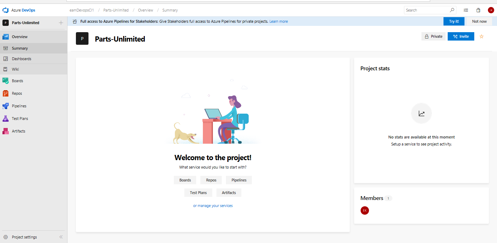

2. Import the PartsUnlimited repo on GitHub by going to **Import a repository** and clicking **Import**

	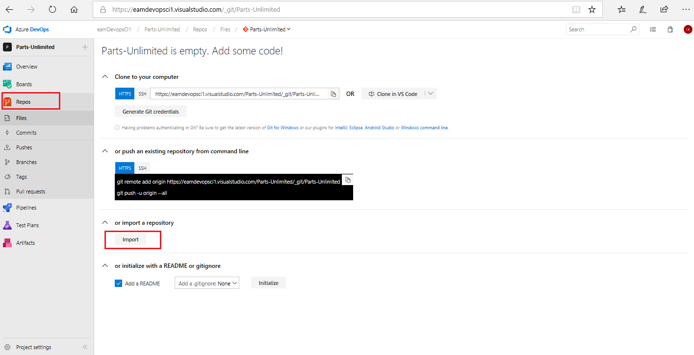


3. Obtain the URL to clone by opening a new browser and going to the URL http://www.github.com/microsoft/PartsUnlimited, then clicking the **Clone or Download** button then copying the URL by clicking **Copy to clipboard** until it says **Copied**

	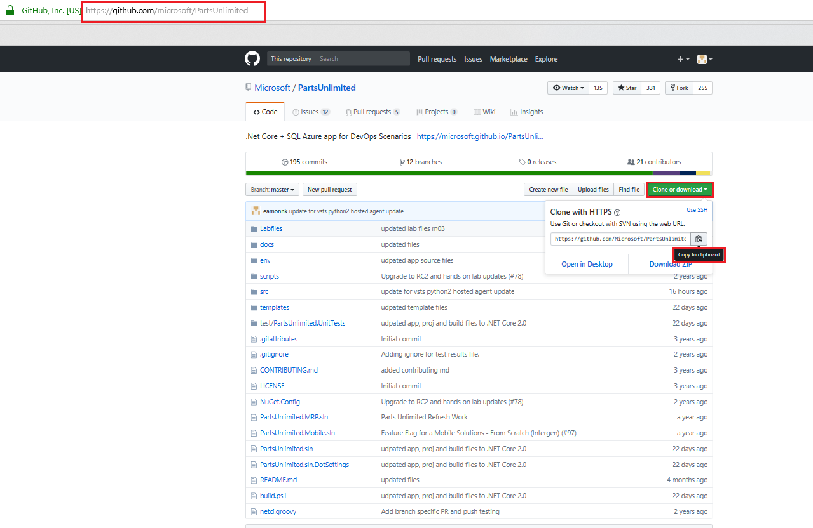


4. Return to VSTS and in the **Import a Git repository** dialogue you opened earlier enter the values

	- Source type = Git
	- Clone URL = https://github.com/Microsoft/PartsUnlimited.git

	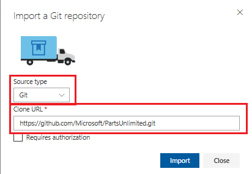


5. Wait until the repo is imported and available in VSTS, you'll see status and success messages, then be able to view the files in VSTS as in the screenshots below.

    Note: You can return and access your project repo files at any time by going to **Code** > **Files**

	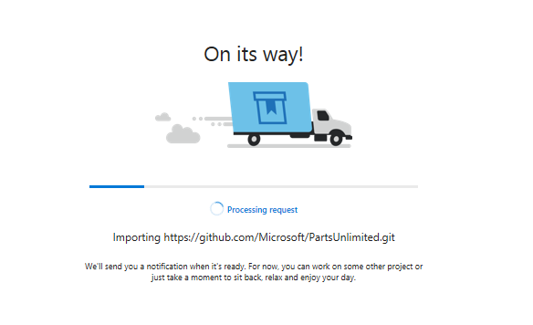

	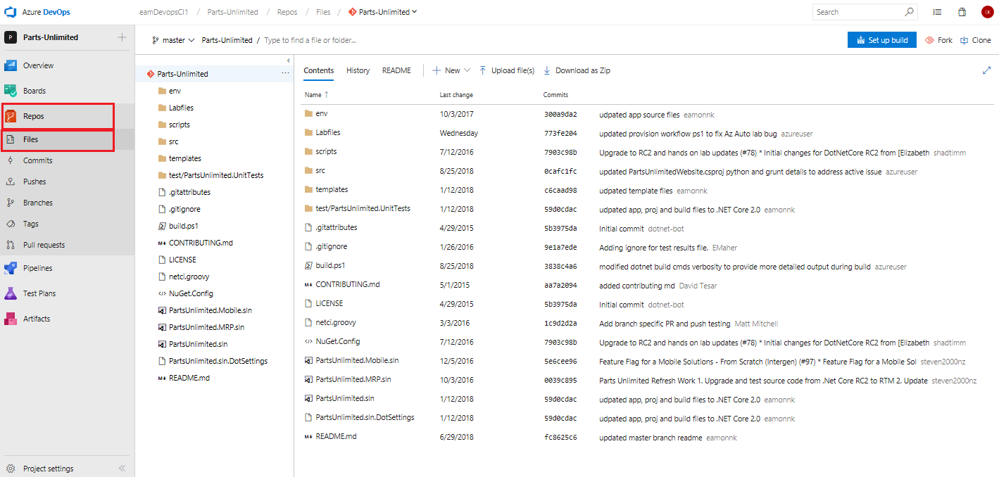


    Congratulations, your code should now be in Azure DevOps.

### Task 2: Create local git repo from your VSTS git repo
There are a number of ways to create a local git repo and there are a number of tools which you can use.

Firstly you need to install git in your local environment, see the page <a href="https://git-scm.com/book/en/v2/Getting-Started-Installing-Git" target="_blank"><span style="color: #0066cc;" color="#0066cc">1.5 Getting Started - Installing Git</span></a> for details on how to install git in your local environment. 

The steps we outline below will be based on a Windows installation but you could also perform similar tasks on linux or mac if you needed using the git bash.

1. Download and Install Git on your local machine by going to 
<a href="https://git-scm.com/download" target="_blank"><span style="color: #0066cc;" color="#0066cc">https://git-scm.com/download</span></a> and following the steps and prompts in the installation wizard.

	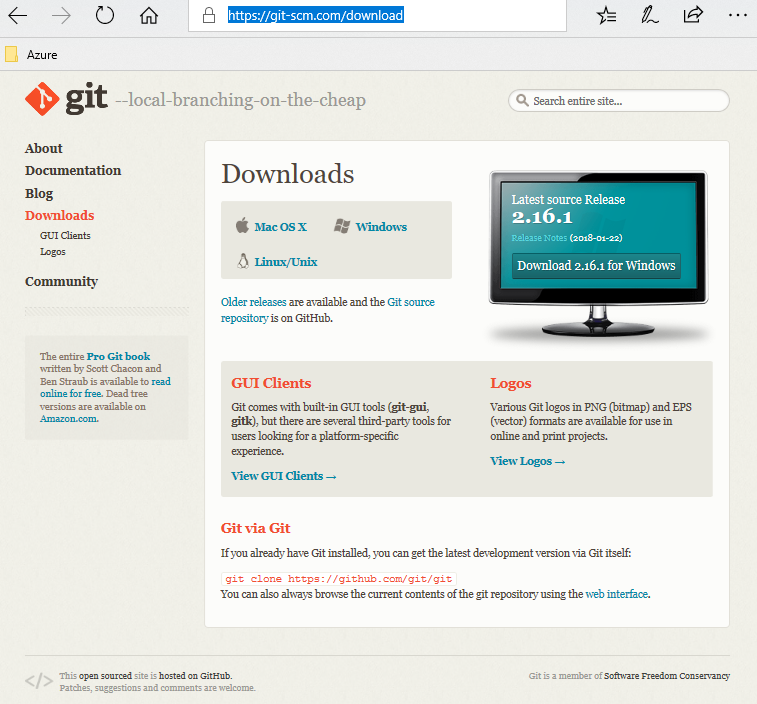

2. Once installed, create a local folder where you can place the repo files i.e. **C:\Repo**

3. Open **Git cmd** window and go to the folder where you want to place the VSTS git repo files i.e. **C:\repo** by running the command

	````
	cd C:\Repo
	````

4. Return to Azure DevOps and in your project go to **Code** > **Files** and then click on **Clone**.

	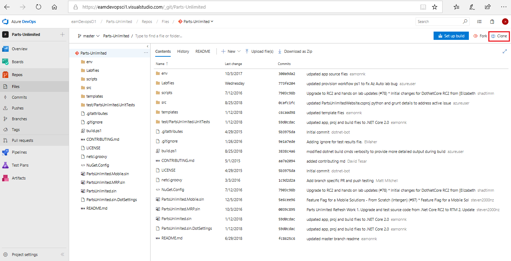

5. Click the copy button to copy the URL to clone

	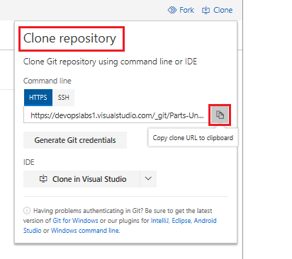

	**Note**: In case you have created or modified your repo and are on any other branches, ensure you are on the master branch on your repo. If you have not modified or added to the repo it is fine to just take the default values.

6. Return to your local git cmd and in the folder where you want to place the repo run the command

	````
	git clone <the copied URL for your VSTS repo>
	````
	
	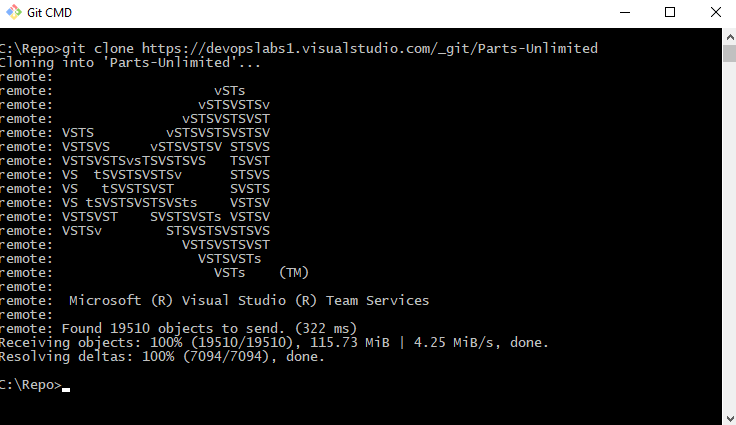

	**Note**: A new folder named with your project name is created in your local repo folder and you will see your files within that folder. i.e. **C:\Repo\Parts-Unlimited**

	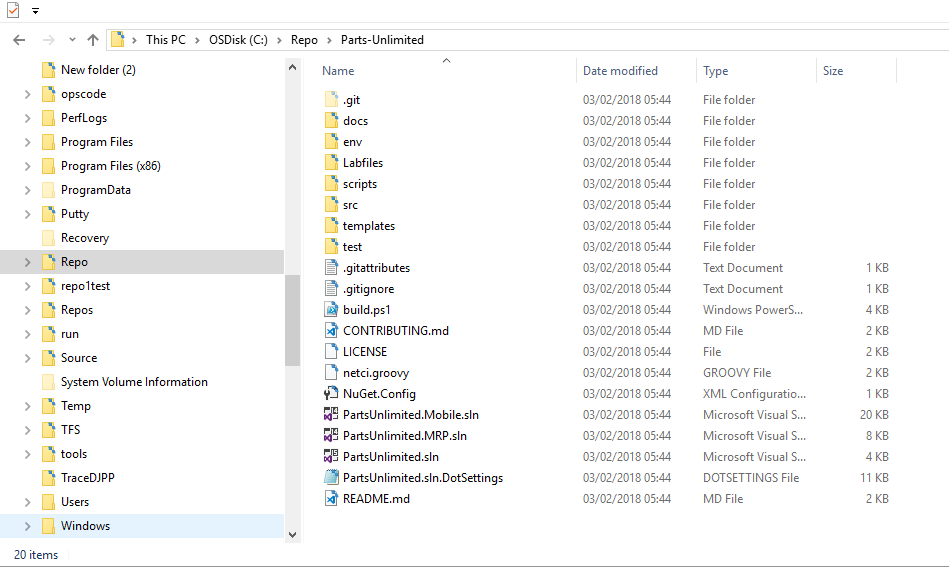

7. Go to the local folder and view the files present. You can now modify any of the VSTS repo files locally and push any changes up to the VSTS repo using the git commands, or variations on them.

	````
	git add *
	git commit -m "<description of your changes>"
	git push
	````

### Task 3: Setting up Service Endpoint in VSTS
 Deploying <a href="https://azure.microsoft.com/en-us/documentation/articles/resource-group-authoring-templates/" target="_blank"><span style="color: #0066cc;" color="#0066cc">ARM Templates</span></a> to Azure from Release Management requires an organizational account or a **Service Principal**. MSA Accounts and certificate-based connections are not supported. 

For this lab, we will use a **Service Principal**. There are many ways to create a Service Principal (SP) in Azure,
- Use <a href="https://docs.microsoft.com/en-us/azure/azure-resource-manager/resource-group-authenticate-service-principal" target="_blank"><span style="color: #0066cc;" color="#0066cc">Azure PowerShell to create SP</span></a> 
- using  <a href="https://docs.microsoft.com/en-us/azure/azure-resource-manager/resource-group-create-service-principal-portal" target="_blank"><span style="color: #0066cc;" color="#0066cc">Azure Portal to create SP</span></a>
- using  <a href="https://docs.microsoft.com/en-us/cli/azure/create-an-azure-service-principal-azure-cli?view=azure-cli-latest" target="_blank"><span style="color: #0066cc;" color="#0066cc">Azure CLI 2.0 Portal to create SP</span></a>

	We will use the **Azure CLI 2.0** and you can refer to the link above for more specifics if needed.


1.  Install the **Azure CLI 2.0** if it is not already installed by following the steps <a href="https://docs.microsoft.com/en-us/cli/azure/install-azure-cli?view=azure-cli-latest" target="_blank"><span style="color: #0066cc;" color="#0066cc">here</span></a> based on your environment.


2. Once **Azure CLI 2.0** is installed, open Azure CLI 2.0 and log into Azure by running the below command and following the prompts

	```
	az login
	```

3. Create a SP by running the command, the output should be similar to the screenshot below.

	```
	az ad sp create-for-rbac --name PU1app --password Pa$$w0rd01
	```

	

4. Check the permissions on the newly created SP and ensure it has a **RoleDefinitionName**= **Contributor**, by running the below command

	```
	az role assignment list --assignee  <app id from earlier > i.e. 5c0e5186-737c-42ad-881e-16d735ac3dab
	```

	

5. Log in with the SP to verify access is working fine by running the below command 

	```
	az login --service-principal -u <APP_ID> --password <PWD> --tenant <TENANT_ID>
	```

	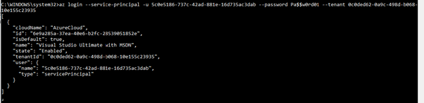

	> **Note**: You will need the below three values from the SP account to be able to successfully create the Service Endpoint in VSTS, you should note them now for use later.

	- **Tenant ID**
	- **Password (also referred to as Service Principal Key)**
	- **User name (also referred to as App ID or Service Principal Client ID)**


6.  Create an Azure Service Endpoint in VSTS by clicking on the **Settings** icon at the top of the page, selecting **Services** and then **New Service Endpoint** and selecting **Azure Resource Manager** from the drop down list.

	

7. In the **Add Azure Resource Manager Service Endpoint** dialogue, click on the link **use the full version of the endpoint dialog**

	

8. Fill in the fields required as per the information you obtained earlier when creating your SP, click **Verify connection** and ensure you can successfully verify the connection to Azure

	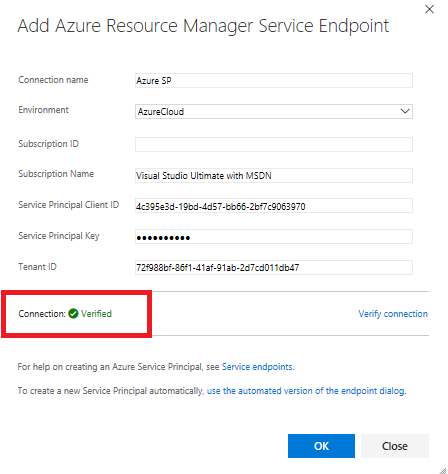

9. Click **OK**, and you should now see the new Service Endpoint listd in VSTS

	


### Task 4: Import Continuous Integration Build Definition into VSTS and kick off a build

1. Navigate to the **Build & Release** tab and click on *Builds*. and click on the **+ Import** button.

	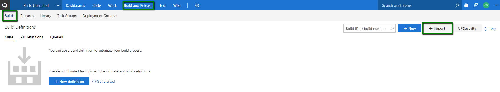

2. Click on **Browse** and go to your local repo which you created in Task 2, i.e. something like **C:\Repo\Parts-Unlimited** then go to the folder  **templates\build definitions** and select the file **PartsUnlimited-CI.json** and click on **Import** button.

	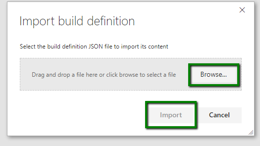

3. Once the import has done, you will need to update some information. Click on the **Process** heading and in the agent queue select **Hosted VS2017** in the hosted section. If this is already filled in please select the option with the **VS logo** beside it.

	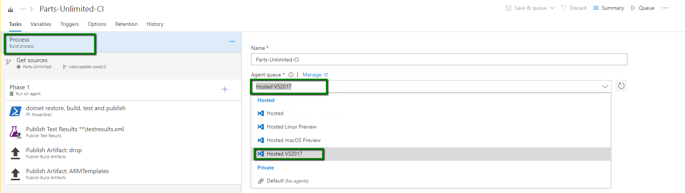

4. Select the **Get Sources** bar.

	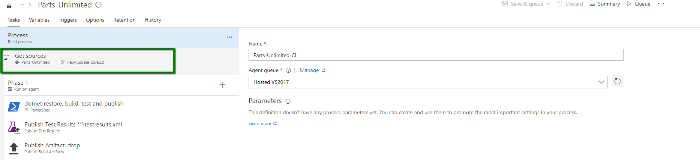

5. Make sure that that the branch that has been selected is `master` and it is using this project. 

	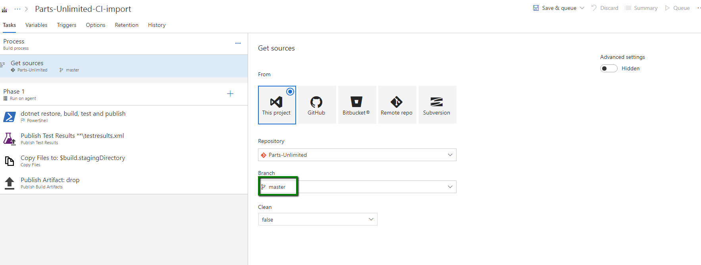

6. Now click **Save & queue**. The build should now run and complete successfully, it may take up to 10 minutes to complete.


### Task 5: Import Continuous Deployment release definition into VSTS and kick off Continuous deployment

1. Navigate to the **Build & Release** tab and click on **Releases**. If you already have at least one release definition then skip to the next step, otherwise we are going to create one very quickly to get an import release option.

	Click on the **+ New definition** button and select "Empty" definition. This will create an empty release definition with default settings. Click on "Save" and "OK".

	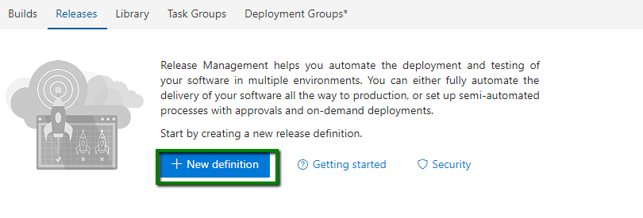

	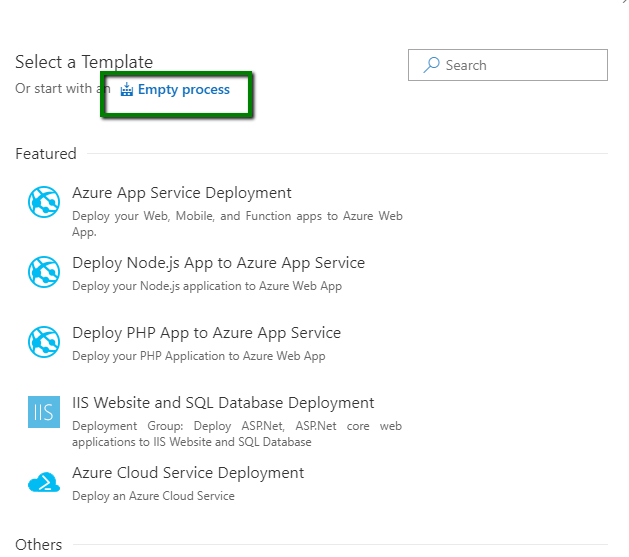

2. Navigate to the Releases heading, to import a release template click on "+" button and select "Import release definition".

	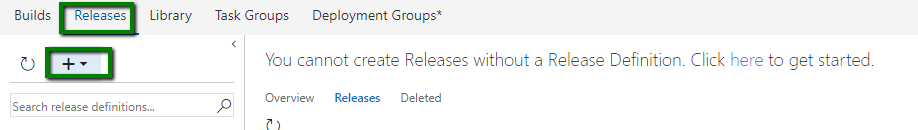

3. Click on **Browse** and select `Deployment.json` file in `templates\release definitions` of your local repository. Then click on **Import** button.

	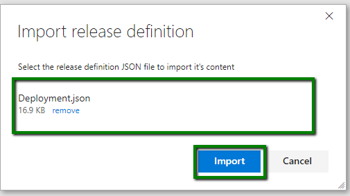

4. Firstly, you need to check on that the artifact has been found and utilized properly. First select **Part-Unlimited-CI-Import** within **Artifacts**. 

	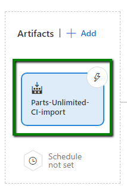

	**Note:** If at the bottom of the artifact it states that there is `No version available`. You will need to delete and add a new one. 

	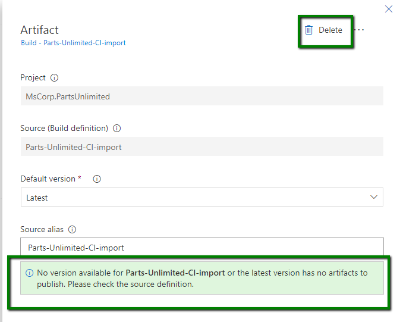

	or a message similar to this

	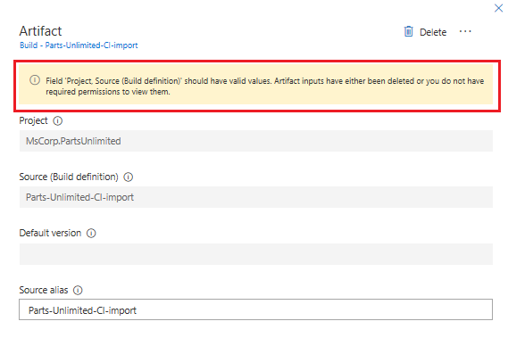

	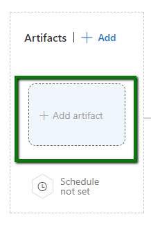

	If Adding an artifact from build you will enter that it is from the **Build**, coming from the project you have created. Select that the **Project** and specify the **Source** as **Parts-Unlimited-CI-import**, the Source alias will auto populate, and click **Add**

	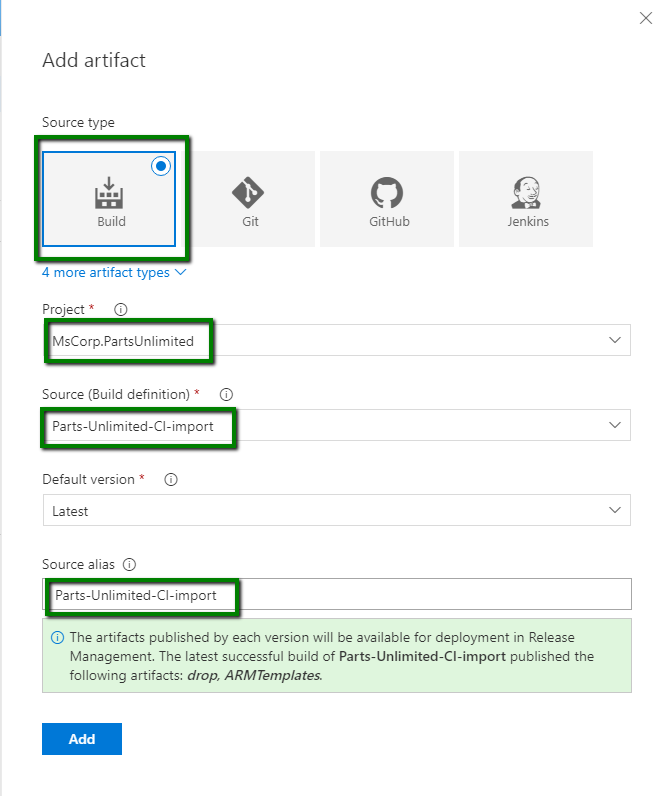

5. Make sure that the **Continuous deployment trigger** is on, by selecting the lightning bolt to the top right of the artifact. 

	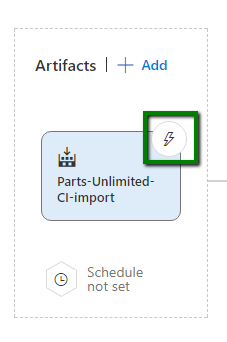

	If it isn't **Enabled** then flick the switch and select the branch to trigger the deployment. and click **+Add** to add a **build branch** and point it to **master**

	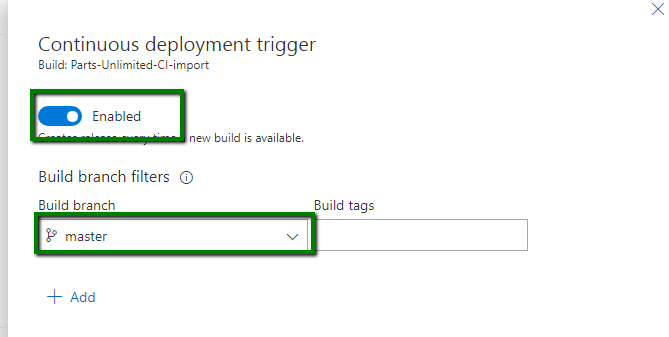 

6. Everything that needs your attention will be listed in red.

	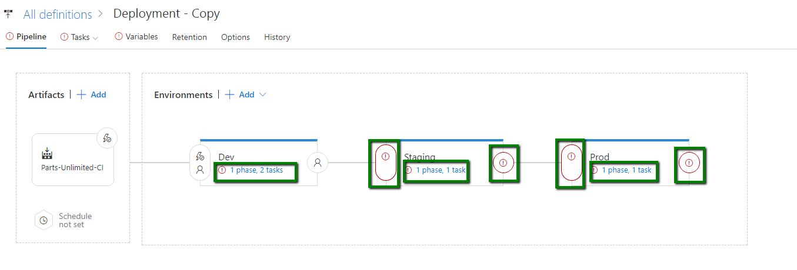

7. If you select to go in the tasks for **Dev**, i.e. click on **1 phase, 2 tasks**, and select the **Agent Phase** you will see that **Agent queue** is in red. Select the **Hosted VS2017** option. Then complete these steps again for the **Staging** and **Prod** environments. You can access these environments by clicking on the **Tasks** tab and selecting the relevant environment.

	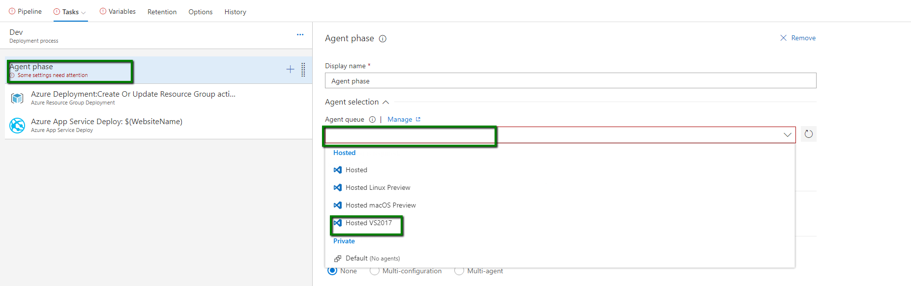

8. Under the **Azure Deployment** you will need to update the **Azure subscription** and the **Location**. This **only** needs to be done in the **Dev** Task.

	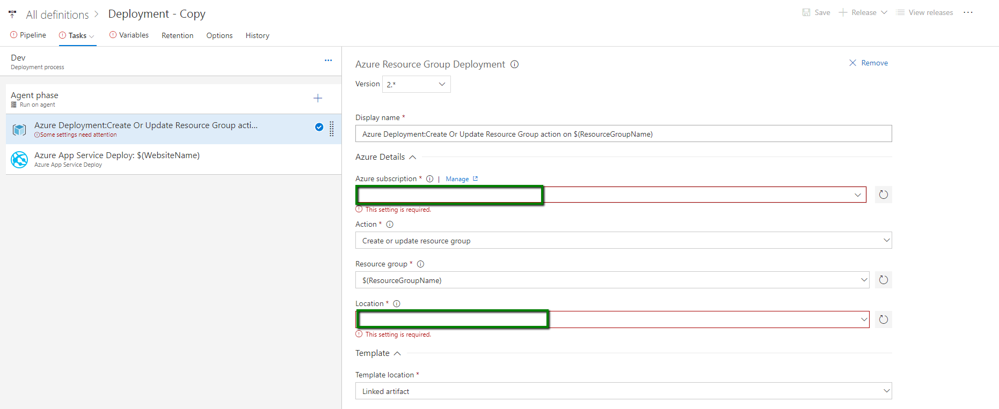

9. You will need to select the **Azure App Service** and update the **Azure subscription** and the **Slot**. For Slot you will need to fill in **Dev** for the **Dev** task, **Staging** for the **Staging** task. 

	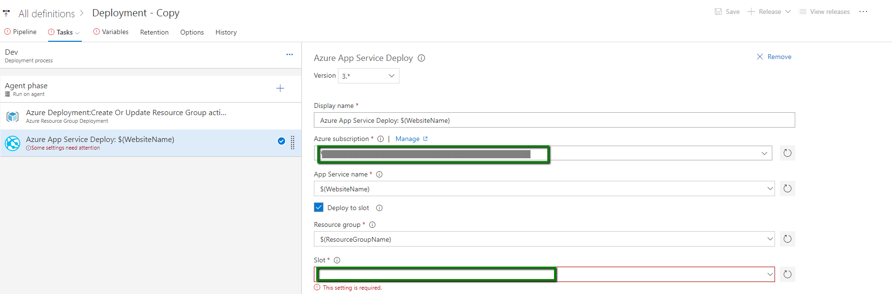

10. Navigate back to the Pipeline and you will see some **pre-** and **post-** deployment conditions where you need to select the approvers for the **Staging** and **Prod** steps. Add your name as an approver to these.

	

11. Select the **Variables** tab, followed by the **Process variables**. The issues here are the **Passwords** where you will need to select the **Lock** icon next to them and type in a new one, you can use the password of **Pa$$w0rd01** if you wish. For the rest of the values please change these to a unique name by adding your initials to the end of them.

	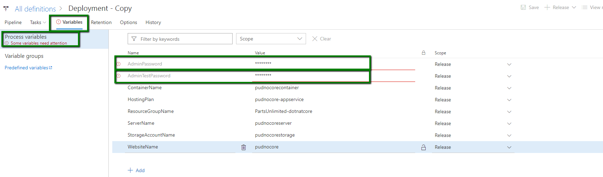

	**Note**: You just need to add your initials to the end of the current values, but you should be aware of the following in case it is needed.
	- The parameter values need to adhere to requirements for the Azure resource they are deploying. If they do not meet those requirements you may receive an error when deploying. 
    - In general, if you try to make all values unique, lowercase and between the resource character limits, i.e. if you stay under 24 characters you should be fine. 
    - You should also **not** have an **underscore** or **dash** in the name, as during deployment some resources and object names are generated and will append names with other values with dashes and underscores, and as a result may give errors if used


12. Up until now, when all errors have rectified, the **Save** option was not available, it was greyed out. However, now that there are no errors present, all that is left to do is to click **Save** to save the release. 


	**Note**: If you had to define an empty release definition before, then it can be now deleted by clicking on the dropdown arrow next to the empty definition and selecting **Delete** if you wish to do so.

	

Congratulations, you have imported a release definition successfully.

### Task 6: Export Build and Release Definitions from VSTS
Now that you have configured build and release definitions specifically for your repository in VSTS, it's a good idea to replace the given templates with your own.

1. Navigate to the **Builds** tab. Click on the ellipsis **(...)** button next to the build definition you would like to export and select **Export**. This will trigger a download of the build definition in JSON format. Click **Save as** and place this file in the `templates\build definitions` directory of your local repository.i.e. **C:\Repo\Parts-Unlimited\templates\build definitions**, you can append your initials to it if you like or overwrite it, and verify it downloads successfully.

	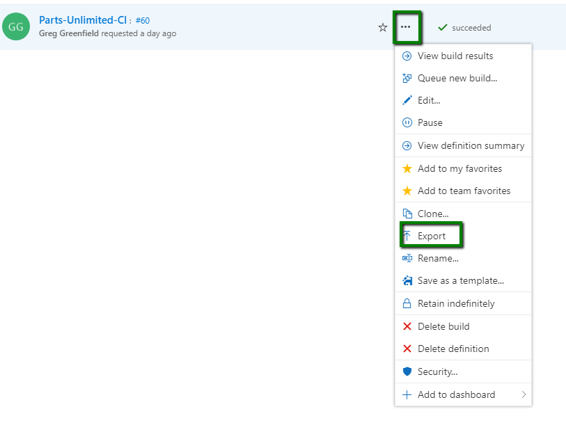

2. Navigate to the **Releases** tab. Click on the dropdown arrow next to the release definition you would like to export and select **Export**. This will trigger a download of the release definition in JSON format. Click **Save as** and place this file in the `templates\release definitions` directory of your local repository.i.e. **C:\Repo\Parts-Unlimited\templates\release definitions**, you can append your initials to it if you like or overwrite it, and verify it downloads successfully.

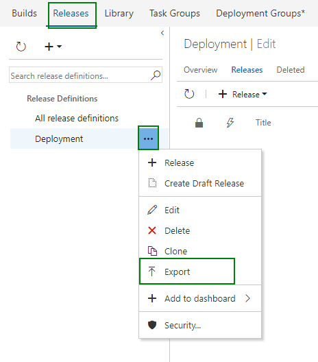

3. Open the git cmd window and go to your local repo location i.e. **C:\Repo\Parts-Unlimited**. 

4. Commit your changes using the following commands:

	````
	git add .
	````

	Stages all changes for the next commit
	````
	git commit -m "added build and release definitions"
	````
	Creates a commit from all current staged changes.
	````
	git push
	````

5. This uploads commits to the remote repository. Go to your VSTS repo and verify the files have been pushed up to the VSTS repo as expected.

Congratulations, now you can reuse your templates with other projects or lab tasks if you wish.


### Task 7: Confirming successful deployment to Azure
The changes you have just committed will trigger a CI build and a deployment to Azure.
Once the deployment to the **dev** slot is completed, the pre-approver for the **Staging** environment will receive an email notification about the pending deployment to the **staging** slot.

1. To approve/reject the request navigate to the **Release** tab, click on  , optionally leave a comment and click on the **Approve** or **Reject** button.  

	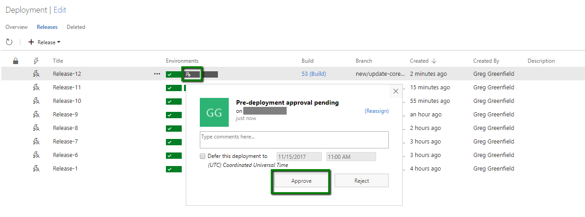

	**Note:** The **Staging** environment also has a post-approver who must confirm that the app is stable and ready for the production environment. The pre-approver for the **Production** environment must also confirm before this final deployment.

2. In Azure, find your App Service with the name **pudncore** and open its URL (this is the production site).

	

	**Note:** In the **Deployment slots** section you can find the **dev** and **staging** slots with their respective URLs.

Congratulations on successfully setting up Continuous Integration and Continuous Deployment with VSTS.


<h3><span style="color: #0000CD;"> Summary </span></h3>
In this lab, you have learned how to push new code to Visual Studio Team Services, set up a Git repo, create a Continuous Integration build that runs when new commits are pushed to the master branch and create a Continuous Deployment that deploys an application to environments automatically.
This allows you to receive feedback as to whether your changes contain syntactical errors or break existing tests, as well as saving time by automating the deployment process.


To learn more in-depth information about CI and CD try out these labs:

- [Continuous Integration with Visual Studio Team Services](https://microsoft.github.io/PartsUnlimited/cicd/200.3x-CICD-M01-CIwithVSTS.html)
- [Continuous Deployment with Visual Studio Team Services](https://microsoft.github.io/PartsUnlimited/cicd/200.3x-CICD-M03-CDwithVSTS.html)
