---
layout: page
title:  CI and CD with Azure DevOps - Quickstart
category: PandP
order: 6
---


In this lab we have an application called PartsUnlimited. We will set up Continuous Integration (CI) and Continuous Deployment (CD) with Azure DevOps (formerly Visual Studio Team Services (VSTS)). Continuous Integration builds the app and runs the unit tests whenever the code is pushed to the master branch. After the CI step succeeds it will trigger a deployment to a `dev` deployment slot. The `staging` slot and `production` will require an approver before the app is deployed into them. Once the approver confirms that `staging` slot is stable, the app will be deployed to the production site.


<h3><span style="color: #0000CD;">DevOps MPP Course Source </span></h3>


- This lab is used in the course <a href="https://www.edx.org/course/introduction-devops-practices-microsoft-devops200-1x-0" target="_blank"><span style="color: #0066cc;" color="#0066cc">DevOps200.1x: DevOps Practices and Principles</span></a> - Module 3.


<h3><span style="color: #0000CD;"> Pre-requisites:</span></h3>

- An active Azure DevOps account.

- Project Admin rights to the Azure devOps account.

- An account in Azure.


<h3><span style="color: #0000CD;"> Lab Tasks:</span></h3>

- Import Source Code into your Azure DevOps Account with Git.
- Create local Git repo from your Azure DevOps Git repo.
- Set up Service Endpoint in Azure DevOps.
- Import Continuous Integration Build pipeline into Azure DevOps and kick off a build.
- Import Continuous Deployment Release pipeline into Azure DevOps.
- Export Build and Release pipelines from Azure DevOps and commit changes to Azure DevOps repo to kick off CI and CD.
- Confirm successful deployment to Azure.


<h3><span style="color: #0000CD;">Estimated Lab Time:</span></h3>

- approx. 80 minutes  


### Task 1: Import GIT source code into Azure DevOps Account
In order to use Azure DevOps Build, your Azure DevOps project must contain source code for the application. For this lab, we are using the Azure DevOps project with a Git repository. The following steps will allow you to add the PartsUnlimited source to the master branch of the Git repository .

1. If you haven't created an Azure DevOps account, go to <a href="http://www.visualstudio.com" target="_blank"><span style="color: #0066cc;" color="#0066cc">http://visualstudio.com</span></a> and create a new organization in your Azure DevOps  (formerly Visual Studio Team Services (VSTS)) account. In order to create a new team project, Click on **Create project** and enter the project name and select the visiblity as **Private**. Now, click on **Advanced** option and select **Git** as the **Version control** and select **Agile** as the process template under **Work item process**. Now, click on **Create** button.

	
	
	

2. Next, click on **Repos** to import the PartsUnlimited repo from GitHub by clicking **Import** under the option **import a repository**.

	


3. Obtain the URL to clone by opening a new tab on the browser and going to the URL http://www.github.com/microsoft/PartsUnlimited. Click the **Clone or Download** button and then copy the URL by clicking **Copy to clipboard** option.

	


4. Return to the project in Azure DevOps and in the **Import a Git repository** dialog box, paste the copied URL from GitHub and click on **Import**. 

	- Source type = Git
	- Clone URL = https://github.com/Microsoft/PartsUnlimited.git

	


5. Wait until the repo is imported and available in Azure DevOps. You will be notified when the import is successful.

    Note: You can return and access your repository files at any time by going to **Repos** > **Files**

	

	


    Congratulations! Your code should now be available in the project created.

### Task 2: Create local Git repo from your Azure DevOps Git repo
There are a number of ways to create a local Git repo and there are a number of tools which can be used.

In the first place, you need to install Git in your local environment, for details on how to install git in your local environment, see the page <a href="https://git-scm.com/book/en/v2/Getting-Started-Installing-Git" target="_blank"><span style="color: #0066cc;" color="#0066cc">1.5 Getting Started - Installing Git</span></a>. 

The installation steps outlined below is with regard to Windows. However, you can also install it on Linux or macOS.

1. Download and Install Git on your local machine by clicking on 
<a href="https://git-scm.com/download" target="_blank"><span style="color: #0066cc;" color="#0066cc">https://git-scm.com/download</span></a> and selecting **Windows**. When prompted, click on **Save** and **Run**. Follow the steps in the installation wizard and complete the installation with default settings.

	

2. Once installed, create a local folder where the repo files can be copied. i.e. **C:\Repo**

3. Search for Git on the PC and click on **Git CMD**. A command-line interface is opened. Select the path where the files in the repo can be placed by running the following command.

	````
	cd C:\Repo
	````

4. Return to Azure DevOps and in your project go to **Repos** > **Files** and then click on **Clone**.

	

5. Click the copy button to copy the URL to clone

	

	**Note**: In case you have created or modified your repo and are on any other branches, ensure you are on the master branch on your repo. If you have not modified or added to the repo it is fine to just take the default values.

6. Return to your local git cmd and in the folder where you want to place the repo run the command

	````
	git clone <the copied URL for your VSTS repo>
	````
	
	

	**Note**: A new folder named with your project name is created in your local repo folder and you will see your files within that folder. i.e. **C:\Repo\Parts-Unlimited**

	

7. Go to the local project folder path and view the files present. You can now modify any of the repo files locally and push the changes to the Azure DevOps repo using git commands.

	````
	git add *
	git commit -m "<description of your changes>"
	git push
	````

### Task 3: Setting up service connection in Azure DevOps
 There are a number of ways to deploy <a href="https://azure.microsoft.com/en-us/documentation/articles/resource-group-authoring-templates/" target="_blank"><span style="color: #0066cc;" color="#0066cc">ARM Templates</span></a> to Azure from Azure DevOps. You can specify your Azure subscription directly in the release pipeline task, or you can use an organizational account or a **Service Principal** and configure a **Service connection** in Azure DevOps.

In this lab, we will use a **Service Principal** and add these details to a **Service connection** in Azure DevOps. The following are the different ways to create a Service Principal (SP) in Azure :
- Using <a href="https://docs.microsoft.com/en-us/azure/azure-resource-manager/resource-group-authenticate-service-principal" target="_blank"><span style="color: #0066cc;" color="#0066cc">Azure PowerShell</span></a> 
- Using  <a href="https://docs.microsoft.com/en-us/azure/azure-resource-manager/resource-group-create-service-principal-portal" target="_blank"><span style="color: #0066cc;" color="#0066cc">Azure Portal </span></a>
- Using  <a href="https://docs.microsoft.com/en-us/cli/azure/create-an-azure-service-principal-azure-cli?view=azure-cli-latest" target="_blank"><span style="color: #0066cc;" color="#0066cc">Azure CLI 2.0 Portal</span></a>

	We will use the **Azure CLI 2.0** and you can refer to the link above for more specifications if needed.


1.  Install the **Azure CLI 2.0**. If it is not installed, follow the steps <a href="https://docs.microsoft.com/en-us/cli/azure/install-azure-cli?view=azure-cli-latest" target="_blank"><span style="color: #0066cc;" color="#0066cc">mentioned here</span></a> and install it accordingly on your environment.


2. Once **Azure CLI 2.0** is installed, open Azure CLI 2.0 and log into Azure by running the below command. When prompted, open the browser and login with microsoft credentials.

	```
	az login
	```

3. Create a SP by running the following command. The output displayed will be similar to the screenshot below.

	```
	az ad sp create-for-rbac --name PU1app
	```

	

4. Execute the below command to check the permissions on the newly created SP and ensure it has a **RoleDefinitionName**= **Contributor**

	```
	az role assignment list --assignee  <app id from earlier > i.e. 5c0e5186-737c-42ad-881e-16d735ac3dab
	```

	

5. Log in with the SP to verify if the access is working fine by running the following command. Use the values from Step 3 for APP_ID, Password and Tenant_ID.

	```
	az login --service-principal -u <APP_ID> --password <PWD> --tenant <TENANT_ID>
	```

	

	> **Note**: You will need the values mentioned below from the SP account inorder to successfully create the service endpoint in Azure DevOps. Make a note of it as we will be using it later.

	- **Tenant ID**
	- **Password (also referred to as Service Principal Key)**
	- **User name (also referred to as App ID or Service Principal Client ID)**


6.  Create an Azure Service Endpoint in Azure DevOps by clicking on  **Project settings** icon at the bottom left of the dashboard panel. Select **Pipelines > Services connections** and then click on **New Service connection**. Now, click on **Azure Resource Manager** from the drop down list.

	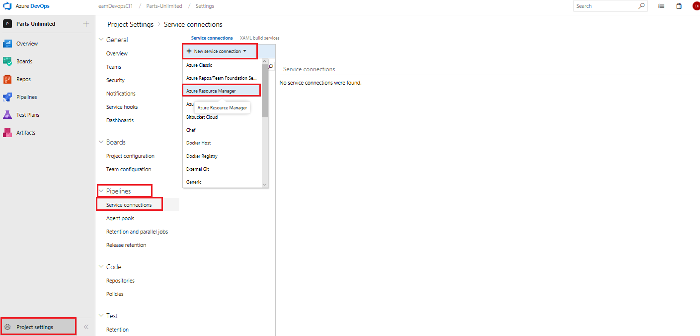

7. In the **Add an Azure Resource Manager Service connection** dialog box, click on the link **use the full version of the service connection dialog**.

	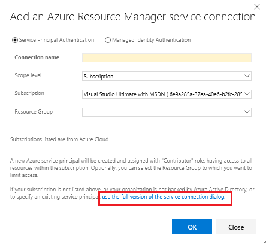

8. Fill in the fields required according to the information you obtained while creating your SP. Now, click **Verify connection** and ensure that the connection to Azure is verified successfully.

    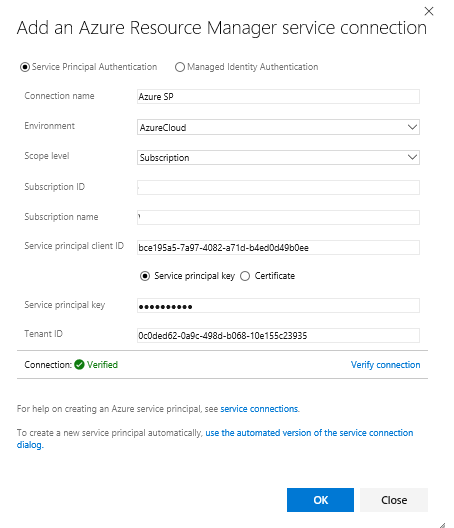

9. Click **OK**, and you will see the new Service connection listed in Azure DevOps.

    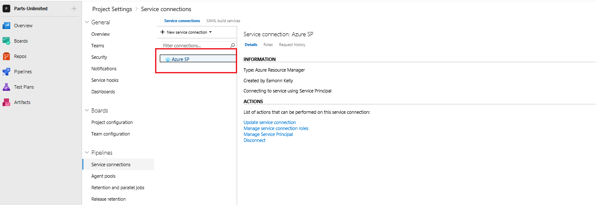


### Task 4: Import Continuous Integration Build pipeline definition into Azure DevOps and kick off a build

1. Navigate to the **Pipelines** and click on **Builds**. There will be a message saying **No build pipelines were found**. Therefore, a build pipeline should be created, before we import a build definition.

    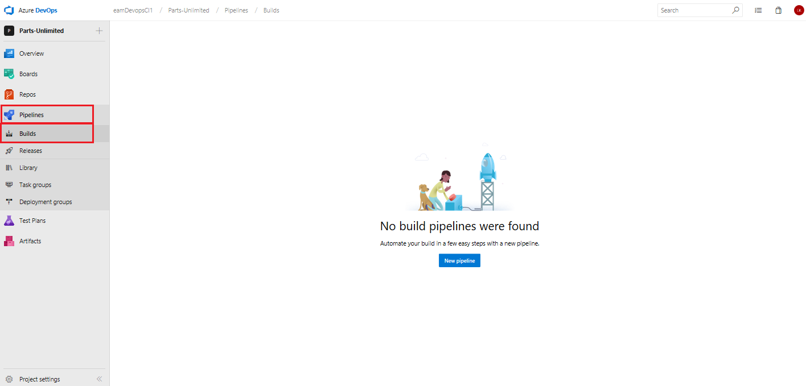
2. Click on **New Pipeline**. It will display a page with different templates. Click on **Use classic editor**. Accept the default options selected and click **Continue**.

    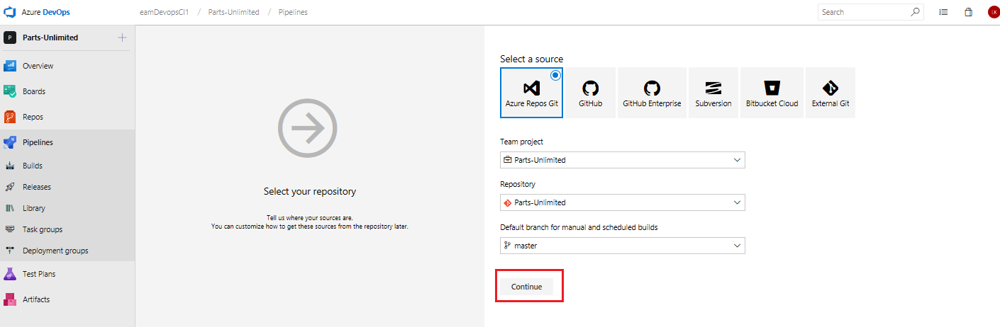
3. In the **Select a template** pane choose **Empty job**.

    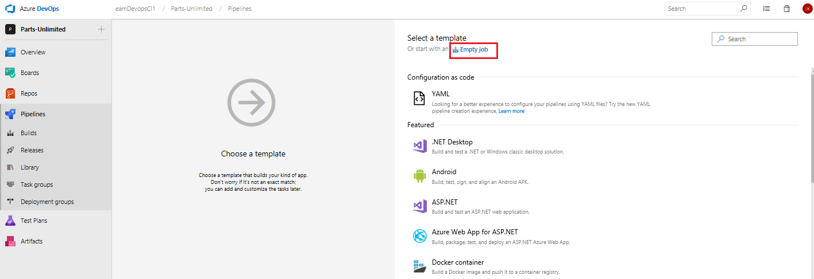 
4. Click the drop-down arrow beside the **Save & queue** option and choose **Save**. Click again on **Save** in the Save build pipeline dialog box.

    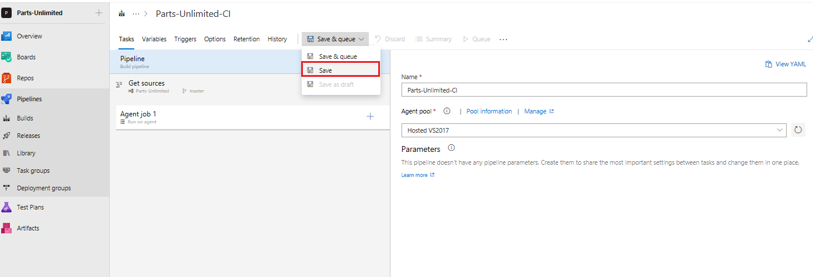
5. Now navigate to **Pipelines > Builds**. Click on **+ New** option and choose **Import a pipeline**.

    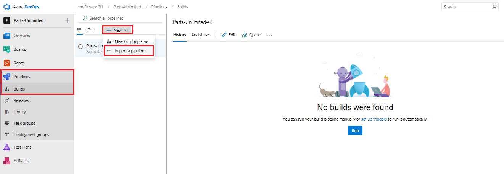
6. Click on **Browse** and go to your local repo which you created in Task 2, i.e. in this case **C:\Repo\Parts-Unlimited** then go to the folder  **templates\build definitions** and select the file **PartsUnlimited-CI.json** and click on **Import** button.

    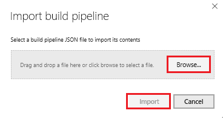
7. Once the import is completed, you will need to update some information. Click on the **Pipeline** heading under **Tasks** and under Agent pool select **Hosted VS2017** in the hosted section. If this is already filled in please select the option with the **VS logo** beside it.

    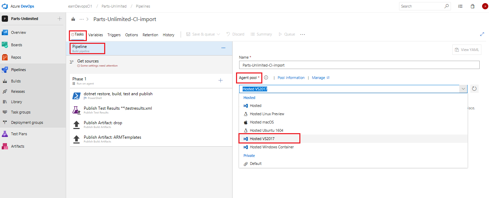
8. Now go to **Get Sources** under **Tasks** and make sure that that the branch that has been selected is `master`. 


    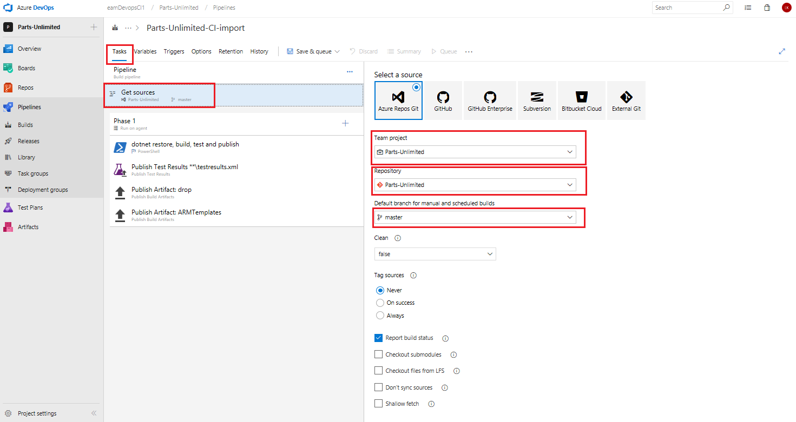

9. Now go to the **Triggers** tab and make sure that the branch specification that has been selected is `master`.

10. Now click **Save & queue**. Again if prompted and click **Save & queue** . This will kick off a build and you should see a message saying a build has been queued. You can click on the link provided to view the build progress. It should run and complete successfully, it may take up to 10 minutes to complete. 

    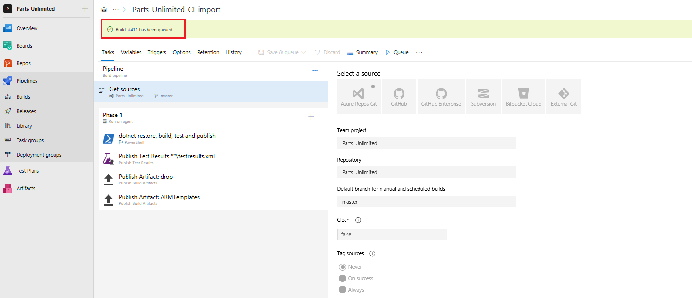
    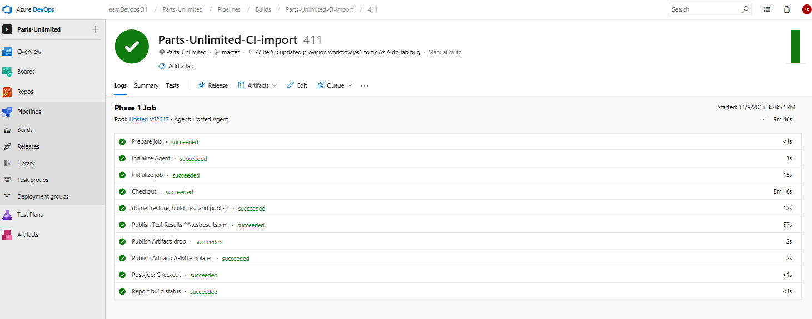


### Task 5: Import Continuous Deployment release pipeline definition into Azure DevOps and kick off Continuous deployment

Note: If you already have at least one release definition then skip to step 2, otherwise you have to create one very quickly to be able to access the import a release option.

1. In order to create one, navigate to the **Pipelines > Releases**. Click on the **+ New pipeline** button and in the **Select a template** pane, select **Empty job** . This will create an empty release pipeline with default settings. Click on **Save** and **OK**.

	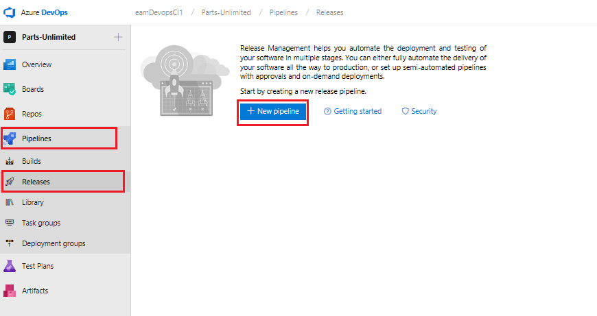

	

2. Click on **Pipelines > Releases**, click on **+** button and select **Import release pipeline**.

	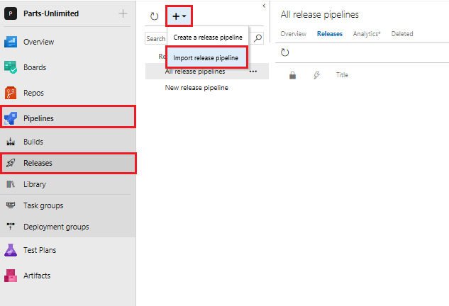

3. Click on **Browse** and select the file `templates\release definitions\PUReldef1.json` in your local repository. Then click on **Import** button.

	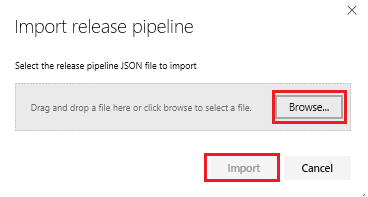

4. In the first place, you need to check if the artifact is found and utilized properly. Therefore, select **Part-Unlimited-CI-Import** within **Artifacts**. 

    

	**Note:** If at the bottom of the artifact it states that there is `No version available`. You will have to delete and add a new one. 

	

	Or if there is a message similar to this, you will also have to delete it and create a new one.

	

5. Click **+ Add an artifact**.
	

	In the Add an artifact dialog, select **Source Type** as **Build**, and then specify the **Project** i.e. `Parts-Unlimted`, and specify the imported build pipeline as the  **Source** i.e. `Parts-Unlimited-CI-import`, the **Source alias** will auto populate. click **Add**

	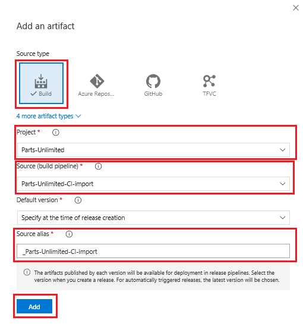

6. Make sure that the **Continuous deployment trigger** is enabled by selecting the lightning bolt to the top right of the artifact. 

	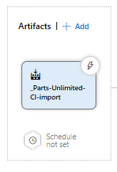
	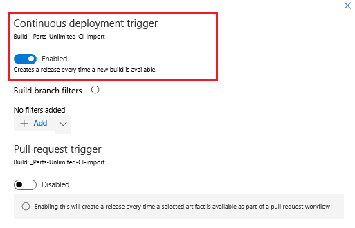 

7. Take note of all the highlighted options listed.

	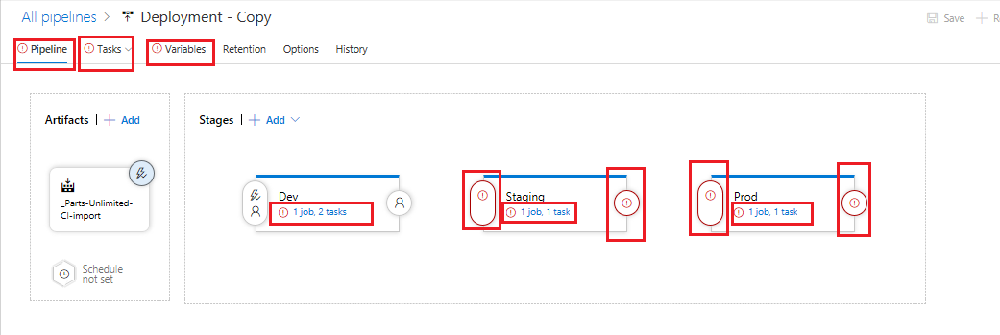

8. Go to **Tasks > Dev**, or click on **1 job, 2 tasks** in the pipeline graphical display, and select the **Agent Phase**, you will see that **Agent pool** is in red. Select the **Hosted VS2017** option. 

    Then complete these steps again for the **Staging** and **Prod** environments. You can access these environments by clicking on the **Tasks > Staging** and **Tasks > Prod** respectively.

	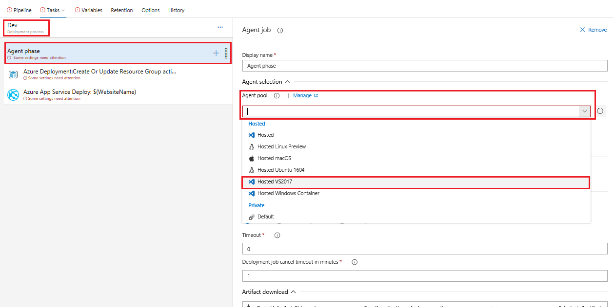

9. Under the **Azure Deployment: Create or Update Resource Group....** task, you will need to update the **Azure subscription** to the Service connection that you specified earlier in **Task 3** i.e. Azure SP and the **Location**, you can specify the Azure DataCenter nearest to you. This needs to be done only in the **Dev** task, as this task only exists under **Dev**.

    


10. You also need to ensure that the template and template parameter values are pointing to the correct files i.e. `FullEnvironmentSetupMerged.json` and `FullEnvironmentSetupMerged.param.json` from the artifacts created in the previous build definition

    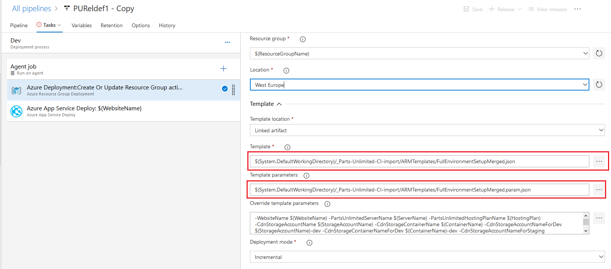

11. Under the **Azure App Service Deploy....** task, you have to  update the **Azure subscription**, again to the **service connection** value you created earlier in **Task 3**, and the **Slot**. For Slot you will need to enter the value **Dev**. This will be set default to the `production` value, but it needs to be changed to `dev` in the `dev` task. 

    This needs to also be done for the **Staging** task and the value to use there is **Staging** task. These slot values default to the value production but need to be changed as outlined. You can leave the value production as it is in the last environment which is production
    
    

12. Also, still under the **Azure App Service Deploy....** task, ensure the correct package file and location `$(System.DefaultWorkingDirectory)/_Parts-Unlimited-CI-import/drop/partsunlimited.zip`. Yhsi is generated as an artifact when the build definition is run. You path may slightly differ from the above, bu tthe last two parts shoudl remain the same.


    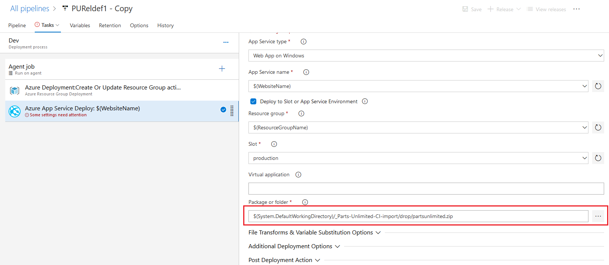

    There should now be no more red highlighted section under **Tasks**
13. Navigate back to the Pipeline and you will see some **pre-** and **post-** deployment conditions where you need to select the approvers for the **Staging** and **Prod** steps. Add your name as an approver to these.

    

14. Select the **Variables** tab, followed by the **Pipeline variables**. The red highlighted issues here are the two **Password** values. You will need to select the **Lock** icon next to them and type in a new one, you can use the password of **Pa$$w0rd01** if you wish. For the rest of the values although not highlighted in **Red** you **must** change these also to be unique value by adding your initials to the end of them. We are deploying live web services and this is to ensure naming values are unique as required by the services. See the bullet notes below when determining the values required.

	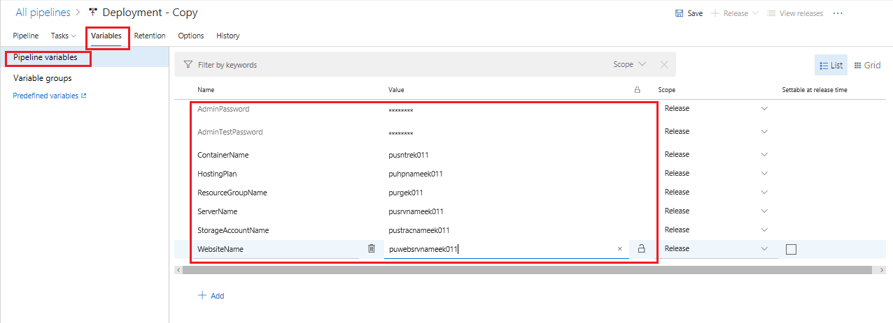

	**Note**: You just need to add your initials to the end of the current values, but you should be aware of the following in case it is needed.
	- The parameter values need to adhere to requirements for the Azure resource they are deploying. If they do not meet those requirements you may receive an error when deploying. 
    - In general, if you try to make all values unique, lowercase and between the resource character limits, i.e. if you stay under 24 characters you should be fine. 
    - You should also **not** have an **underscore** or **dash** in the name, as during deployment some resources and object names are generated and will append names with other values with dashes and underscores, and as a result may give errors if used


15. All errors should now have been addressed. Prior to this the **Save** option was not available, it was greyed out. However, now that there are no errors present, you can click **Save** to save the release. 

    **Note**: If you had to define an empty release definition before, then it can be now deleted by clicking on the dropdown arrow next to the empty definition and selecting **Delete** if you wish to do so.

	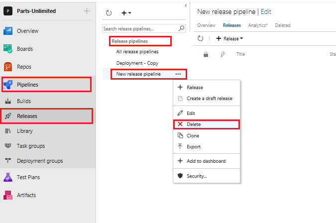

    Congratulations, you have imported a release definition successfully.

### Task 6: Export Build and Release Pipeline definitions from Azure DevOps
Now that you have configured build and release pipelines specifically for your repository in Azure DevOps, it's a good idea to replace the given templates with your own.

1. Navigate to **Pipelines > Builds**, click on your build pipeline definition i.e. **PartsUnlimited-CI-Import** and then click on the ellipsis **(...)** button next to tab options and select **Export**. 
 
    This will trigger a download of the build definition in your browser in JSON format. Click **Save as** and place this file in the `templates\build definitions` directory of your local repository.i.e. **C:\Repo\Parts-Unlimited\templates\build definitions**, you can append your initials to it if you like or overwrite it, and verify it downloads successfully.

	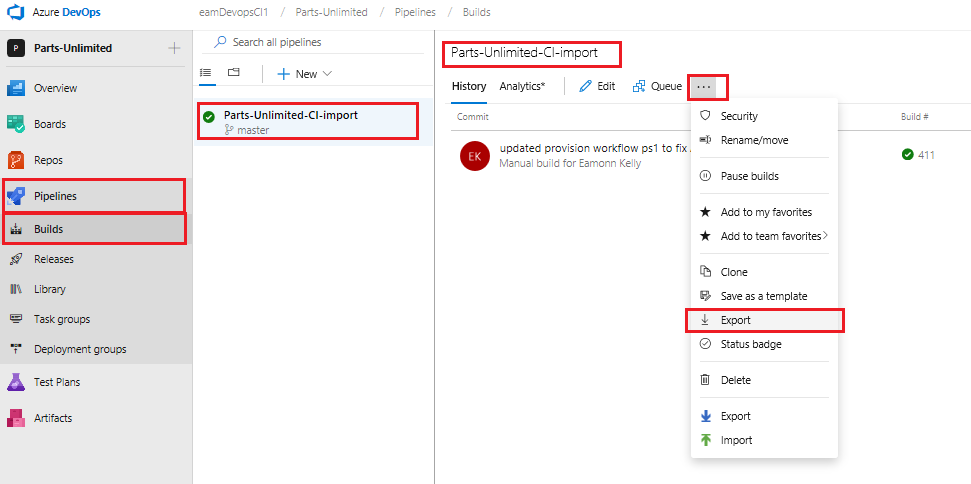

2. Navigate to **Pipelines > Releases** and click on the **elipsis** option beside the release pipeline, i.e. Deployment and select **Export**. 

    This will trigger a download of the release definition in JSON format. Click **Save as** and place this file in the `templates\release definitions` directory of your local repository.i.e. **C:\Repo\Parts-Unlimited\templates\release definitions**, you can append your initials to it if you like or overwrite it, and verify it downloads successfully.

    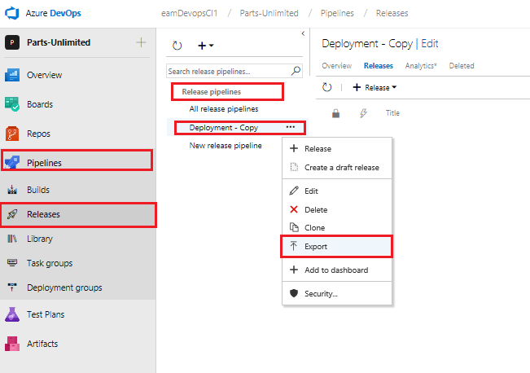

3. Open the Git CMD window and go to the local repo location i.e. **C:\Repo\Parts-Unlimited**. 

4. Commit the changes using the following commands:

	````
	git add .
	````

	Stages all changes for the next commit
	````
	git commit -m "added build and release definitions"
	````
	Creates a commit from all current staged changes.
	````
	git push
	````

5. This pushes commits to the Azure DevOps repository. Go to your Azure DevOps repo and verify if the files have been pushed up to the Azure DevOps repo as expected.

    Congratulations! Now you can reuse the templates with other projects or lab tasks if needed.


### Task 7: Confirming successful deployment to Azure
The changes that have just been committed will trigger a CI build and deployment to Azure using your release pipeline. 

1. You can view the release pipeline progress by clicking on the release and viewing the pipeline progress, as shown below.

	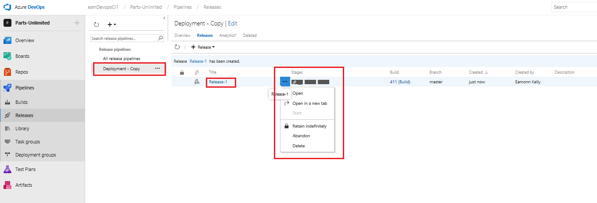
	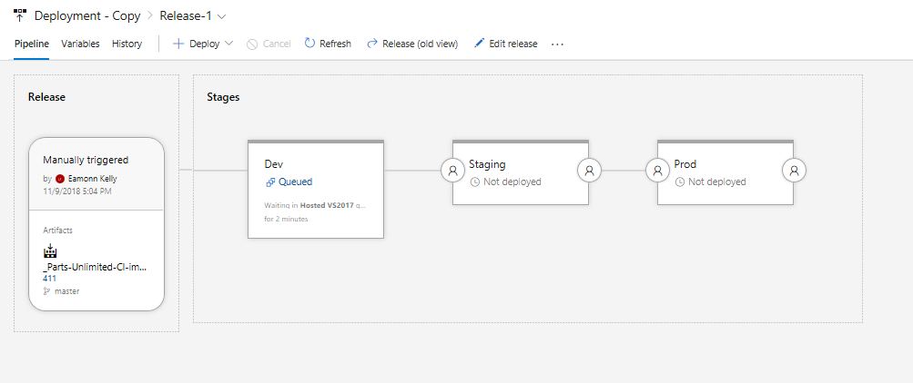

2. Once the deployment to the **dev** slot is completed, the pre-approver for the **Staging** environment will receive an email notification regarding the pending deployment to the **staging** slot.

3. To approve or cancel the request, In the release pipeline progress progress pane, click on the **Approve** or **cancel the deployment** button (circle with diagonal line through it) and choosing it again on the approval pane.  

	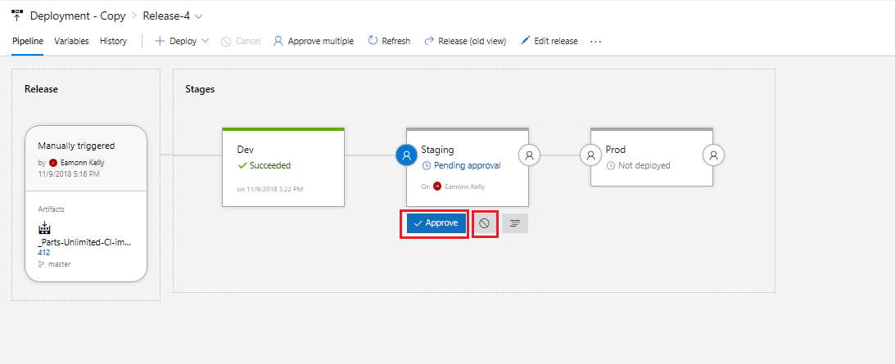

	**Note:** The **Staging** environment also has a post-approver who must confirm that the app is stable and ready for the production environment. The pre-approver for the **Production** environment must also confirm before this final deployment.

	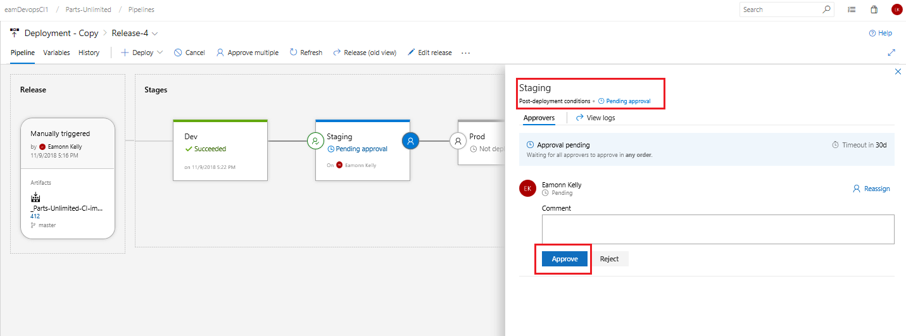

    Continue the approval processes until the release pipeline completes successfully.

	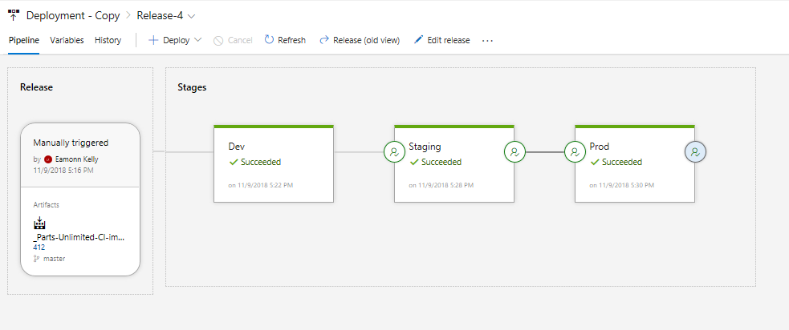

4. In Azure, find your App Service with the name of the web server you specified, and open its URL (this is the production site).

	

	**Note:** In the **Deployment slots** section you can find the **dev** and **staging** slots with their respective URLs.

Congratulations on successfully setting up Continuous Integration and Continuous Deployment with Azure DevOps.


<h3><span style="color: #0000CD;"> Summary </span></h3>
In this lab, you have learned how to push new code to Azure DevOps, set up a Git repo, create a Continuous Integration build that runs when new commits are pushed to the master branch and create a Continuous Deployment that deploys an application to environments automatically.
This allows you to receive feedback as to whether your changes contain syntactical errors or break existing tests, as well as saving time by automating the deployment process.


To learn more in-depth information about CI and CD try out these labs:

- [Continuous Integration with Azure DevOps](https://microsoft.github.io/PartsUnlimited/cicd/200.3x-CICD-M01-CIwithVSTS.html)
- [Continuous Deployment with Azure DevOps](https://microsoft.github.io/PartsUnlimited/cicd/200.3x-CICD-M03-CDwithVSTS.html)
