---
layout: page
title:  Continous Delivery with Octopus
category: CICD
order: 5
---


This lab will step through integrating Octopus deployments into Azure and as well as your deployment pipelines in Visual Studio Team services (VSTS)


<h3><span style="color: #0000CD;">DevOps MPP Course Source </span></h3>

- This lab is used in course <a href="https://www.edx.org/course/continuous-integration-continuous-microsoft-devops200-3x-0" target="_blank"><span style="color: #0066cc;" color="#0066cc">DevOps200.3x: Continuous Integration and Continuous Deployment</span></a> - module 5.


<h3><span style="color: #0000CD;"> Pre-requisites:</span></h3>

- a VSTS accont
- an Azure Subscription
- Visual Studio 


<h3><span style="color: #0000CD;"> Lab Tasks:</span></h3>

In this lab you will Install and Configure Octopus Deploy Server using VSTS and Deploy a Web App to Azure App Service Web App. 
- Task 1: Install Octopus Deploy on an Azure virtual machine using Azure Portal
- Task 2: Install Octopus Deploy extension in VSTS account
- Task 3: Configure Octopus Deploy Connected Service as VSTS Service Endpoint
- Task 4: Create a Simple Application and push Code to VSTS
- Task 5: Configure Octupus Deploy Build Integration Tasks in VSTS
- Task 6: Create a Web App and Service Principal in Azure for deployment
- Task 7: Create Deployment Environments
- Task 8: Create an Octopus Deploy Project and configure variable replacement
- Task 9: Create a Release and Deploy


<h3><span style="color: #0000CD;">Estimated Lab Time:</span></h3>

- approx. 90 minutes  

### Task 1: Install Octopus Deploy on an Azure virtual machine using Azure Portal


Octopus Deploy can be installed either on premises or the cloud. All that is needed is a Windows Server machine and a Microsoft SQL Server (Express edition supported) or a Microsoft Azure SQL Database.

> See [Minimum requirements](https://octopus.com/docs/installation/installing-octopus#InstallingOctopus-Requirements) and [SQL Server requirements](https://octopus.com/docs/installation/installing-octopus/sql-server-database-requirements).

We can install everything manually, or we can use an Azure Virtual machine template that installs an Octopus Deploy Server with just a few clicks (including setting up a trial, which after 45 days downgrades automatically to Octopus Deploy community edition).


1. Log on to [Azure Portal](https://portal.azure.com/) and click  __+ Create a Resource__ and enter _Octopus_ in the search box:

    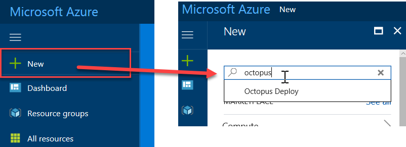

2. Click on **enter**, and on the Filter blade, select Octopus Deploy Template and then select Octopus Deploy template:

    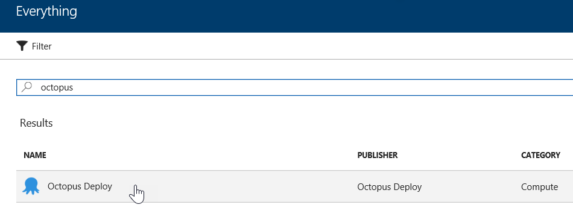

3. A new blade will open with the description of the Octopus Deploy template:

    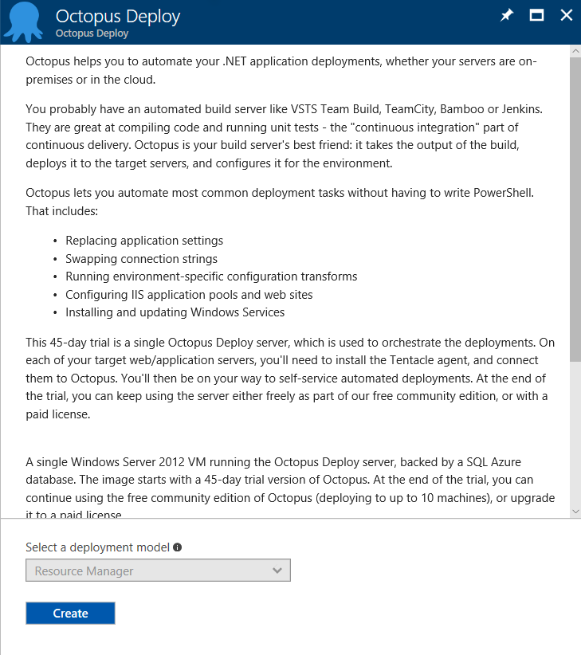

4. Take a few minutes to read the description and follow the links to learn more about Octopus Deploy.

5. Click on the __Create__ button and configure the settings for the virtual machine:

    * Configure the **Resource Group** (we recommend a group on its own)
    * Give the machine a name (it will be accessible on the internet under this name)
    * Assign a password to **_octoadmin_ user** (or choose a new user name). This can be used to remote desktop to the machine
    * Select **virtual machine size** (this will have impact on costs)
    * Assign a password for **_sqladmin_ user**
    * Assign **Octopus Deploy Administrator password**
    * Enter your **name**, your **organization*8 name, and your **email address** (you will be emailed the trial license just in case)

    After filling all required fields, validate the entered data and click OK.

6. Read the terms of use and [privacy policy](https://octopus.com/privacy) [1] for the virtual machine.

7. When you are ready to purchase the virtual machine, click on _Purchase_ button [2].

    

8. Deployment of the Virtual Machine will start and will take a few minutes.

    > While the Virtual Machine deploys you can take a few moments to see [how to install Octopus Deploy](https://octopus.com/docs/installation/installing-octopus) had we not used a Virtual Machine Template.

    When deployment finishes, you will see a notification in the portal notification area:

    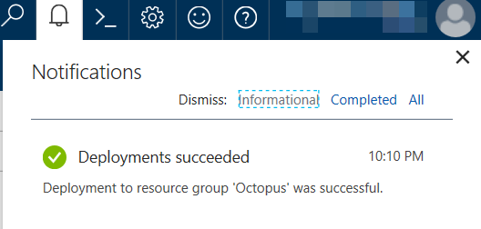

9. If you access the resource group where you have created the virtual machine, you can see all created resources provisioned by the template (virtual machine, SQL Azure database, public IP, storage account, etc.)

    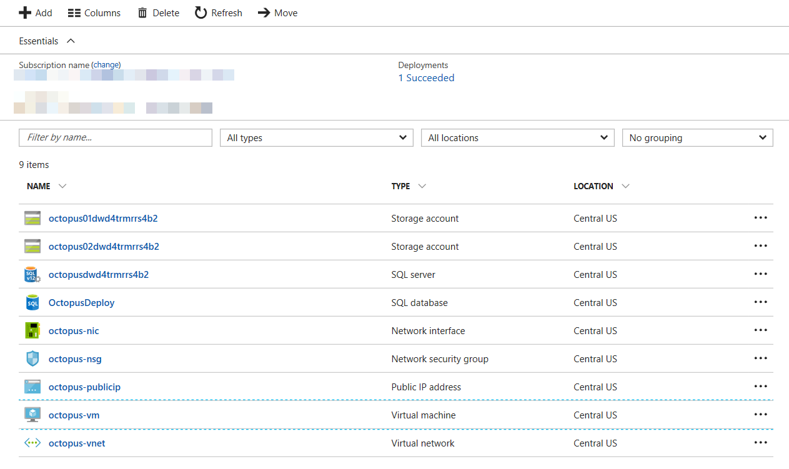

10. We are now ready to login on Octopus Deploy by opening our favorite browser and pointing to the fully qualified domain name that you have created.

    > If you don't remember the name you have assigned to your virtual machine, access the VM on Azure portal and check its details:
    > 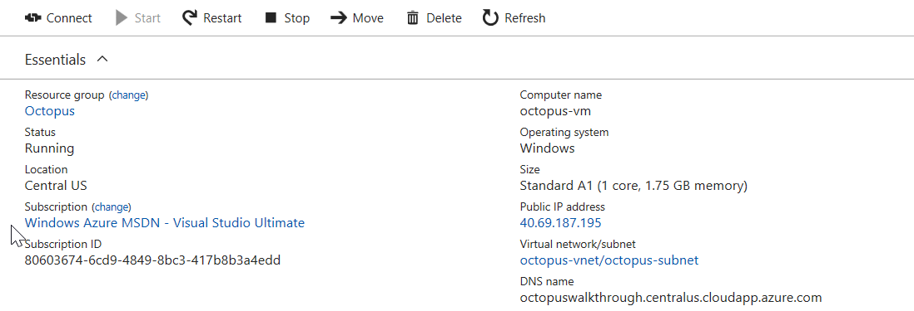

11. After entering your fully qualified domain name on the browser (in our case, it is http://octopuswalkthrough.centralus.cloudapp.azure.com), the login page will appear after a few seconds:

    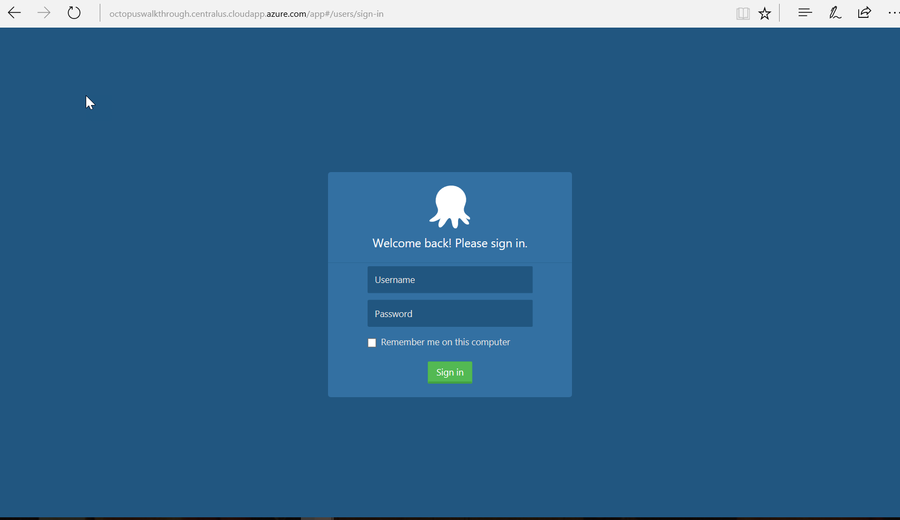

Congratulations. You are now ready to start using Octopus Deploy.

If you want, you can log in (_admin_ if you haven't changed the default username) to take a peek at Octopus Deploy.


### Task 2: Install Octopus Deploy extension in VSTS account


Octopus can deploy software in multiple formats: packages [NuGet](https://www.nuget.org/), which can be created using [OctoPack](https://octopus.com/blog/octopack-3.0),  ZIP files, and other formats.

> Learn more about [packaging applications](https://octopus.com/docs/packaging-applications).

Octopus Deploy supports multiple build automation solutions ([Visual Studio Team Services](https://www.visualstudio.com/team-services/), [Jenkins](https://azuremarketplace.microsoft.com/en-us/marketplace/apps/octopus.octopusdeploy), [TeamCity](http://jetbrains.com/TeamCity), [Bamboo](https://www.atlassian.com/software/bamboo), etc.) or manual builds.

In this exercise, we are going to use Visual Studio Team Service (VSTS) to host the source code and to build the package that Octopus is going to deploy.

> We assume you already have a VSTS account (with administration privileges). If you don't have one, [learn how to sign up for a free VSTS account](https://www.visualstudio.com/en-us/docs/setup-admin/team-services/sign-up-for-visual-studio-team-services).


#### Installing the extension

We are now going to set up [Octopus Deploy Integration](https://marketplace.visualstudio.com/items?itemName=octopusdeploy.octopus-deploy-build-release-tasks) extension from [Visual Studio Marketplace](https://marketplace.visualstudio.com) to quickly package and push applications from Team Build to Octopus Deploy.

1. Open [Octopus Deploy Integration](https://marketplace.visualstudio.com/items?itemName=octopusdeploy.octopus-deploy-build-release-tasks) on your favorite browser and click on the _Install_ button,

    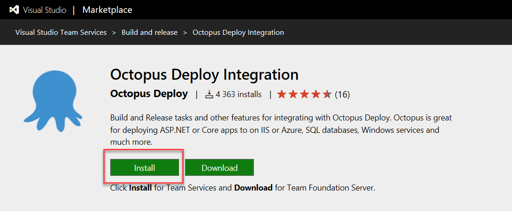

2. Select the account you want to install by clicking on the _Continue_ button and then on _Confirm_.

The extension is now installed and ready to be used.


### Task 3: Configure Octopus Deploy Connected Service as VSTS Service Endpoint

We are now going to set an Octopus Deploy connected service to allow builds to connect to Octopus.

#### Generate an Octopus Deploy API key

First, we need to login to Octopus and create an API key with all the required permissions for the operations we need to perform.

1. Login to Octopus Deploy portal and create an API key.

2. Expand the Admin profile, select the Profile entry,

    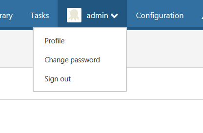

3. click on the _API keys_ tab, and click on _New API key_.

4. Enter the purpose of this team (e.g., VSTS team build),

    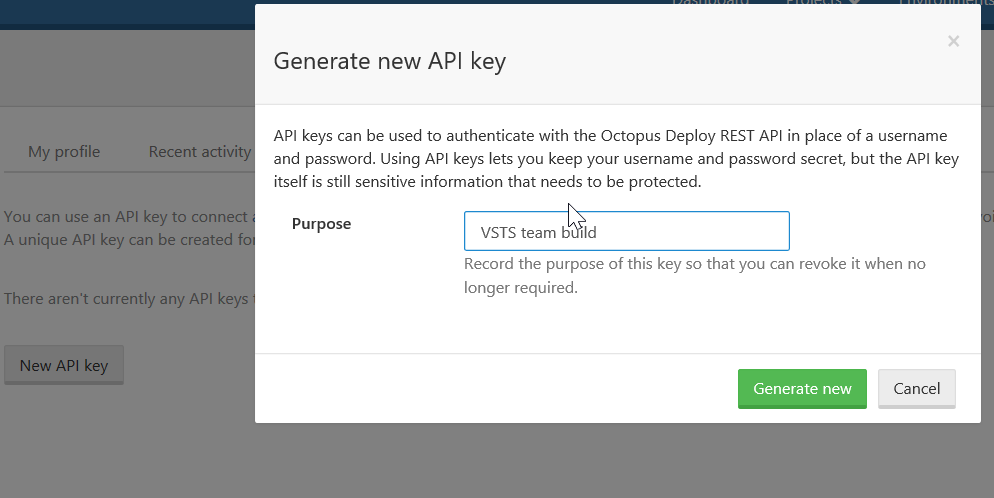

    and click on _Generate new_:

    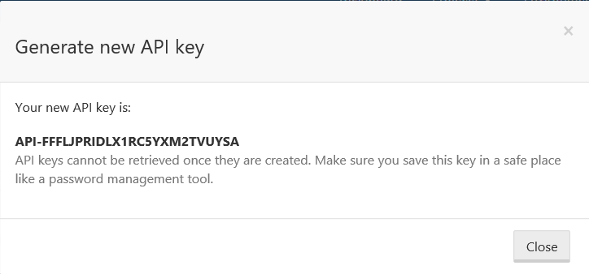

5. Copy the key to a safe place since it cannot be retrieved (you can generate a new one though).

> We need an API Key for a user that has sufficient permissions for the tasks we want to perform in our build and release process (e.g., create releases on the projects we want to deploy to). Since we have used the _admin_ user, we are all good.

> Generating an API key is described in the [Octopus official documentation](https://octopus.com/docs/how-to/how-to-create-an-api-key).


6. lets configure VSTS Connected Service now. Access the Team project we have created previously in VSTS, hover over the cog [1] and then select the Services entry [2]:

    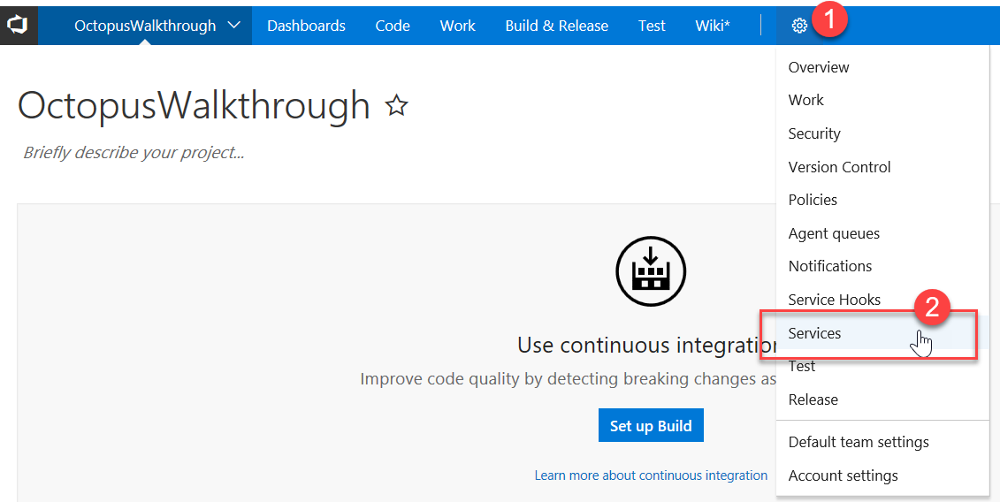

7. Click on _+ New Service Endpoint_ [1] and select Octopus Deploy [2]:

    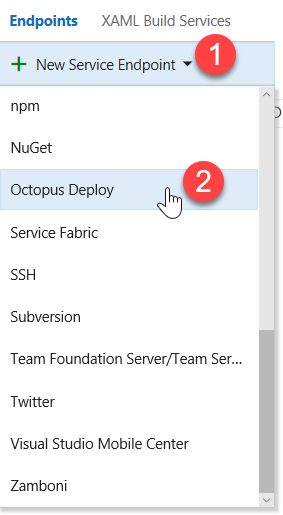

8. Enter a name, the server URL, and the API key obtained previously and click the _OK_ button [1].

    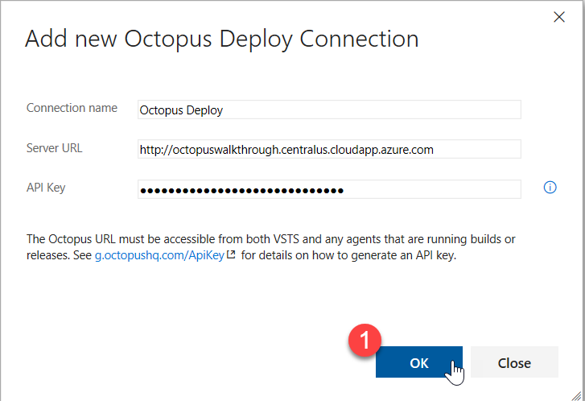

    We are now ready to configure the build.

9. Let's go back to the team project by clicking on the team project name [1] and then clicking on Team Project Home [2]:

    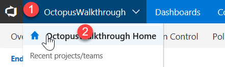


### Task 4: Create a Simple Application and push Code to VSTS

We are going to create a simple ASP.NET using Visual Studio 2017; it is enough for our purpose. But first, we are going create a new team project to hold our application.


1. On the VSTS landing page, we are going to click on the _New Project_ button.

    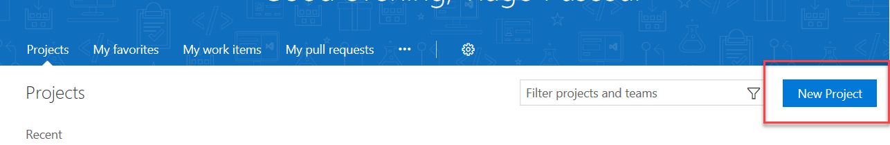

2. We are going to name it _OctopusWalkthrough_ [1], select Git in Version control [2], and click on the _Create_ button [3].

    

    It will take a moment.

3. We are now going to create a simple ASP.NET project and then push the source code to the Git repository on VSTS using Visual Studio.

4. First, make sure we are connected to our Team Project. On Team Menu, select __Manage Connections__.

    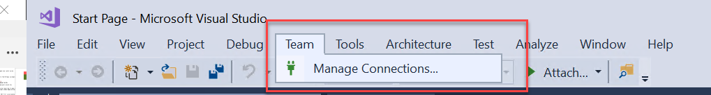

5. On Team Explorer click on __Manage Connections__ and then click on __Connect to Project__.

    

6. A Connect to a Project window will open (enter account and credentials if asked). If you have never connected to the account, click on the __Add TFS Server__ link and enter the URL of your account [2] and click on _Add_ [3]:

    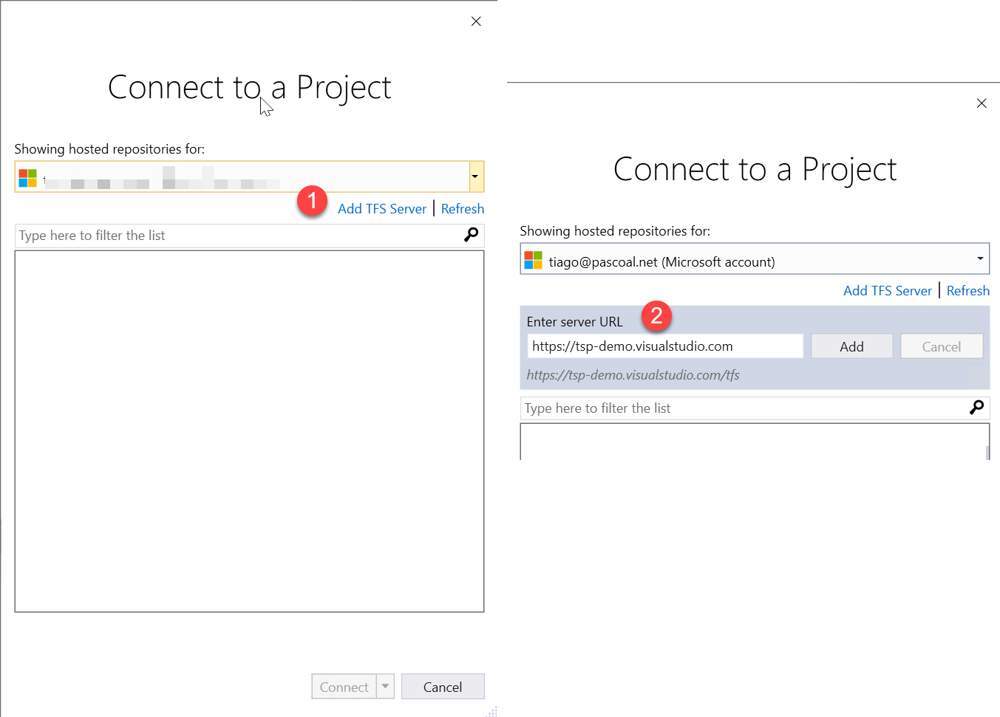

7. Expand your account, select _OctopusWalkthrough_ team project and click _Connect_:

    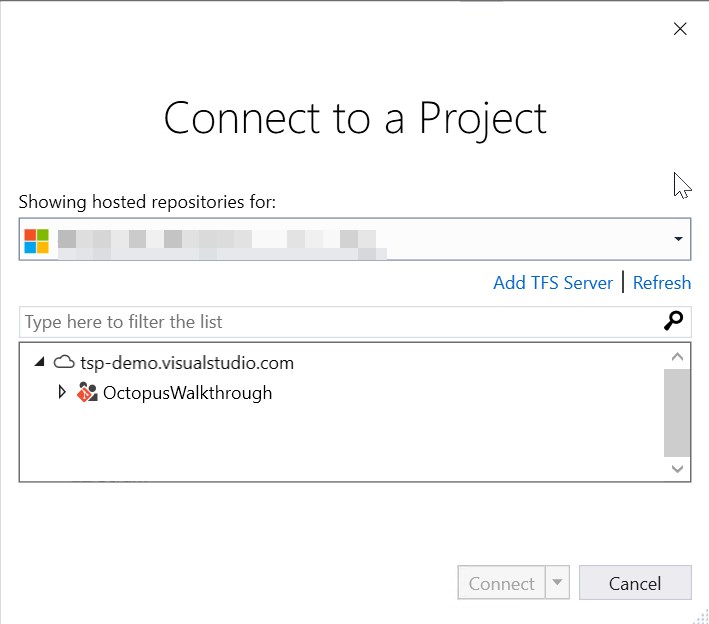

8. You are now connected to _OctopusWalkthrough_. Team Explorer is now giving us the chance to clone the team project Git repository.

    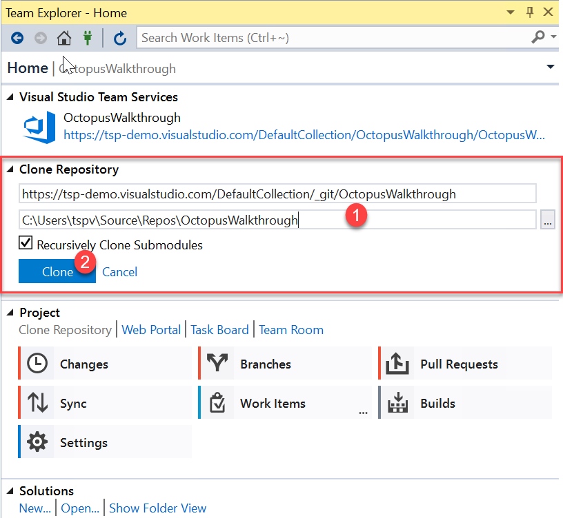

9. If you wish, you can change the path of the local folder [1] where the remote Git repository will be cloned.

10. We now click on the _Clone_ button and the repository will be cloned in a few seconds.

11. Select _File->New->Project..._

    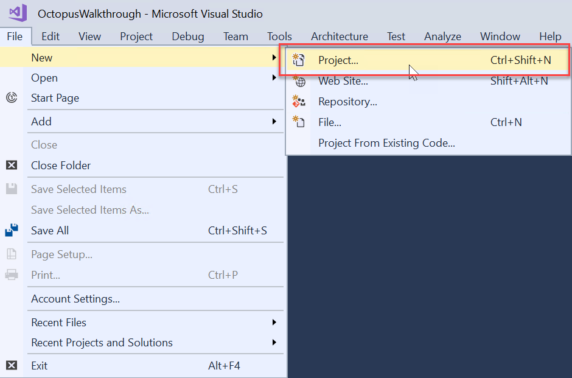

    and select _ASP.NET Web Application (.NET Framework)_[1], name the project, and set its location. [2]

    **Note:**  Make sure the project location is inside the local folder of the repository we have cloned to [3].

    

12. Click on the _OK_ button.

13. Select an MVC project type and click on _OK_:

    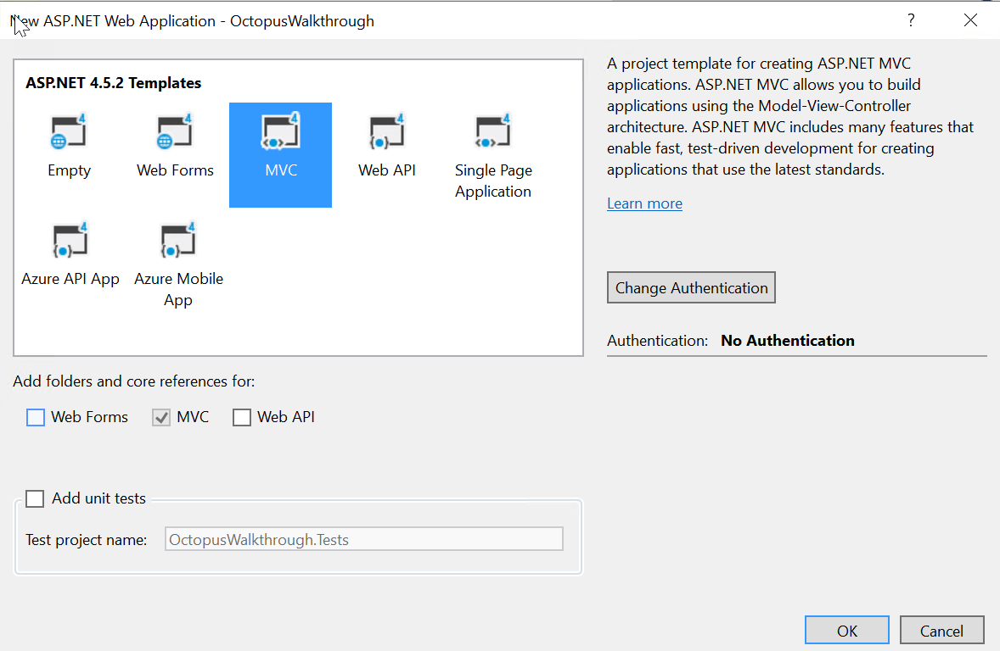

14. Edit the `Web.config` file and add a setting with name `deployedFrom` to the `appSettings` element.

    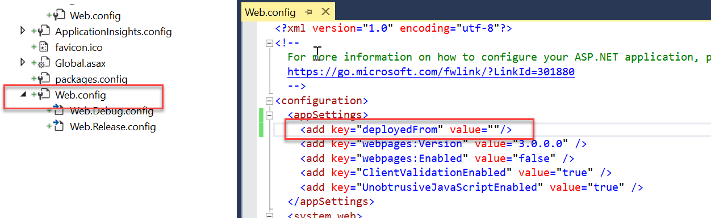

15. Edit `HomeController.cs` file in the `Controllers` folder and add to the `Index` method the following code:

    ```c#

    ViewData["deployedFrom"] = ConfigurationManager.AppSettings["deployedFrom"];

    ```

    

    ```html
    <h1>ASP.NET</h1>
    ```

    with

    ```html
    <h1>ASP.NET deployed from @ViewData["deployedFrom"]</h1>
    ```

16. Edit `Index.cshtml` file in the Views folder and replace

    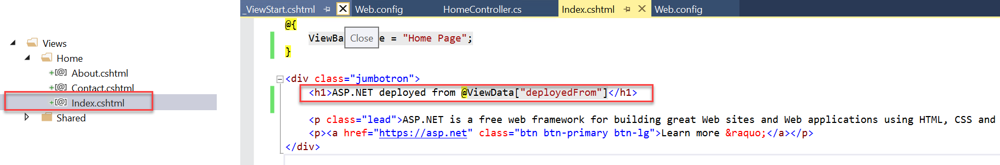


17. Open __Team Explorer__ (_View->Team Explorer_), click on _Changes_, enter a commit message [1], click on the _Commit All_ drop-down, and then click on _Commit All and Push_ [2].


### Task 5: Configure Octupus Deploy Build Integration Tasks in VSTS

1. Open a browser and navigate to your VSTS account. If the project is not in the list of recent projects, then search for it[1].

2. Hover over the team project name and click on _code_ to access the _code_ hub [2]:

    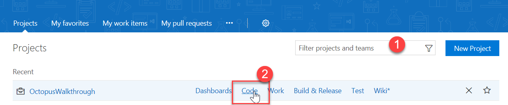

3. You can now see the code in the _OctopusWalkthrough_ repository [1] and you can navigate all files, and even edit them online, but we are more interested in automating the build.

    We can do this in the _Build & Release_ hub, but since there is yet no build for this repository, we will just click on the _Set up build_ button [2] that is sitting on the top upper left corner:

    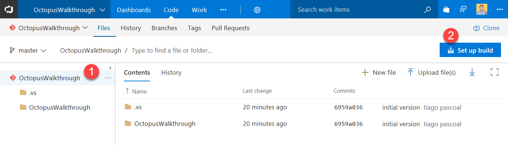

4.  A new window/tab will open with the build editor and first you will see is the list of build templates.

    Hover over the ASP.NET template and click on the _Apply_ button:

    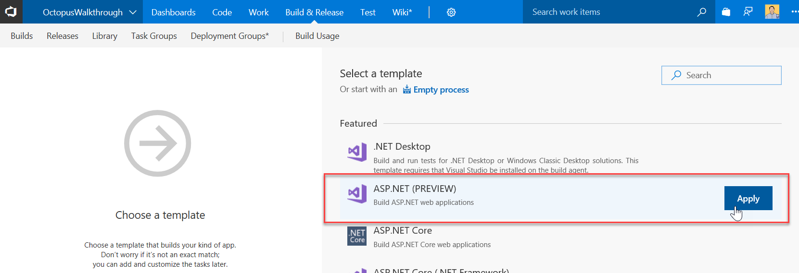

5. Select __Hosted__ in the __Default Agent queue__ dropdown [1]:

    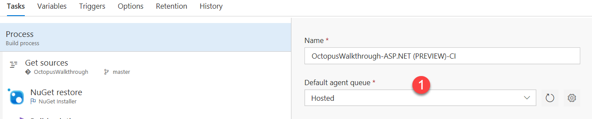

6. Click on the _Build Solution_ task and replace the _MSBUild arguments_ parameter value with the value:

    ```
    /p:DeployOnBuild=true /p:WebPublishMethod=Package /p:PackageAsSingleFile=true /p:SkipInvalidConfigurations=true /p:PackageLocation="$(build.artifactstagingdirectory)\\"
    ```

    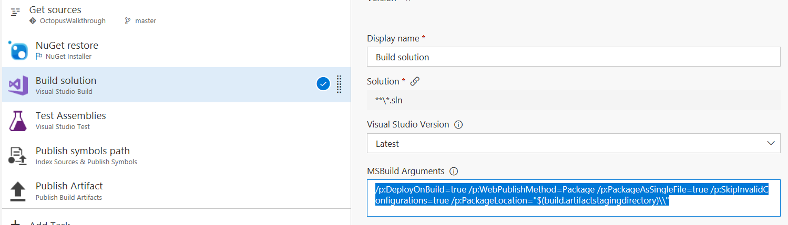

7. Remove Unwanted Tasks byt selecting the _Test Assemblies_ and the _Publish symbols paths_ tasks and remove them from the build definition (right click and then click on _Remove selected task(s)_):

    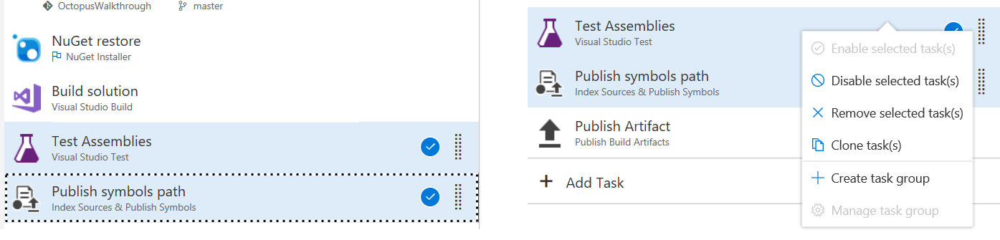

8. Click on the _+ Add Task_ and add the following tasks (use the _add_ button). Before clicking on the add, make sure you click on the _Build solution_ task, so new tasks are added between _Build solution_ and _Publish Artifact_ task).

    If the tasks are not added before the _Publish Artifact_ task, don't worry---you can reorder them by dragging and dropping in the right order).

    * Package Application [1]
    * Push Package(s) to Octopus [2]

    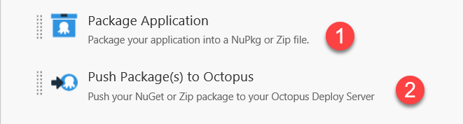

    **Note:** use the search box to find the tasks faster (enter _package_ for example): 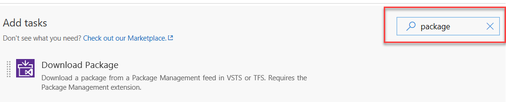

9. Now, configure the task's parameters:

    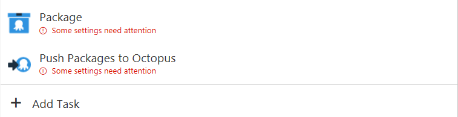

10. Click on _Package_ task and enter the following values:

    * OctopusWalkthrough for **Package ID** field
    * select NuPkg  for the **Package Format** dropdown
    * 1.0.$(Build.BuildId) for **Package Version** (notice the 1.0 version is hardcoded. We could use a variable for readability and easier maintenance.)
    * $(Build.ArtifactStagingDirectory) for **Source Path**
    * $(Build.ArtifactStagingDirectory)\packages for **Output Path**

    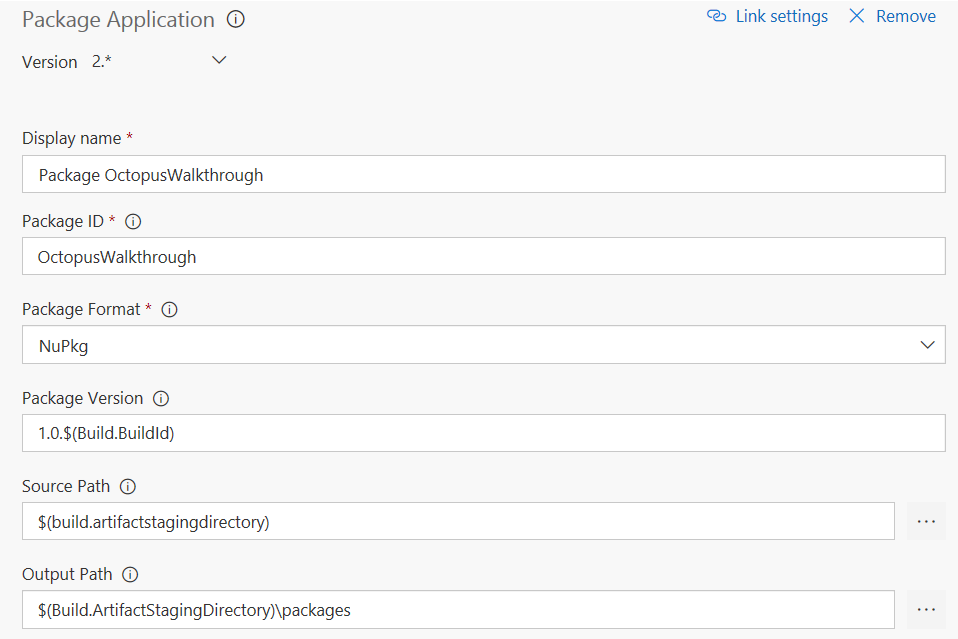

    **Note:** Octopus requires the [semver](http://semver.org/) versioning format for the build number. If you intend to build from multiple branches, you can use the 1.0.$(BuildID)-$(SourceBranchName).

    We only configured the version for the OctoPack package version. Octopus uses this version; it is recommended that we use a similar version number for the build itself for easier correlation between builds and releases in Octopus.

11. Click on _Push Packages to Octopus_ task and enter the following values:

    * The connected service name we configured previously in the **Octopus Deploy Server** drop-down
    * $(Build.ArtifactStagingDirectory)\packages\*.nupkg for **Package**

    

    We are now ready to save and queue our first build.

12. Click on _Save & queue_,

    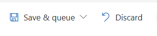

13. accept the default parameters, and then click on _Queue_ button:

    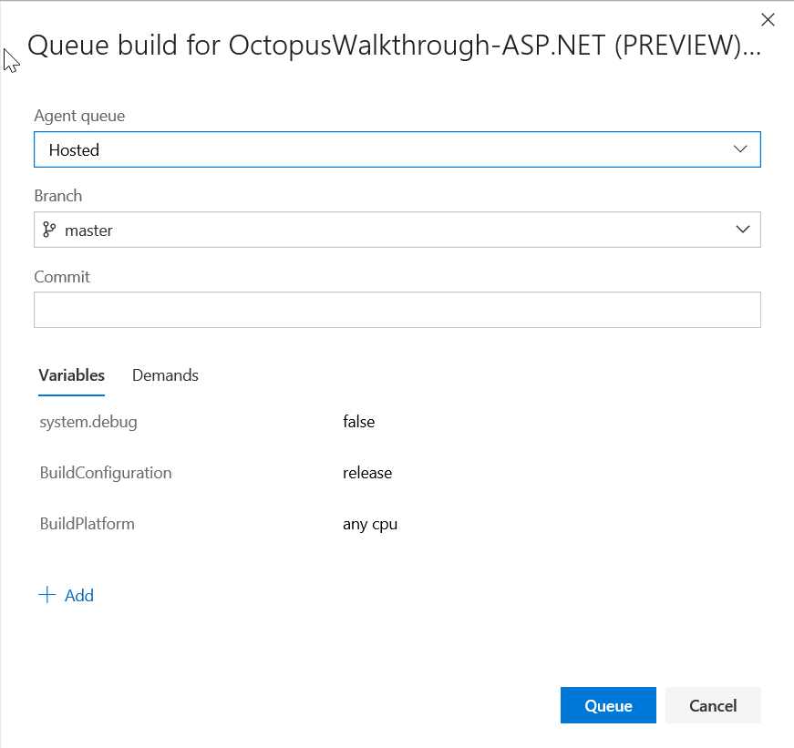

14. The build is queued and will start as soon as there is an available agent. Click on the build number:

    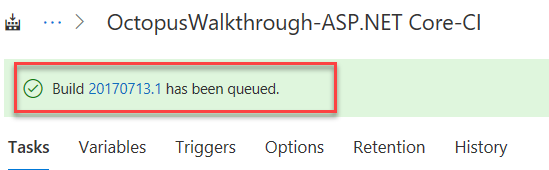

15. We are now going to check the results of our build execution.

    Navigate to Octopus Deploy portal and log in. We now have a check mark on the _Application Package_ set. It means we have successfully uploaded our first package to the Octopus Deploy repository[1]. Click on the _Library_ menu [2].

    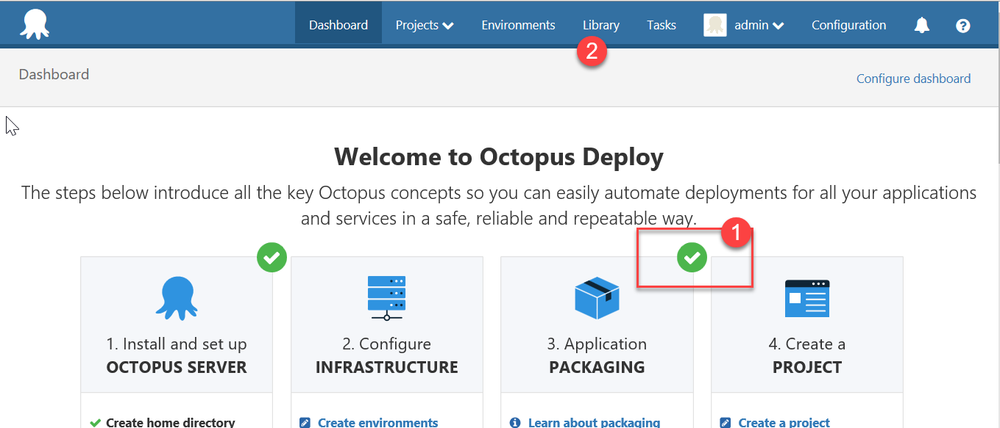

16. We can see we now have one package [1] in the repository. The _OctopusWalkthrough_ package is visible [2] on the list of Available packages:

    

    With our package in Octopus Deploy Repository, we are now ready to deploy it.


### Task 6: Create a Web App and Service Principal in Azure for deployment

1. Login to [Azure portal](https://portal.azure.com) and click on the _+_ sign [1], click on _Web + Mobile_ [2], and finally, click on _Web App_[3].

    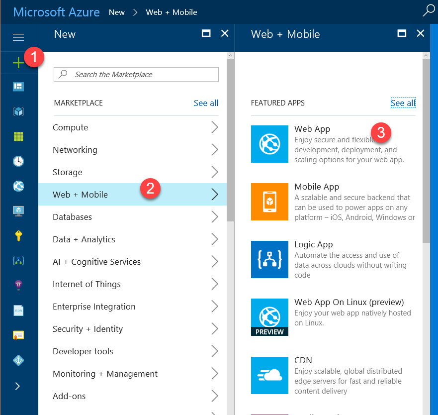

2. A new blade will open. Fill in the details to create a Web Application:

    * Enter a name [1]
    * Assign a resource group (create a new one or use the one used previously, for example) [2]
    * Select the Service plan [3]. If you do not have any service plan on the selected subscription [4], then create a new one.

    

3. Click on the _Create_ button [5]; in a few seconds, the web app is provisioned.

4. Before being able to deploy to Azure, we need to provide Octopus Deploy with the means to authenticate itself against Azure to perform the necessary operations.

5. Open Octopus Deploy dashboard and click on _Environments_ [1] and then Select _Accounts_ [2]:

    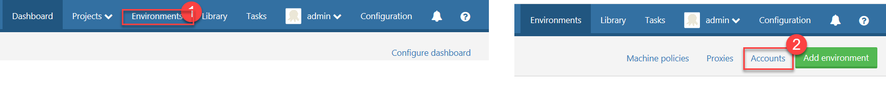

6. Click on _Add account_ in the Azure Subscriptions section.

    Octopus Deploy supports two kinds of Azure Authentication:

    * Certificate which can be used to interact with Azure Web Apps. This implies creating a certificate and uploading it to the portal.
    * A Service Principal, which is required if you want to use Azure Resource Management.

    We will go with service principal authentication. If you have a service principal created already you can re-use that.

    There are three ways of creating a service principal:

    * [Using PowerShell](https://docs.microsoft.com/en-us/azure/azure-resource-manager/resource-group-authenticate-service-principal)
    * [Azure Command Line interface](https://docs.microsoft.com/en-us/cli/azure/create-an-azure-service-principal-azure-cli?toc=%2fazure%2fazure-resource-manager%2ftoc.json)
    * [Azure Portal](https://docs.microsoft.com/en-us/azure/azure-resource-manager/resource-group-create-service-principal-portal)

7. After creating a service principal using your preferred method, you will be ready to configure the Account on Octopus Deploy.

    **Note:**  Don't forget to grant permissions to the service principal (at least to the resource group you created for the Web Application).

8. Enter the account settings for the service principal data:

    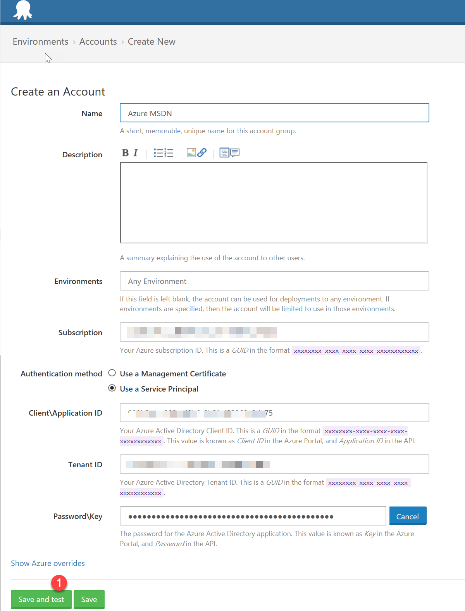

9. Next, click on the _Save and test_ button [1].

    If the data verifies successfully, a green checkmark appears:

    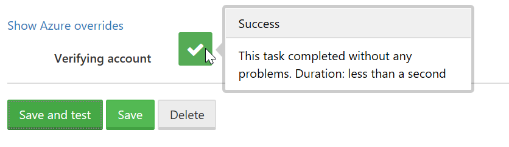

### Task 7: Create Deployment Environments

We need to create an environment so we can deploy to one or more targets. An environment represents a group of deployment targets that we can deploy to at the same time.

It is common to have a set of environments, for example, development, testing, and production.

1. On Octopus Deploy portal, click on environment [1] and then click on _Add environment_ button [2]:

    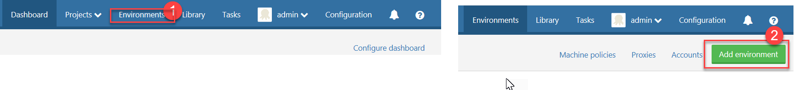

2. Enter _Development_ on the environment name and give it a description of _Octopus Walkthrough Development Environment_ and click on the _Save_ button.

    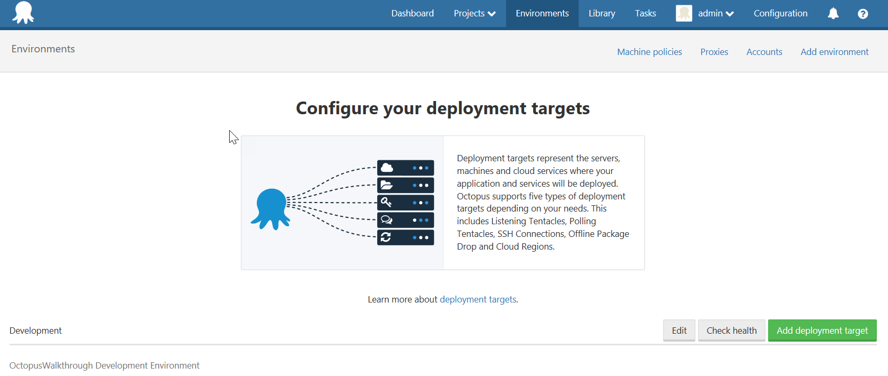

    We now have an environment to deploy to; now, we need to define what we are going to deploy by creating a project.

### Task 8: Create an Octopus Deploy Project and configure variable replacement

1. On Octopus Deploy portal, click on _Projects_ drop down [1] and then click on _All_[2]. When the project screen loads, click on the _Add project_ button [3].

    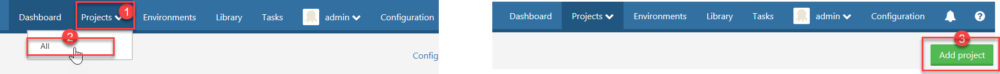

2. Give the project a name, __Octopus Walkthrough__, and description, and then click on the _Save_ button.

    We will be routed to the project details page:

    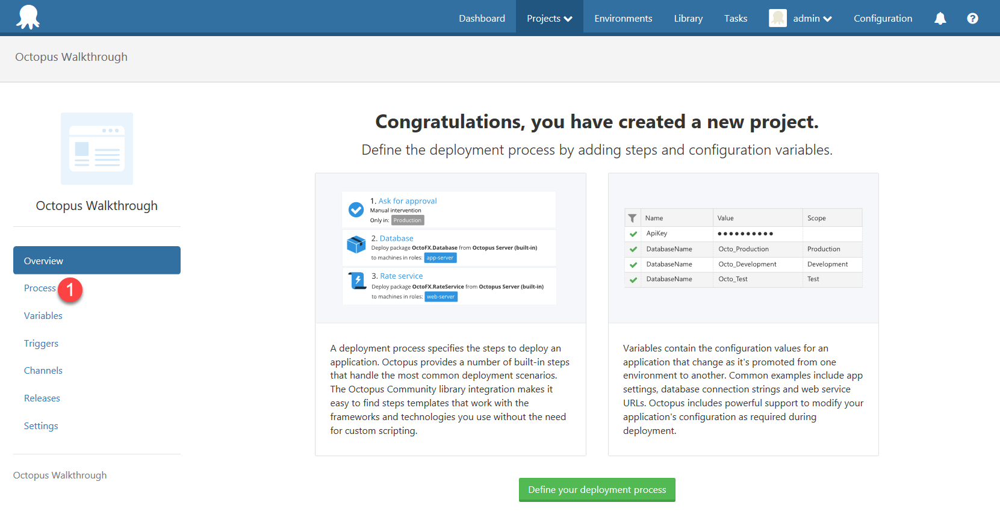

3. We are now ready to start defining the deploy process. Click on the _Process_ tab [1]:

    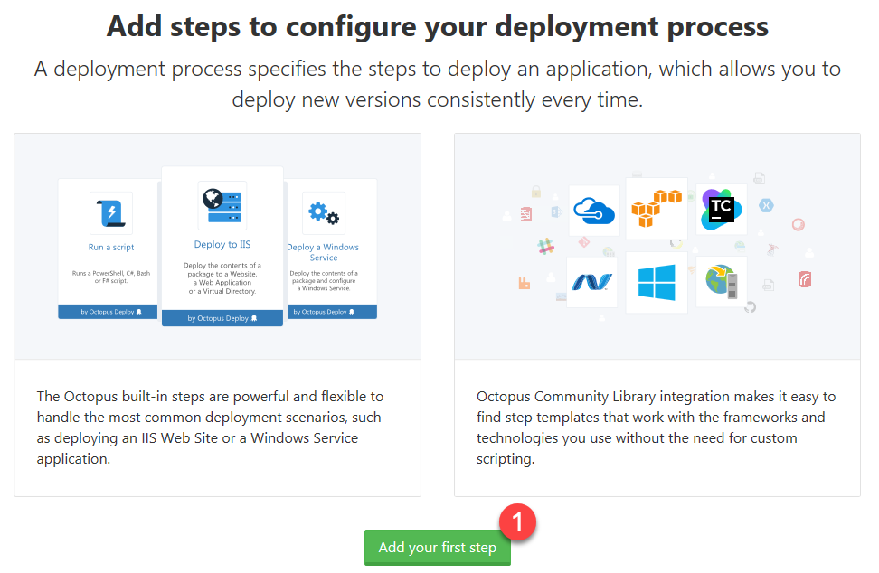

4. Then, click on the _Add your first step_ button [1].

5. The list of step templates appears:

    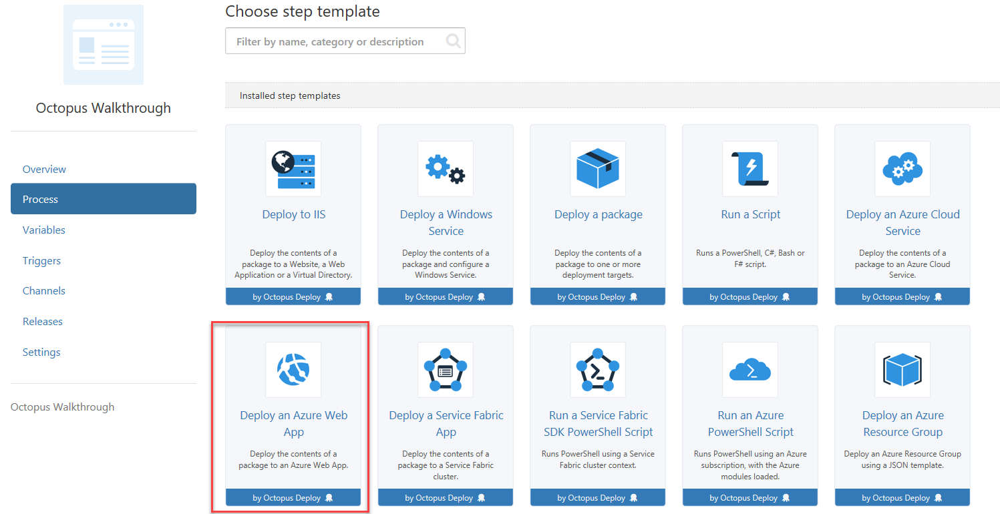

6. Click on _Deploy an Azure Web App_ and configure the step details:

* __Step Name__ Deploy to Web App

* __Package__
  * __Run on__ Octopus Server
  * __Package ID__ OctopusWalkthrough (the id of package we packaged and published previously using VSTS Team Build)
   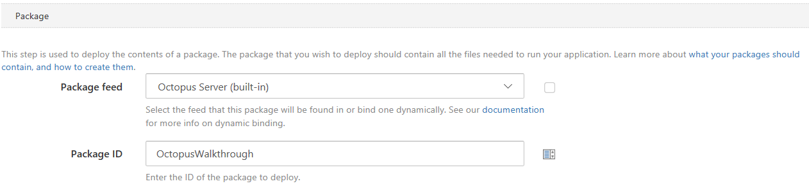

* __Azure__
  * __Account__ Select the Azure Account name you created previously
  * __Web App__ Select from the dropdown the name of the Web App created previously: 
  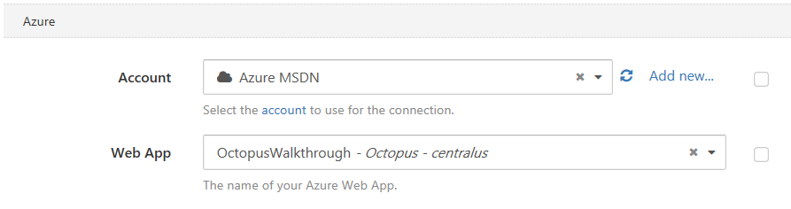

> The __Web App__ value is hard coded to the web application name. If we want to deploy to multiple web applications (representing different environments) we should use an expression and a variable to deploy to multiple environments.

7. Click on _Configure features_ [1], select the _Configuration Variables_ check box [2], and then click on the _Apply_ button [3]:

    

8. Click on the _Save_ button and then click on the _Variables_ tab.

9. Click on the first row of the _Project Variables_ and enter __deployedFrom__ as the variable name and __Octopus Deploy__ as the value:

    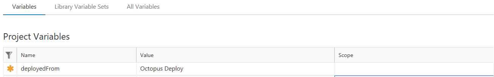

10. The star is an indicator the variables are unsaved. Click on the _Save_ button on right top of the screen.

    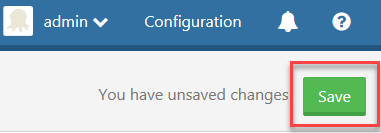

> Learn more about [Configuration Variables](https://octopus.com/docs/deploying-applications/configuration-files).

### Task 9: Create a Release and Deploy

1. On the project details click on the _Create release_ button [1] or the _Create a release_ link [2], or click on the _Releases_ tab and then on the _Create your first release_ button:

    

2. Give the release a version number and select the OctopusWalkthrough package version (there should be only one unless you have built the code multiple times) and click on the _Save_ button:

    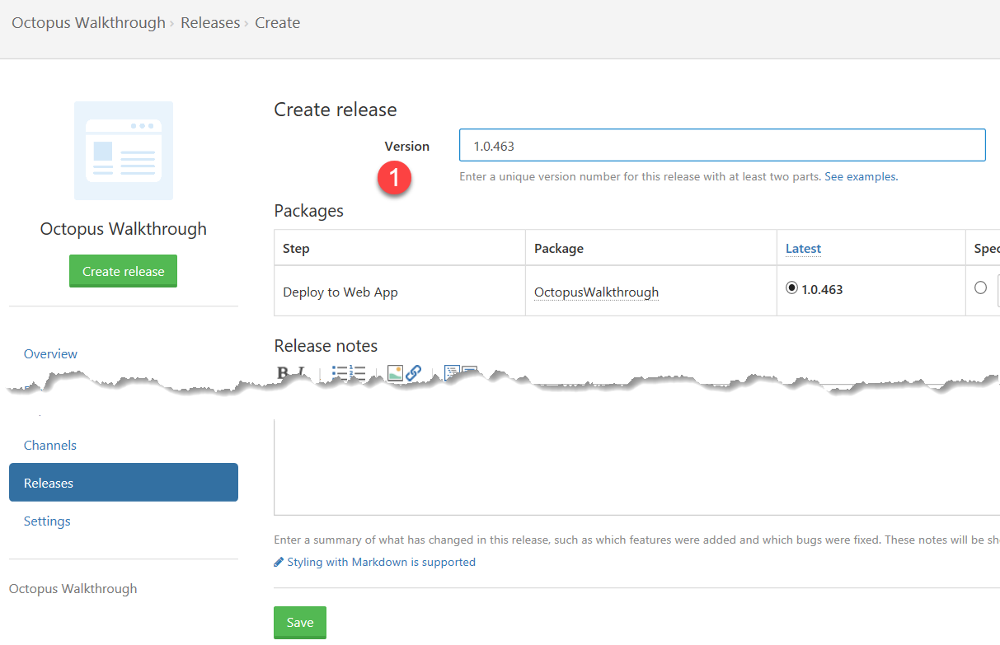

> We could automate creation of a release from VSTS build. This way, we could have a continuous deployment scenario by setting up VSTS in continuous integration mode and deploy it using Octopus Deploy every time someone pushed a change to VSTS.

3. We are now ready to deploy. Click on the _Deploy to Development_ button [1] (or click on the _Deploy to_ link [2] for more advanced scenarios):

    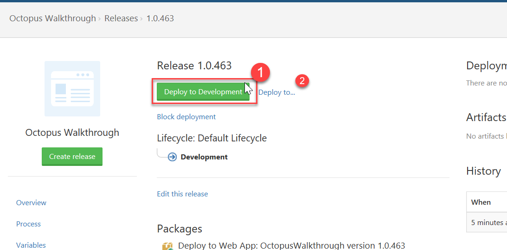

4. After clicking on _Deploy to Development_, click on the _Deploy now_ button [1]:

    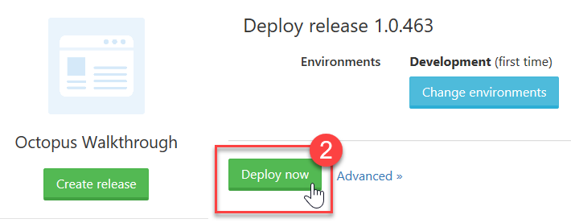

5. Deployment will start, and you can see in real time the status of the deployment:

    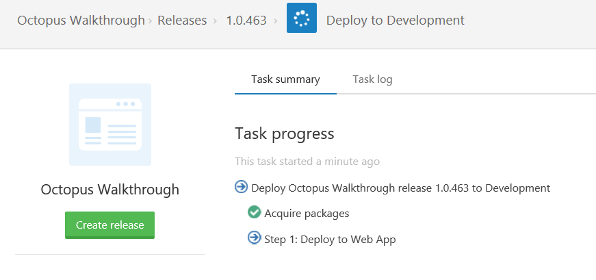

6. After deployment is complete, on the front of the release, you can now see a green check mark [1] signaling the deploy was successful.

7. On the task progress [2], you can see the status of all tasks.

8. On the history zone [3], you can see all changes that this release has suffered.

9. Since this is our first deployment, you can also see a congratulation banner [4].

10. If we navigate to the Azure Web Site we have deployed to, we can now see the application we have created previously is now deployed:

    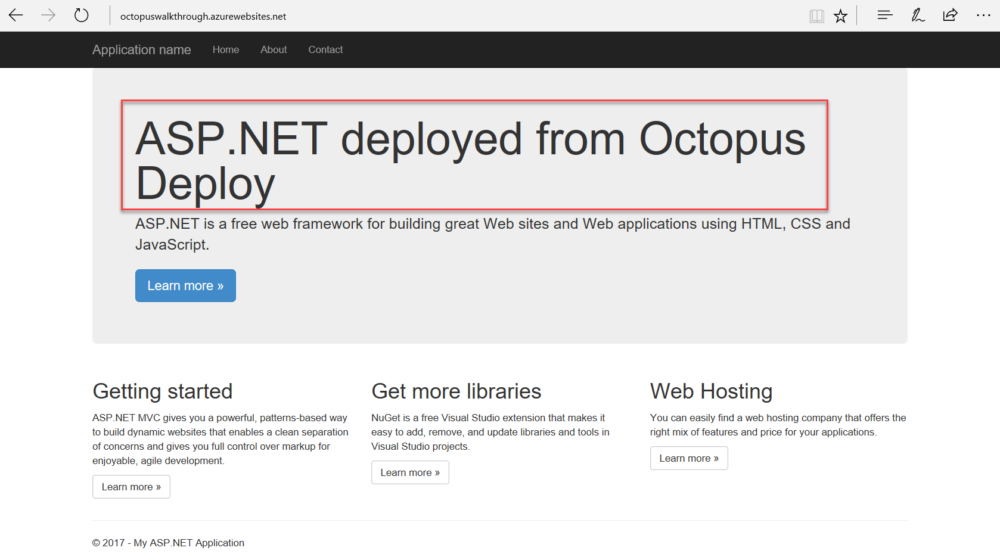

    As the message says, "ASP.NET deployed from Octopus Deploy," which means we have used the configuration variables to make a change unique to our process.

We have now successfully deployed an application into an Azure Web Application.


<h3><span style="color: #0000CD;"> Summary</span></h3>
In this lab you completed the following tasks:

- Installed Octopus Deploy on an Azure virtual machine using Azure Portal
- Installed Octopus Deploy extension in VSTS account
- Configured Octopus Deploy Connected Service as VSTS Service Endpoint
- Created a Simple Application and push Code to VSTS
- Configured Octupus Deploy Build Integration Tasks in VSTS
- Created a Web App and Service Principal in Azure for deployment
- Created Deployment Environments
- Created an Octopus Deploy Project and configured variables
- Created a Release and Deployed your sample app to azure.
