---
layout: page
title:  Continuous Integration with Azure DevOps
category: CICD
order: 1
---

In this lab we have an application called PartsUnlimited. We want to set up Azure DevOps to be able to continuously integrate code into the master branch of code. This means that whenever code is committed and pushed to the master branch, we want to ensure that it integrates into our code correctly to get fast feedback. To do so, we are going to be setting up a Continuous Integration Build pipeline (CI) that will allow us to compile and run unit tests on our code every time a commit is done in Azure DevOps.

<h3>DevOps MPP Course Source </h3>

- This lab is used in course <a href="https://www.edx.org/course/continuous-integration-continuous-microsoft-devops200-3x-0" target="_blank">DevOps200.3x: Continuous Integration and Continuous Deployment</a> - Module 1.

<h3> Lab Video </h3>

<h3> Pre-requisites:</h3>

- An active Azure DevOps account (ex-VSTS). <a href="https://www.visualstudio.com/en-us/docs/setup-admin/team-services/sign-up-for-visual-studio-team-services" target="_blank">Sign up for Azure DevOps</a>

<h3> Lab Tasks:</h3>

- Import Source Code into your Azure DevOps Account: 
- Create Continuous Integration Build pipeline:
- Test the CI Trigger in Azure DevOps:

<h3>Estimated Lab Time:</h3>

- approx. 75 minutes  

### Task 1: Import Source Code into your Azure DevOps Account with Git

We want to push the application code to your Azure DevOps account in order to use Azure DevOps Build. You will connect your own Azure DevOps account, download the PartsUnlimited source code, and then push it to your own Azure DevOps account. There are two approaches to doing this: a) Use the Git command line, or b) Use Visual Studio.

> **Talking Point:** For this lab, we are using the Azure DevOps Git project. The next couple of steps will allow you to add the PartUnlimited source code to the Git master repository.

If you haven't already, create a new team project in your Azure DevOps account that uses Git for source control.

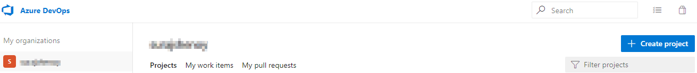

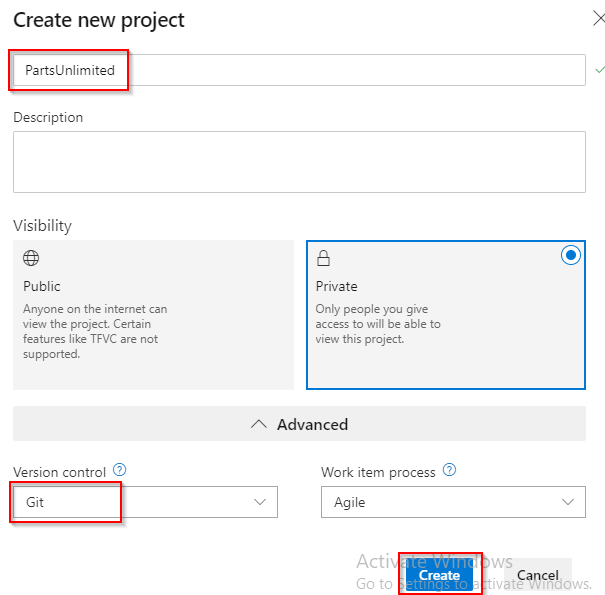

**1.** Clone the repository to a local directory.

Create a parent **Working Directory** on your local file system. For instance, on a Windows OS you can create the following directory:

`C:\Source\Repos`

Open a command line (one that supports Git) and change to the directory you created above.

Clone the repository with the following command. You can paste in the URL if you copied it in Step 1.  In the example below, the clone will be copied into a directory named HOL. Feel free to use whatever directory name you like, or leave it blank to use the default directory name:

	git clone https://github.com/Microsoft/PartsUnlimited.git HOL

After a few seconds of downloading, all of the code should now be on your local machine.

Navigate to the directory that was just created.  In a Windows OS (and assuming you used HOL as the directory name), you can use this command:

	cd HOL

**2.** Remove the link to GitHub.

The Git repo you just downloaded currently has a remote called _origin_ that points to the GitHub repo.  Since we won't be using it any longer, we will delete the reference.

To delete the GitHub remote, use:

	git remote remove origin

**3.** Find the URL to access the Azure DevOps Git repo

First, we need to find the URL of the empty Git repository in Azure DevOps.  If you remember your account name, and the Team Project name you created, the URL to the default Git repo can be easily assembled:

	https://dev.azure.com/<organization>/_git\<project>

Alternatively, you can use a web browser to browse to your account, click into your project, and click the Repos tab to get to your default Git repository:

	https://<account>@dev.azure.com

Additionally, at the bottom of the web page, you will see the two commands that we will use to push the existing code to Azure DevOps.

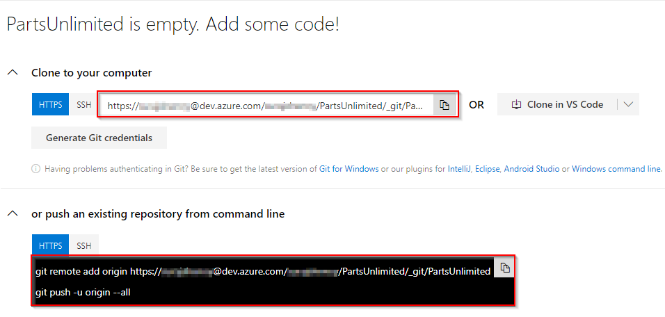

**4.** Add the link to Azure Devops and push your local Git repo

In the local directory from Step 1, use the following command to add Azure DevOps as the Git remote named _origin_. You can either type the URL you found in Step 3, or simply copy the first command from the Azure DevOps web page.

	git remote add origin https://<account>@dev.azure.com/<account>/<project>/_git/<project>
Now, push the code, including history, to Azure DevOps:

	git push -u origin --all
*Congratulations*, your code is now in Azure DevOps!

### Task 2: Create Continuous Integration Build pipeline

Here you will create a build definition that will be triggered every time a commit is pushed to your repository in Azure DevOps. A continuous integration build will give us the ability check whether the code we checked in can compile and will successfully pass any automated tests that we have created against it.

**1.** Go to your **account's homepage**:

	https://dev.azure.com/<account>

**2.** Click on your project to open it.

**3.** Once on the project’s home page, click on the **Pipelines**  at the left of the page, then on **Builds**, and then on **New pipeline**.

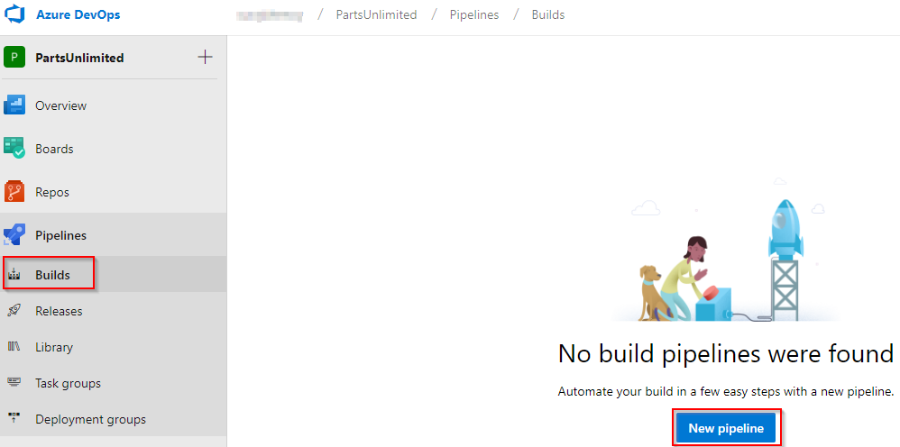

**4.** Select **Use the classic editor** option from the bottom.
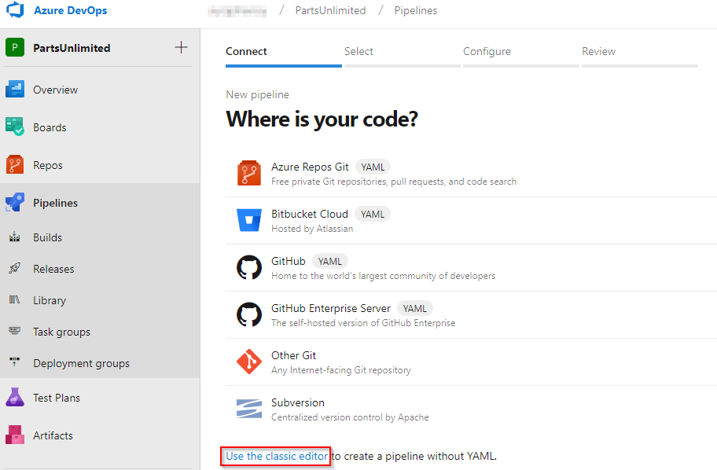

**5.** Select source code location as **Azure Repos Git** and make sure you select the correct repository, **master** branch and click *Continue*.

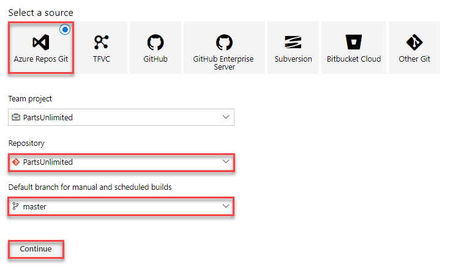

**6.** Click the **Empty job** link.

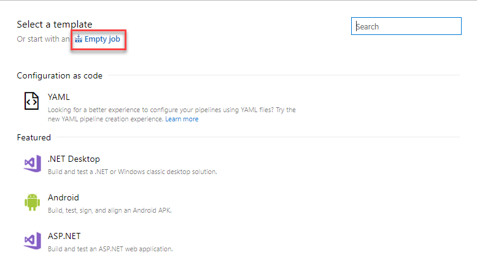

**7.** Click on the **pipeline** and provide a name for your build pipeline and select **HOSTED VS2017** in the agent pool drop down if that is not selected.

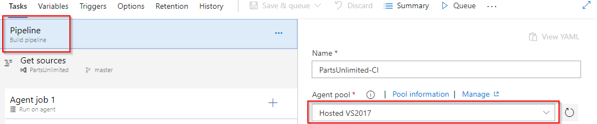

**6.** To start adding tasks to the you need to select the **+** next to **Agent job 1**. 

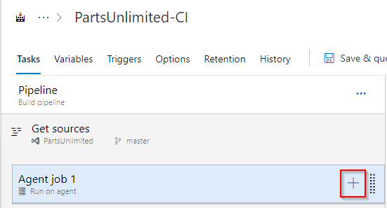

**7.** In the **Add tasks** dialog, select the **Utility** page and then add a **PowerShell** task.

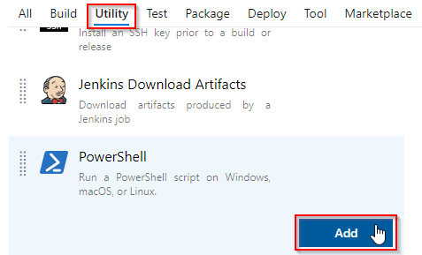

**8.** Still in the **Add tasks** dialog, select the **Test** page and add a **Publish Test Results**.

 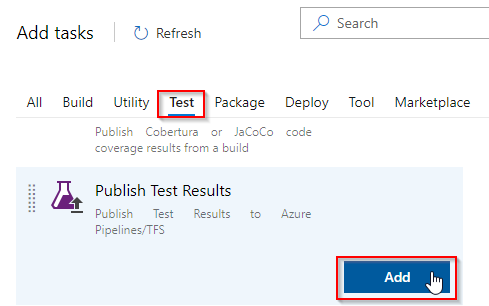

 **9.** Still in the **Add tasks** dialog, select the **utility** page and scroll to the **Copy Files to** task, select and click **Add**.

 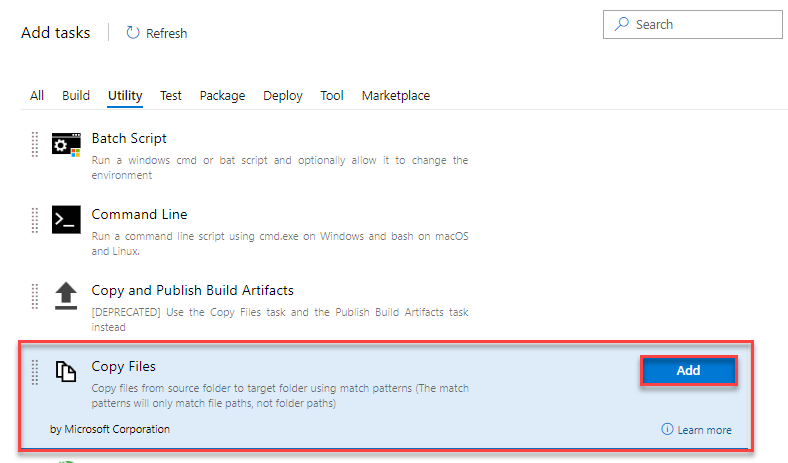

**10.** Select the **Utility** page again and add a **Publish Artifacts** task.

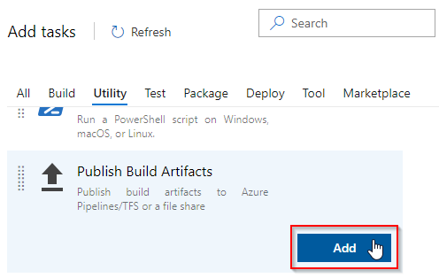

**11** Select the **Tool** tab again and add a **Use Python version** task.

**12** Still in the **Tool** tab, add a **Node.js tool installer** task.

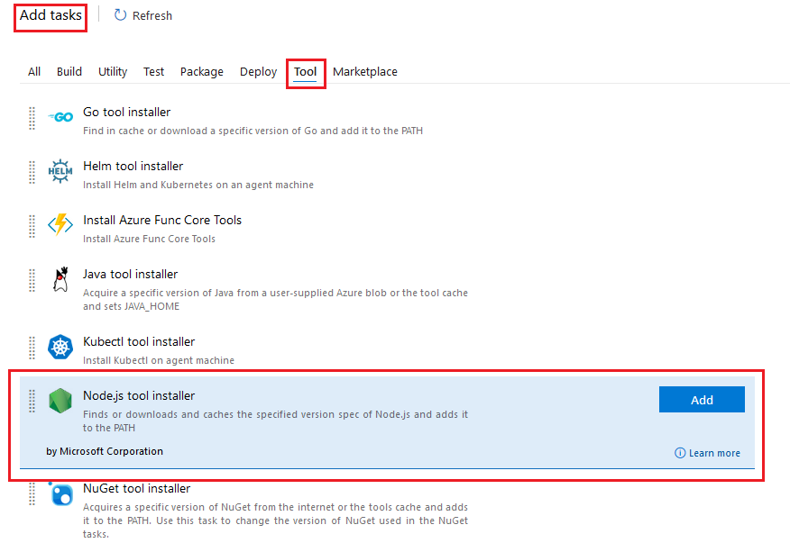

**12.** On the **PowerShell Script** task, click on the blue **rename** pencil icon and change the name of the step to **dotnet restore, build, test and publish** and click **OK**

**13.** Select **File Path** for the **Type** property, enter **"build.ps1"** for the **Script filename** property and **$(BuildConfiguration) $(Build.SourcesDirectory) $(build.stagingDirectory)** for the **Arguments** property.

> **Note:** The build.ps1 script contains commands using the **dotnet.exe** executable used by .Net Core.  The build script does the following: restore, build, test, publish, and produce an MSDeploy zip package.

**14.** On the **Publish Test Results** task, change the **Test Result Format** to **VSTest** and the **Test Results File** to **\*\*\testresults.xml**.

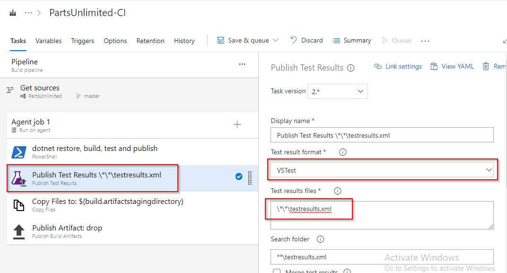

**15.** On the **Copy Files To** task, change the **Source Folder** to **$(build.sourcesdirectory)** and the **Target Folder** to **$(build.artifactstagingdirectory)**.

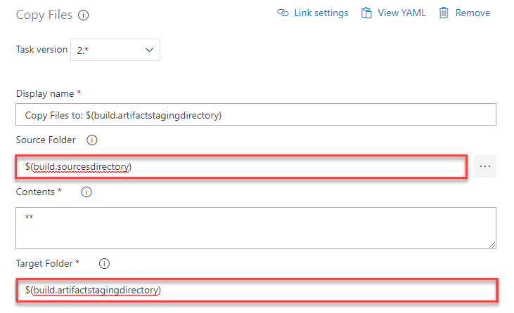

**16.** On the **Publish Artifact** task, make sure that the **Path to publish** has the value **$(build.artifactstagingdirectory)** and the **Artifact name** as **drop**.

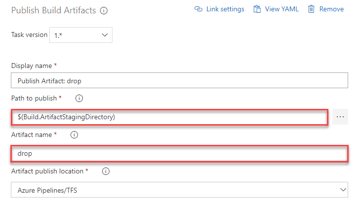

**17.** Move the **Use Python version** task to the top of the list of tasks in the pipeline and for **Version spec** enter **2.7**

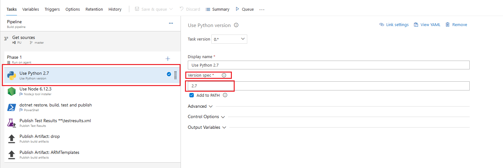

**18.** Move the **Node.js tool installer** task to be second in the list of tasks in the pipeline and for **Version spec** enter **6.12.3**

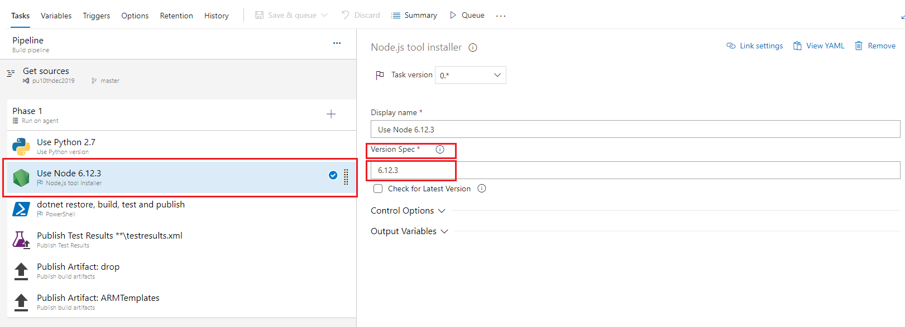

**19.** Select the **Variables** tab and a new variable that will be used by the build.ps1 PowerShell script; **BuildConfiguration** with a value of **release**.

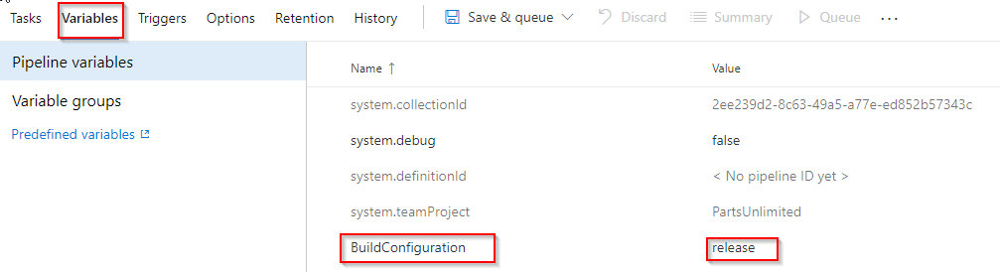

**20.** Click on the **Triggers** tab and verify that the **Enable continuous integration (CI)** option is enabled for your project to build the solution every time a change is checked in. Also make sure the filter includes the appropriate branch, in this case **master*, also and that **Batch changes while a build is in progress** checkbox is unchecked.

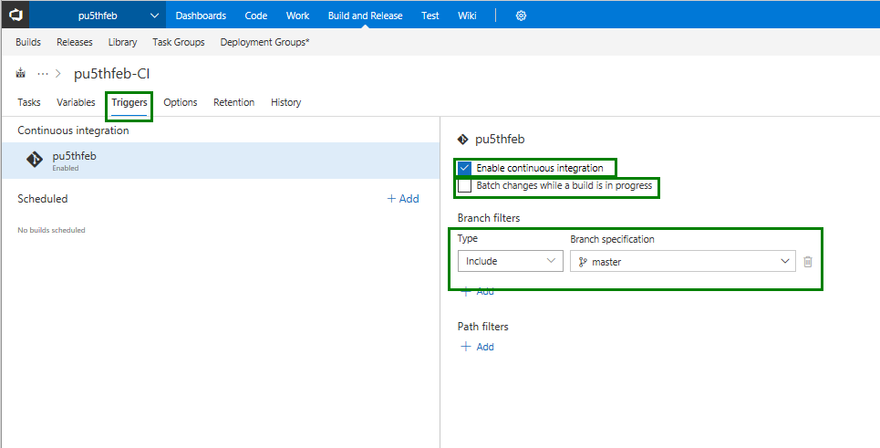

> **Note:** To enable Continuous integration in your project, check the **Enable continuous integration (CI)** checkbox. You can select which branch you wish to monitor, as well.

**21.** Click **Save & queue** and select the **Save** option.

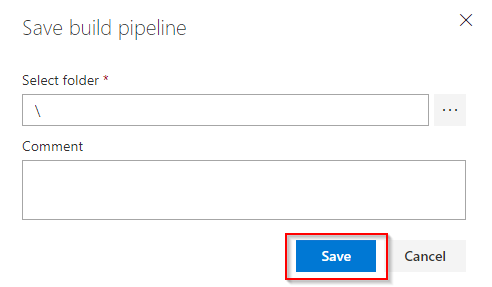

### Task 3: Test the CI Trigger in Azure DevOps

Let's test the Continuous Integration build (CI) build pipeline we created by changing code in the PartsUnlimited project with Azure DevOps.

We will now test the **Continuous Integration build (CI)** build we created by changing code in the Parts Unlimited project with Azure DevOps.

**1.** Select the **Code** hub and then select your your repo, **Parts-Unlimited**.

**2.** Navigate to **/src/PartsUnlimitedWebsite/Controllers** in the PartsUnlimited project, then click on the ellipsis to the right of **HomeController.cs** and click **Edit**.

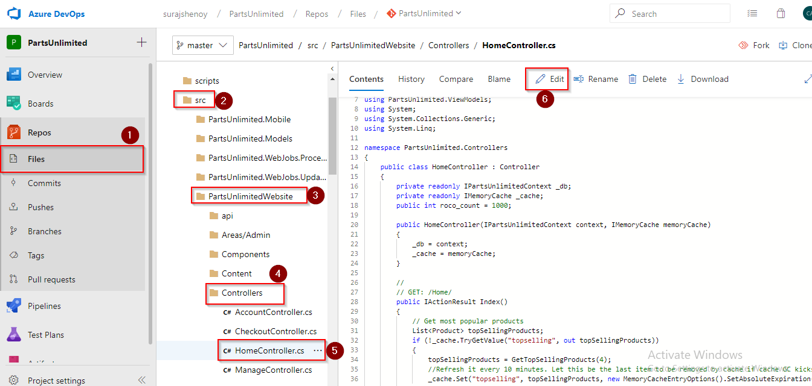

**3.** After clicking **Edit**, add a comment (i.e. *//Testing CI*) after the last *Using* statement. Once complete, click **Commit...**.

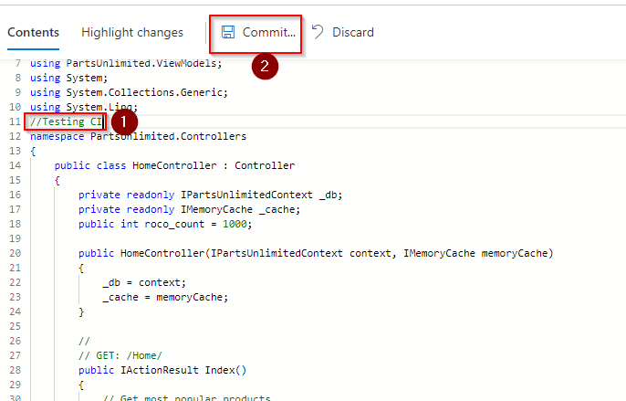

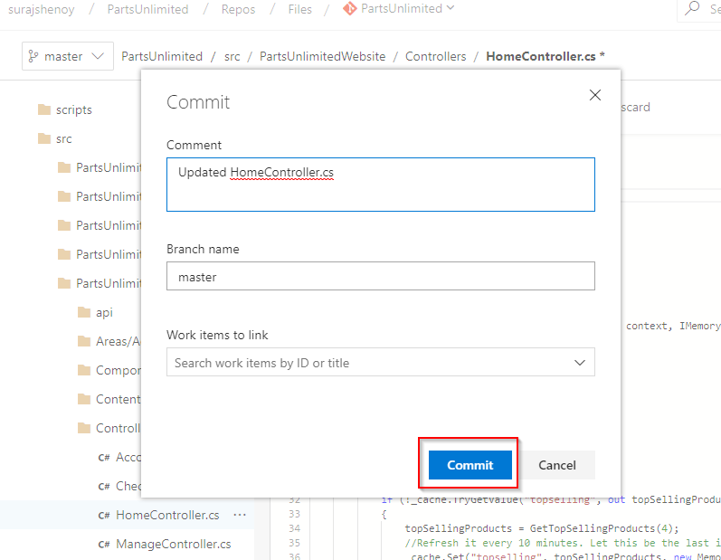

**3.** Click **Build** hub from the pipeline option in the left. This should have triggered the build we previously created.

**4.** Click on the **Build Name**, and you should get the build in progress. Here you can see the detailed logs of each and every task that is included in build definition.
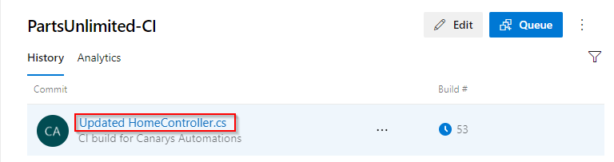

**5.** We can see the build summary and test results along with the logs by clicking on the **summary** and **tests** options.

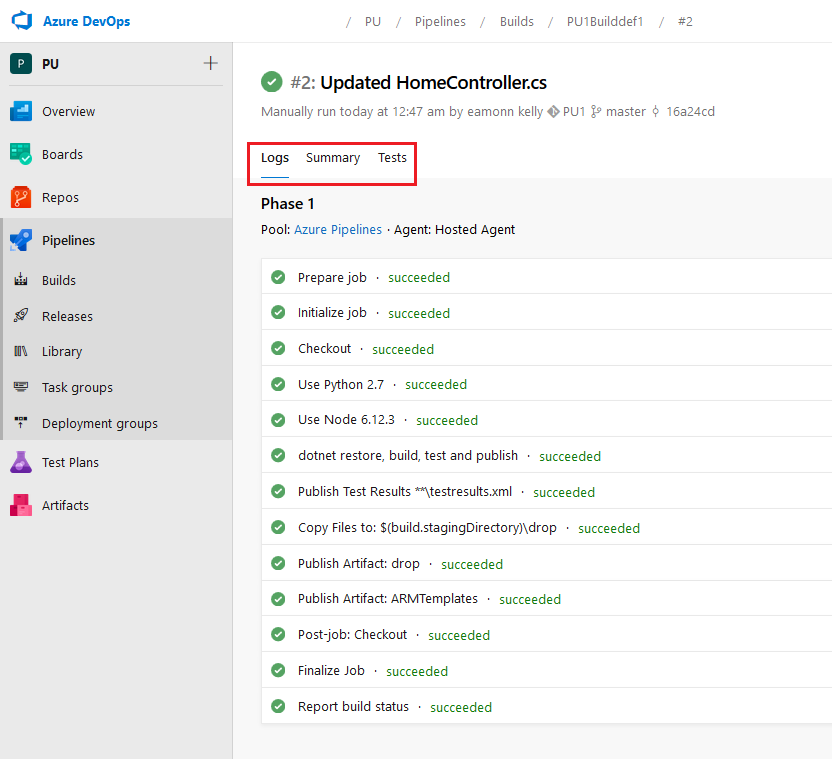

<h3> Summary</h3>
In this lab, you learned how to push new code to Azure DevOps, setup a Git repo and create a Continuous
Integration build that triggers when commits are pushed to the master branch. This allows you to get feedback of whether your changes breaks syntax changes,or if they broke one or more automated tests, or if your changes are fine.

- You set up your account, downloaded PartsUnlimited source code, and pushed it to your own git repo inside the Azure DevOps project. 

- You created a build pipeline that is triggered every time a commit is pushed to your repository in Azure DevOps.

- You tested the Continuous Integration build (CI) you created by changing code in the Parts Unlimited project with Azure DevOps.

<h3>Next steps </h3>

Try this lab for next steps:

- [Continuous Deployment Lab](https://microsoft.github.io/PartsUnlimited/cicd/200.3x-CICD-M03-CDwithVSTS.html)
