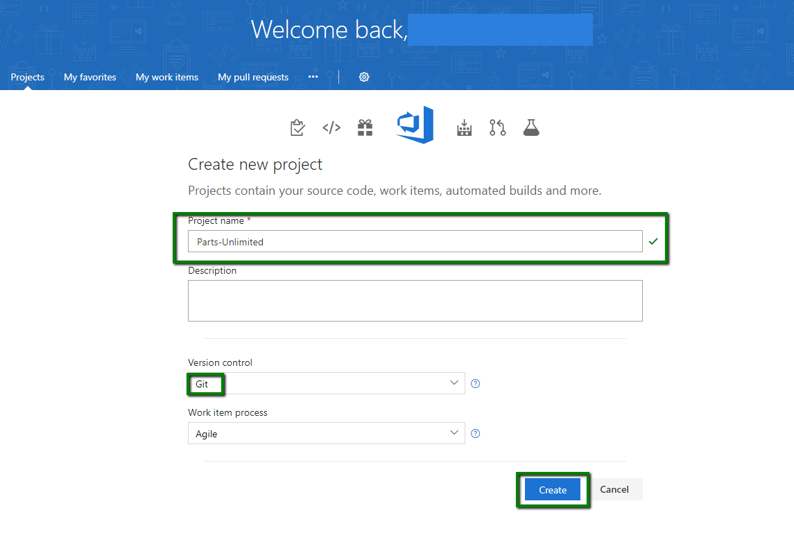
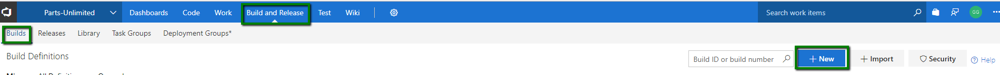
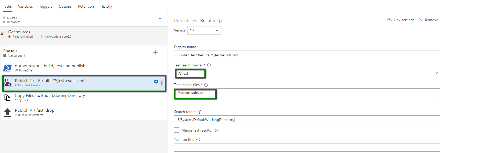
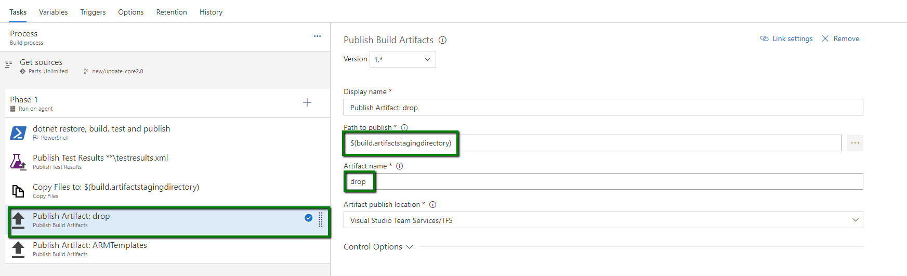
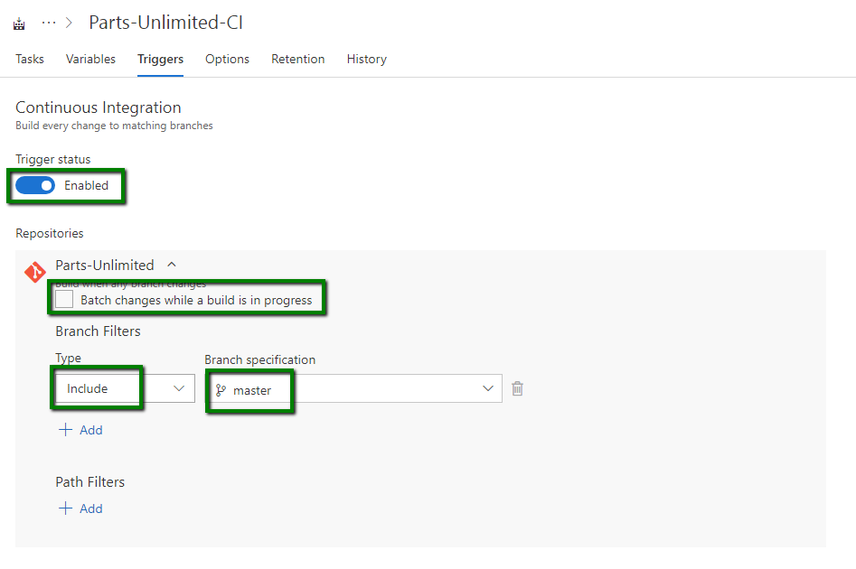
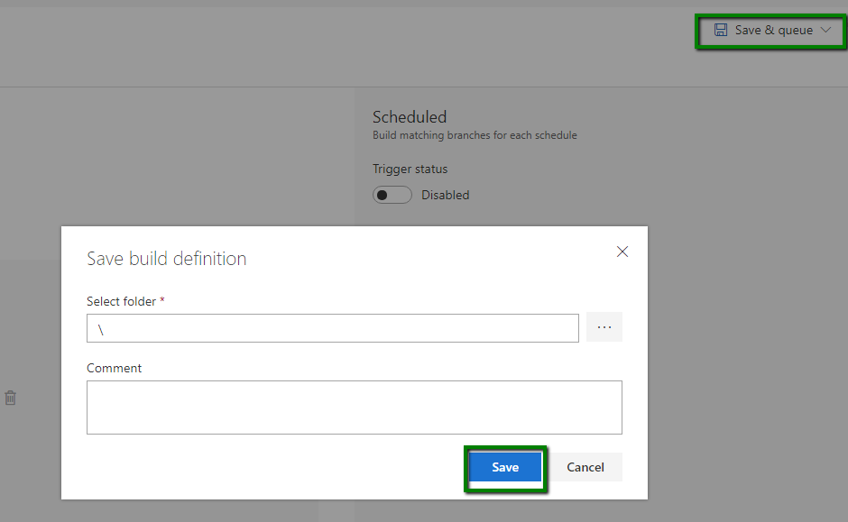
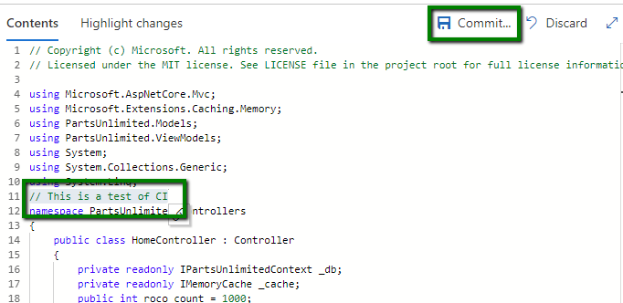

---
layout: page
title:  DevOps200.3x Continuous Integration and Continuous Deployment - CI with VSTS
category: CICD
order: 1
---

<h1>Continuous Integration with Visual Studio Team Services</h1>

In this lab we have an application called PartsUnlimited. We want to set up
Visual Studio Team Services to be able continuously integrate code into the master
branch of code. This means that whenever code is committed and pushed to the
master branch, we want to ensure that it integrates into our code correctly to
get fast feedback. To do so, we are going to be setting up a Continuous Integration build (CI) that
will allow us to compile and run unit tests on our code every time a commit is
pushed to Visual Studio Team Services.

### Pre-requisites: ###
- Complete [Getting Started](../GettingStarted.md) task.
-   An active Visual Studio Team Services account.

	 [Sign up for Visual Studio Team Services](https://www.visualstudio.com/en-us/docs/setup-admin/team-services/sign-up-for-visual-studio-team-services)

### Tasks Overview: ###

**1. Import Source Code into your VSTS Account:** In this step, you will connect your own Visual Studio Team Services account, download the PartsUnlimited source code, and then push it to your own Visual Studio Team Services account. There are two approaches to doing this: a) Use the Git command line, or b) Use Visual Studio.  

> Note: VSTS does support GitHub source code integration for use with VSTS builds, but is outside of the scope of this HOL

**2. Create Continuous Integration Build:** In this step, you will create a build definition that will be triggered every time a commit is pushed to your repository in Visual Studio Team Services.

**3. Test the CI Trigger in Visual Studio Team Services:** In this step, test the Continuous Integration build (CI) build we created by changing code in the Parts Unlimited project with Visual Studio Team Services.

### I: Import Source Code into your VSTS Account with Git

We want to push the application code to your Visual Studio Team Services account in
order to use VSTS Build.

> **Talking Point:** For this lab we are using the VSTS Git project. The next couple of steps will allow you to add the PartUnlimited source to the Git master repository.

If you haven't already, create a new team project in your Visual Studio Team Services account that uses Git for source control.

**1.** Clone the repository to a local directory.

Create a parent **Working Directory** on your local file system. For instance, on a Windows OS you can create the following directory:

`C:\Source\Repos`

Open a command line (one that supports Git) and change to the directory you created above.

Clone the repository with the following command. You can paste in the URL if you copied it in Step 1.  In the example below, the clone will be copied into a directory named HOL. Feel free to use whatever directory name you like, or leave it blank to use the default directory name:

	git clone https://github.com/Microsoft/PartsUnlimited.git HOL

After a few seconds of downloading, all of the code should now be on your local machine.

Move into the directory that was just created.  In a Windows OS (and assuming you used HOL as the directory name), you can use this command:

	cd HOL

**2.** Remove the link to GitHub.

The Git repo you just downloaded currently has a remote called _origin_ that points to the GitHub repo.  Since we won't be using it any longer, we can delete the reference.

To delete the GitHub remote, use:

	git remote remove origin

**3.** Find the URL to access the VSTS Git repo

First, we need to find the URL to empty Git repository in VSTS.  If you remember your account name, and the Team Project name you created, the URL to the default Git repo is easily assembled:

	https://<account>.visualstudio.com\_git\<project>

Alternatively, you can use a web browser to browse to your account, click into your project, and click the Code tab to get to your default Git repository:

	https://<account>.visualstudio.com

Additionally, at the bottom of the web page, you will see the two commands that we will use to push the existing code to VSTS.

**4.** Add the link to VSTS and push your local Git repo

In the local directory from Step 1, use the following command to add VSTS as the Git remote named _origin_. You can either type the URL you found in Step 3, or simply copy the first command from the VSTS web page.

	git remote add origin https://<account>.visualstudio.com\<project>\_git\<project>
Now you can push the code, including history, to VSTS:

	git push -u origin --all
Congratulations, your code should now be in VSTS!

### II. Create Continuous Integration Build

A continuous integration build will give us the ability check whether the code
we checked in can compile and will successfully pass any automated tests that we
have created against it.

**1.** Go to your **account’s homepage**:

	https://<account>.visualstudio.com

**2.** Once on the project’s home page, click on the **Build** hub at the top of the page, then on **All Definitions**, and then on **New Definition**.

**3.** Select the **Empty** build definition, and then click **Next**.

**4.** Once the new empty build has been created under the "Process" heading on the left, you need to update the "Agent queue" to **Hosted VS2017**.

> **Note:** We may have multiple repos and branches, so we need to select the correct Repo and Branch before we can select which Solution to build.

**5.** Under the "Get sources" you need to make sure that the "Repository" is the project you have create **Parts-Unlimited** in my case, also update the "Branch" to **Master**.

**6.** To start adding tasks to the you need to select the **+** next to **Phase 1**. 

**7.** In the **Add tasks** dialog, select the **Utility** page and then add a **PowerShell** task.

**8.** Still in the **Add tasks** dialog, select the **Test** page and add a **Publish Test Results**.

 

**9.** Select the **Utility** page again and add a **Publish Artifacts** task.

**10.** On the **PowerShell Script** task, click on the blue **rename** pencil icon and change the name of the step to **dotnet restore, build, test and publish** and click **OK**

**11.** Select **File Path** for the **Type** property, enter **"build.ps1"** for the **Script filename** property and **$(BuildConfiguration) $(Build.SourcesDirectory) $(build.stagingDirectory)** for the **Arguments** property.

> **Note:** The build.ps1 script contains commands using the **dotnet.exe** executable used by .Net Core.  The build script does the following: restore, build, test, publish, and produce an MSDeploy zip package.

**12.** On the **Publish Test Results** task, change the **Test Result Format** to **VSTest** and the **Test Results File** to **\*\*\testresults.xml**.

**13.** On the **Publish Artifact** task, change the **Path to publish** to **$(build.artifactstagingdirectory)** and the **Artifact name** to **drop**.

**14** Select the **Variables** tab and a new variable that will be used by the build.ps1 PowerShell script; **BuildConfiguration** with a value of **release**.

**15.** Click on the **Triggers** tab and verify that the **Continuous integration (CI)** option is enabled to build the solution every time a change is checked in. Also make sure the filter includes the appropriate branch (in this case **master** and **Batch Changes** checkbox is unchecked

> **Note:** To enable Continuous integration in your project, check the **Continuous integration (CI)** checkbox. You can select which branch you wish to monitor, as well.

**16.** Click **Save & queue** and select the **Save** option.

### III. Test the CI Trigger in Visual Studio Team Services

We will now test the **Continuous Integration build (CI)** build we created by changing code in the Parts Unlimited project with Visual Studio Team Services.

**1.** Select the **Code** hub and then select your your repo, **Parts-Unlimited**.

**2.** Navigate to **/src/PartsUnlimitedWebsite/Controllers** in the PartsUnlimited project, then click on the ellipsis to the right of **HomeController.cs** and click **Edit**.

**2.** After clicking **Edit**, add in text (i.e. *This is a test of CI*) after the last *Using* statement. Once complete, click **Save**.

**3.** Click **Build** hub. This should have triggered the build we previously created.

**4.** Click on the **Build Number**, and you should get the build in progress. Here you can also see the commands being logged to console and the current steps that the build is on.

**4.** Click on the **Build Number** on the top left and you should get a build summary similar to this, which includes test results.

Next steps
----------

In this lab, you learned how to push new code to Visual Studio Team Services, setup a Git repo and create a Continuous
Integration build that runs when new commits are pushed to the master branch.
This allows you to get feedback as to whether your changes made breaking syntax
changes, or if they broke one or more automated tests, or if your changes are a
okay.

Try these labs out for next steps:

-[Continuous Deployment Lab](../HOL-Continuous_Deployment/README.md)
