<h1><span style="color: #0000CD;">DevOps200.3x: Continuous Integration and Continuous Deployment</span></h1>

============================================================

<h2><span style="color: #0000CD;">Continuous Deployment with VSTS Lab</span></h2>

In this lab, you have an application called PartsUnlimited, committed to a Git repository in Visual Studio Team Services (VSTS) and a Continuous Integration build that builds the app and runs unit tests whenever code is pushed to the master branch.
Please refer to the [Continuous Integration with Visual Studio Team Services](https://microsoft.github.io/PartsUnlimited/cicd/200.3x-CICD-M01-CIwithVSTS.html) in order to see how the CI build was set up.
Now you want to set up Release Management (a feature of Visual Studio Team Services) to be able continuously deploy the application to an Azure Web App.
Initially the app will be deployed to a `dev` deployment slot. The `staging` slot will require and approver before the app is deployed into it. Once an approver approves the `staging` slot,
the app will be deployed to the production site.


<h3><span style="color: #0000CD;"> </span></h3>

[](https://youtu.be/6ItrMCwQV8A)


<h3><span style="color: #0000CD;"> Pre-requisites:</span></h3>

- An active Visual Studio Team Services account
- Project Admin rights to the Visual Studio Team Services account
- An active Azure account to host the PartsUnlimited Website as a Web App

	> **Note**: In order to use deployment slots, you'll need to configure the Web App to use Standard or Premium App Service Plan mode. You **cannot** create deployment slots for Basic or Free Azure Web Apps. To learn more about deployment slots, see [this article](https://docs.microsoft.com/en-ie/azure/app-service/web-sites-staged-publishing).

* You have completed the [Continuous Integration with Visual Studio Team Services](https://microsoft.github.io/PartsUnlimited/cicd/200.3x-CICD-M01-CIwithVSTS.html)

* An organizational account that is a co-administrator on your Azure account

	> **Note**: This is required because deploying [ARM Templates](https://azure.microsoft.com/en-us/documentation/articles/resource-group-authoring-templates/) to Azure requires an organizational account or a [Service Principal](http://blogs.msdn.com/b/visualstudioalm/archive/2015/10/04/automating-azure-resource-group-deployment-using-a-service-principal-in-visual-studio-online-build-release-management.aspx). MSA Account and certificate-based connections are not supported. For this HOL, you will use an organizational account.

<h3><span style="color: #0000CD;"> Lab Tasks:</span></h3>

- **1. Complete the [Continuous Integration with Visual Studio Team Services](https://microsoft.github.io/PartsUnlimited/cicd/200.3x-CICD-M01-CIwithVSTS.html):** This will walk through creating a Visual Studio Team Services account, committing the PartsUnlimited source code and setting up the Continuous Integration (CI) build.

- **2. Modify the CI Build to include ARM Templates:** The source code already defines the infrastructure required by the application in code (Infrastructure as Code). The code is a json file based on the Azure Resource Manager (ARM) template schema. You will use the template to deploy or update the infrastructure as part of the release.

- **3. Create a Service Endpoint from VSTS to an Azure Account:** In this step you'll download your Azure publish settings file and create Service Endpoint in Visual Studio Team Services for your Azure account. This will enable you to configure deployment of the PartsUnlimited Website to Azure as an Azure Web Application from Builds or Releases.

- **4. Create a Release Pipeline for the Parts Unlimited Website:** In this step, you will create a Release definition for the PartsUnlimited Website. You'll use the CI build output as the input artefact for the Release and then define how the release moves through `environments` with approvals in between.

- **5. Trigger a Release:** Once the Release Definition is set up, you will trigger a release and see the pipeline in action.

<h3><span style="color: #0000CD;">Estimated Lab Time:</span></h3>

- approx. 90 minutes  


### Task 1: Complete HOL - Parts Unlimited Website Continuous Integration with Visual Studio Team Services
Make sure you've completed [Continuous Integration with Visual Studio Team Services](https://microsoft.github.io/PartsUnlimited/cicd/200.3x-CICD-M01-CIwithVSTS.html).

### Task 2: Modify the CI Build to include the ARM Templates
In order to deploy to Azure, you're going to specify the infrastructure that the PartsUnlimited Website requires.
For example, the site requires an Azure SQL Database and an Azure Web App.
Rather than create these by hand, you are going to use the Azure Resource Manager (ARM) templates that describe this infrastructure in a json file.
This is good practice, since you're describing infrastructure as code.

The task that will deploy the ARM template will create the resource group if it does not exist.
If the resource group does exist, then the template is used to update the existing resources.

> **Note:** The infrastructure described in the ARM templates for this lab will create resources that are not free.
It creates an Azure Web App with 3 deployment slots.
Deployment slots are only available on Standard or Premium App Service Plans.
They are **not** available on Free or Basic plans.
Once you've completed this lab, you probably want to delete the resource group in order to minimize charges to your Azure account.

1. Log into your VSTS account and click on the **Build and Releases > Build**.

2. Click the Build that you configured earlier in the Continuous Integration lab, and click **Edit**, as per the screenshot below. 

	

3. Click the  **+** to add a Task, click **Utility > Publish Build Artifacts** and configure it as follows, then save it when finished the configuration.

	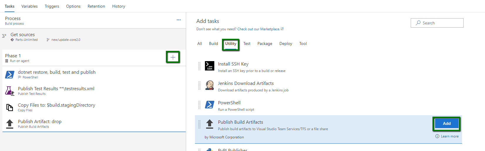
	
	- Version = **< default value >**
	- Display name= **Publish Artifact: ARMTemplates**
	- Path to Publish = **env/Templates** (click the elipsis at the end of the box,browse to **env\templates** and click **OK**)
	- Artifact Name= **ARMTemplates**
	- Artifact publish location = **Visual Studio team services/TFS**
	- Control Options = < ensure **Enabled** is checked>

	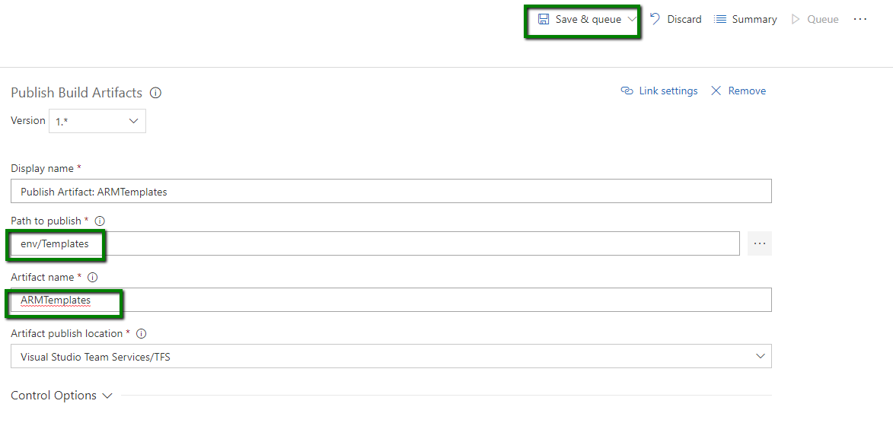

4. To verify the Build is working correctly with the additional task, queue a new build by clicking the **Queue** button and confirming again by clicking **Queue**. When the build has completed, verify that there are 2 folders in the Artifacts: **drop** and **ARMTemplates**.

	- The **drop** folder should contain a single file: **PartsUnlimitedWebsite.zip** (click **Explore** to view the contents or **Download** and extract it)

	- The **ARMTemplates** folder should contain a number of environment template and parameters JSON files.


	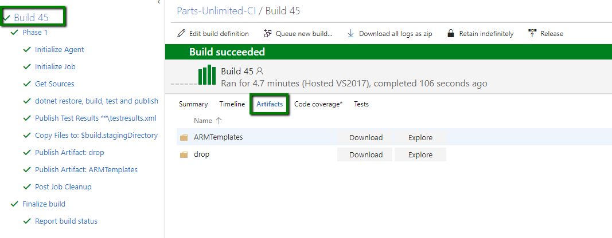


### Task 3: Create a Service Endpoint from VSTS to an Azure Account
In order to interact with Azure, you'll need to create a Service Endpoint in VSTS.
This Endpoint includes the authentication information required to deploy to Azure.

> **Note**: Deploying [ARM Templates](https://azure.microsoft.com/en-us/documentation/articles/resource-group-authoring-templates/) to Azure from VSTS requires an organizational account or a [Service Principal](http://blog.jstroheker.com/2016/10/11/SPNAzure/). MSA Accounts and certificate-based connections are not supported. For this HOL, we will create a Service Principal.

> **Note**: There are many ways to create a Service Principal (SP) in Azure, we will use the **Azure CLI 2.0**. Details on using Azure CLI 2.0 to Create a SP can be viewed on the page https://docs.microsoft.com/en-us/cli/azure/create-an-azure-service-principal-azure-cli?view=azure-cli-latest 


1.  Install the **Azure CLI 2.0** if it is not already installed by following the steps here https://docs.microsoft.com/en-us/cli/azure/install-azure-cli?view=azure-cli-latest based on your environment.


2. Once **Azure CLI 2.0** is installed, open Azure CLI 2.0 and log into Azure by running the below command and following the prompts

	```
	az login
	```

3. Create a SP by running the command, the output shoudl be similar to the screenshot below.

	```
	az ad sp create-for-rbac --name PU1app --password Pa$$w0rd01
	```

	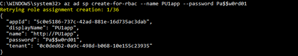

4. Check the permissions on the newly created SP and ensure it has a **RoleDefinitionName**= **Contributor**, by running the below command

	```
	az role assignment list --assignee  <app id from earlier > i.e. 5c0e5186-737c-42ad-881e-16d735ac3dab
	```

	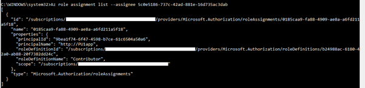

5. Log in with the SP to verify access is working fine by running the below command 

	```
	az login --service-principal -u <APP_ID> --password <PWD> --tenant <TENANT_ID>
	```

	

	> **Note**: You will need the below three values from the SP account to be able to successfully create the Service Endpoint in VSTS, you should note them now for use later.

	- **Tenant ID**
	- **Password (also referred to as Service Principal Key)**
	- **User name (also referred to as App ID)**


6.  Create an Azure Service Endpoint in VSTS by clicking on the **Settings** icon at the top of the page, selecting **Services** and then **New Service Endpoint** and selecting **Azure Resource Manager** from the drop down list.

	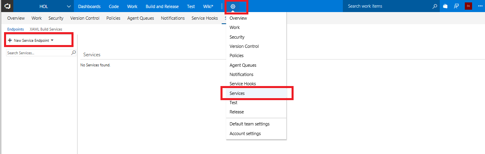

7. In the **Add Azure Resource Manager Service Endppoint** dalogue, click on the link **use the full version of the endpoint dialog**

	

8. Fill in the fields required as per the information you obtained earlier when creating your SP, click **Verify connection** and ensure you can successfully verify the connection to Azure

	

9. Click **OK**, and you should now see the new Service Endppoint listd in VSTS

	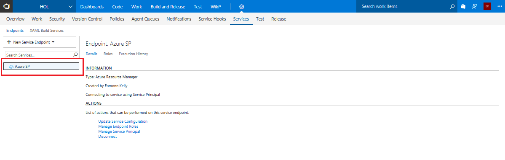

### Task 4: Create a Release Definition
Now that you have an Azure Service Endpoint to deploy to, and a package to deploy (from your CI build), you can create a Release Definition.
The Release Definition defines how your application moves through various Environments, including Tasks to update infrastructure, deploy your application, run scripts and run tests. You can also configure incoming or outgoing approvals for each Environment.

An Environment is simply a logical grouping of tasks - it may or may not correspond to a set of machines.

For this Release Definition, you will create 3 Environments: **Dev**, **Staging** and **Production**.

The infrastructure required for all 3 environments is described in an ARM Template. The ARM Template will be invoked during the deployment in the Dev Environment before deploying the website to Dev.
It will not be necessary to run any infrastructure tasks during Staging or Production deployments in this case.

**Step 1.**  Create a Release Definition to Deploy Infrastructure and Deploy to Dev

1. In VSTS, click on Releases. Then click on the **+ New definition** button to create a new definition. This will launch a wizard prompting you to select a deployment template. 
	
	

2. Click on **Empty** to start with an empty release and click **Next**. 
	
	

3. Click **Save** and **OK** to confirm. The template has created a single Environment (called **PartsUnlimited**). Close the pane on the right hand side.

4. You'll now need to configure the source package. Under the **Pipeline** tab in **Artifacts** click **+ Add artifact** 


	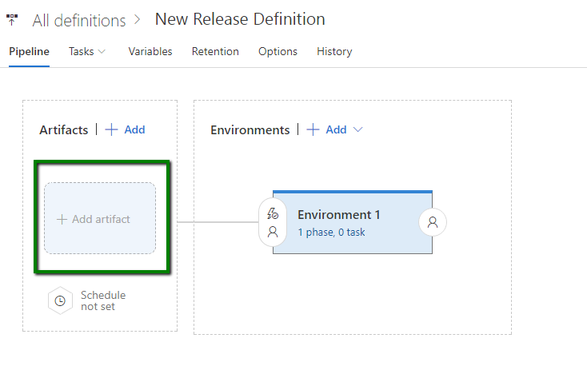


5. Enter the below settings inot the Add artifact pane.

	- Source Type = **Build**
	- Project = **select your VSTS project name from the dro down options**
	- Source (Build definition)Type= ** the name you called the build definintion when you created your CI build earlier**
	- Default version = **Latest**
	- Source alias = **the build source**

	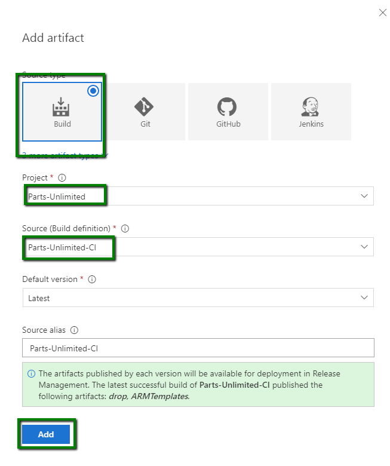

	> **Note:** It is possible to Link other package sources, but you only need the CI build for this Release.

6. Click the **1 phase, 0 task** label in "Environment 1". Once in change the name to **Dev**.

	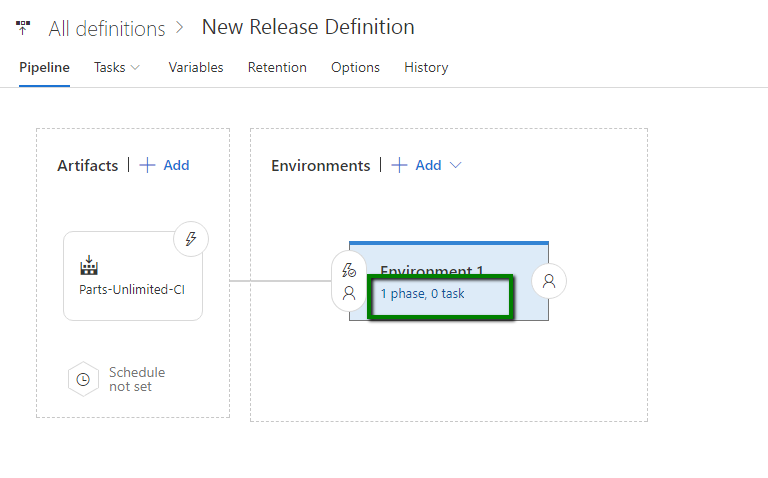

8. Click on the **+** button next to the **Agent phase** to add a task for this environment. Under **Deploy** group, select **Azure Resource Group Deployment** and click **Add**. Close the "Add Task" dialog.

	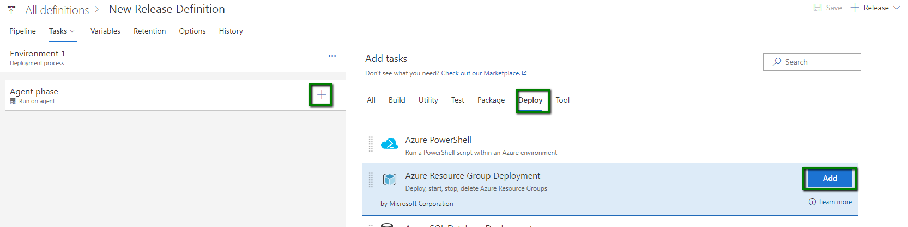

9. Click on the "Azure Resource Group Deployment" task. Configure it as follows:
	* `Version` = **< default >** 
	* `Display name` = **< default >**
	* `Azure RM Subscription`: **select the Azure subscription endpoint that you created in Task 2**
	* `Action`: select **Create or Update Resource Group**
	* `Resource Group`: enter **$(ResourceGroupName)** into the box, you will create a variable named this shortly.
	* `Location`: select an Azure location
	* `Template`: click the **...** button and browse to the **FullEnvironmentSetupMerged.json** file in the **ARMTemplates** folder.


		

	* `Template Parameters`: click the **...** button and browse to the **FullEnvironmentSetupMerged.param.json** file in the **ARMTemplates** folder.

		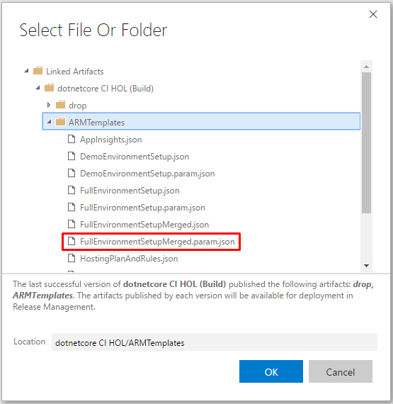

	* `Override Template Parameters`: Enter the following in a single line (shown split here for convenience):

		```powershell
		-WebsiteName $(WebsiteName) -PartsUnlimitedServerName $(ServerName) -PartsUnlimitedHostingPlanName $(HostingPlan) -CdnStorageAccountName $(StorageAccountName) -CdnStorageContainerName $(ContainerName) -CdnStorageAccountNameForDev $(StorageAccountName)-dev -CdnStorageContainerNameForDev $(ContainerName)-dev -CdnStorageAccountNameForStaging $(StorageAccountName)-stage -CdnStorageContainerNameForStaging $(ContainerName)-stage -PartsUnlimitedServerAdminLoginPassword (ConvertTo-SecureString -String '$(AdminPassword)' -AsPlainText -Force) -PartsUnlimitedServerAdminLoginPasswordForTest (ConvertTo-SecureString -String '$(AdminTestPassword)' -AsPlainText -Force)
		```
		

			You will shortly define the values for each parameter, like `$(ServerName)`, in the Environment variables.
		
		> **Note**: If you open the FullEnvironmentSetupMerged.param.json file, you will see empty placeholders for these parameters. You could hard code values in the file instead of specifying them as "overrides". Either way is valid. If you do specify  values in the params file remember that in order to change values, you would have to edit the file, commit and create a  new build in order for the Release to have access the new values.

		

10. Click on the **Variables Tab** next to the Environment and select **Process variables**.


11. Create the following variables, by selecting the **+**, then adding a name and values for the following.
	* **WebsiteName** - Name of the website in Azure
	* **ServerName** - Prefix for the name of the database servers. Will have `-dev` or `-stage` added for dev/staging
	* **HostingPlan** - Name of the hosting plan for the website
	* **StorageAccountName** - Storage account name prefix. Will have `-dev` or `-stage` added for dev/staging
	* **ContainerName** - Container name prefix. Will have `-dev` or `-stage` added for dev/staging
	* **AdminPassword** - Admin password for production database server
	* **AdminTestPassword** - Admin password for dev and staging database servers
	* **ResourceGroupName** - Name of the Resource Group.

	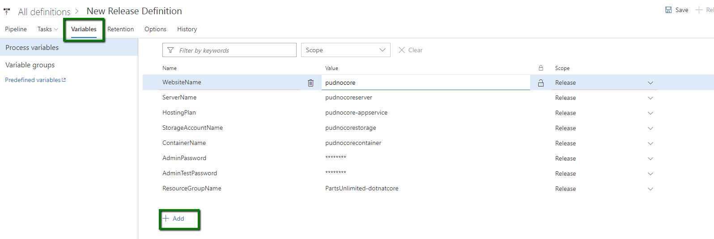
		> **Note**: Use unique values for your variables by adding something custom at the end like your initials. Example for WebsiteName : pudncorejstr 

		> **Note**: You can hide passwords and other sensitive fields by clicking the padlock icon to the right of the value text box.

12. Save the definition.

**Step 2.** Test the ARM Template Deployment

Before moving on, it is a good idea to test the template so far.

1. Click on "+ Release" in the toolbar and select "Create Release" to start a new release.

	

2. Select the latest build from the drop-down and click "Create" to start the release.

	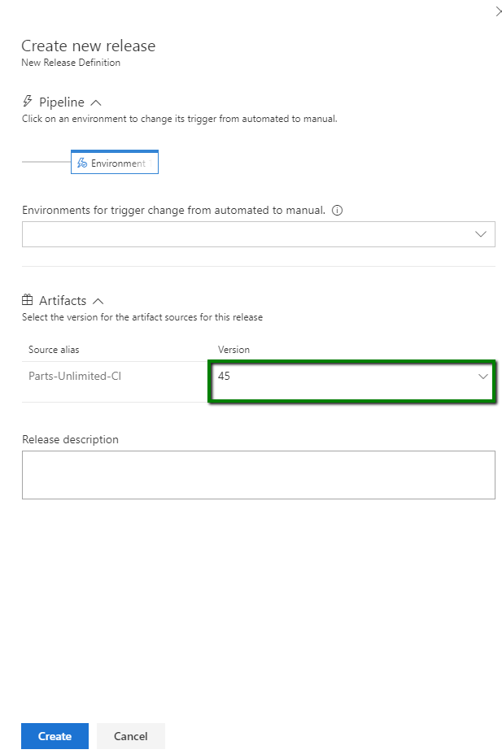

3. Click the "Release-x" link to open the release.

	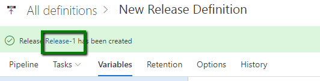

4. Click on the Logs link to open and monitor the deployment logs.

5. You should see a successful release after a few minutes.

	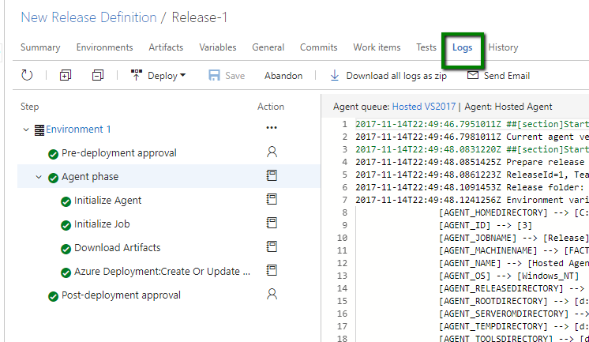

6. If you log into the Azure Portal, you will see the Resource Group has been created.

	

**Step 3.**  Add Web Deployment Tasks to Deploy the Web App

Now that the infrastructure deployment is configured, you can add a task to deploy the web app to Dev.

1. Click on the Dev environment in the Release Definition. Then click "+" to add a new task.
2. Select the "Deploy" group in the left and click the add button next to "Azure App Service Deploy" to add the task. Close the task selector dialog.

	

3. Click on the "Azure App Service Deploy" Task.
4. Select the Azure Service Endpoint you created earlier in the AzureRM Subscription drop down.
5. For "App Service name", enter the `$(WebsiteName)` to use a variable. You defined this variable earlier when deploying
the ARM Template. You will shortly "promote" it to a Release variable so that it can be used in all Environments in the Release.
6. Check the Deploy to Slot check box.
7. Enter `$(ResourceGroupName)` into the Resource Group Box.
8. Enter "dev" for the Slot. This will deploy the site to the "dev" deployment slot. This allows you to deploy the site to an Azure deployment slot without affecting the Production site.
9. Tick "Take App Offline" this is under "Additional Deployment Options". This stops the website for deployment period and takes it back online afterwards. This is required because sites receive requests all the time causing files to lock down (i.e. making them unmodifiable).
10. Click the ellipsis (...) button, next to the Package box, to set the Web Deploy Package location. Browse to the PartsUnlimitedWebsite.zip file and click OK.

	

	> **Note**: It is a good practice to run smoke tests to validate the website after deployment, or to run load tests. The code-base you are using
	does not have any such tests defined. You can also run quick cloud-performance tests to validate that the site is up and running. For more
	information on quick load tests, see [this video](https://channel9.msdn.com/Events/Visual-Studio/Connect-event-2015/Cloud-Loading-Testing-in-Visual-Studio-Team-Service)
	from around the 6 minute mark.

11. Click Save to save the Release Definition.

**Step 4.**  Test the Dev Environment

You will shortly clone the Dev Environment into both Staging and Prod environments.
However, before you do that it's a good idea to test that the Dev Environment is correctly configured by creating a new Release.

1. Click on the "+ Release" button and select Create Release.

	

2. You can enter a Release Description if you want to.
3. Select the latest build from the PartsUnlimited build drop down and click on "Create".
4. Click the Release link to open the Release.

	

5. Click on the Logs link to open the deployment logs.
6. Once the deployment completes, you can check that the site was in fact deployed successfully by navigating to the site url.

	> Since you deployed to the dev slot, you will need to navigate to `http://{siteName}-dev.azurewebsites.net` where siteName is the name of your Web App in Azure.

	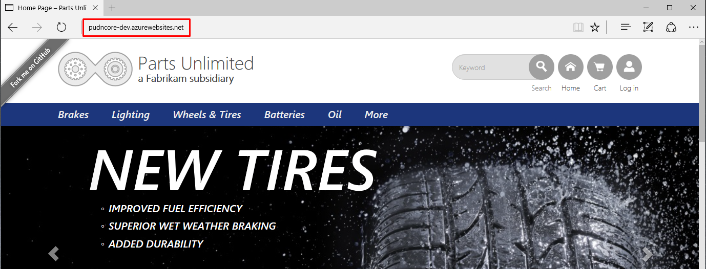

**Step 5.**  Clone the Dev environment to Staging and Production

Now that you have verified that the Dev Environment is configured correctly, you can clone it to Staging and Production.

1. Click on the PartsUnlimited link and then the Edit link to open the Release Definition.

	> **Note:** It is possible to change the definition for a Release without changing the Release Definition (i.e. the Release is an instance of the Release Definition that you can edit). You want to make sure that you are editing the Release Definition, not a Release.

2. Click the "Clone" on the Dev Environment card.

	

3. Select the Clone of Dev and change the name to "Staging"

4. Select the Pre-deployment conditions (the lightning bolt and user icon), then select for it to trigger after Dev. Turn on approvers.

	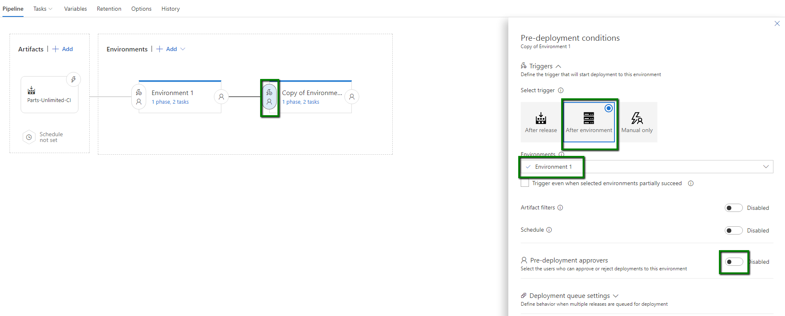

5. Type the name of the approver you would like and select them. 

	

	* **Pre-deployment approvers** must approve a deployment coming _into_ the environment. The deployment will stop and wait before executing any tasks in the environment until approval is granted.
	* **Approvers** can be individuals or groups.

6. Select the task to get to the task list.

	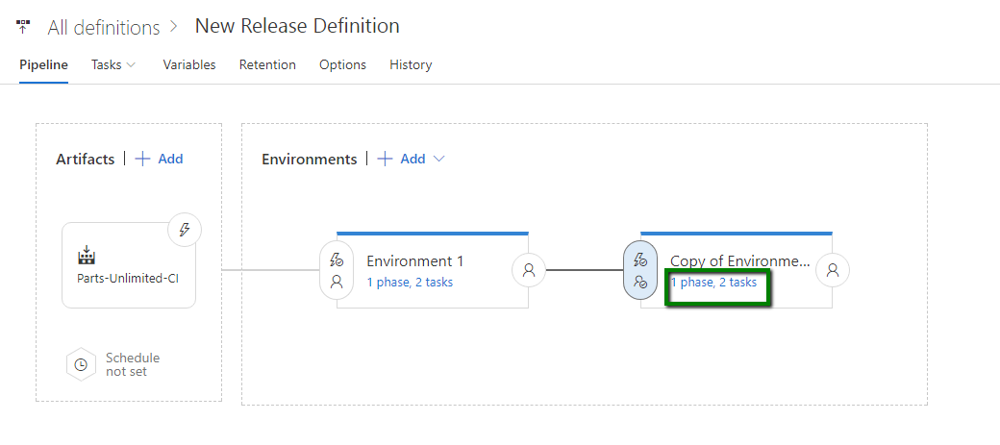

7. Delete the "Azure Resource Group Deployment" task. This is not required in this Environment since the ARM template deployed the infrastructure for all 3 environments. By right clicking on it and selecting remove.
8. On the Azure Web App Deployment task, set the Slot to `staging`.

	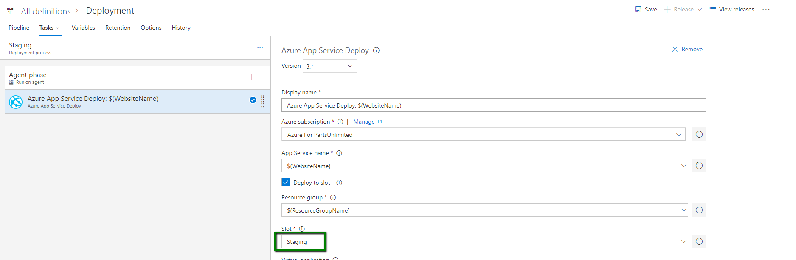

	> **Note**: If you had environment-specific variables, you would be able to set Staging-specific values. It is not necessary in this case.

9. In this case, you want to pause the deployment coming in. This ensures that if someone is testing in the Staging environment,
they don't suddenly get a new build unexpectedly.
10. Configure approvers for the post Staging environment

	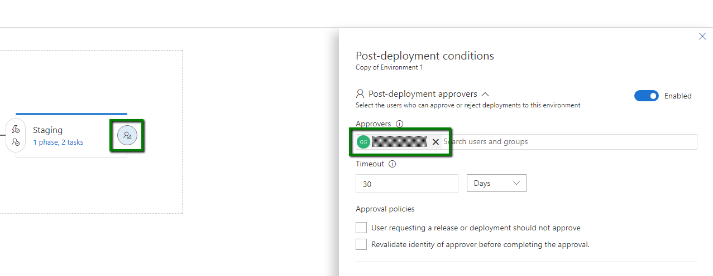

	* **Post-deployment approvers** approve deployments so that the _next_ Environment can begin. They act as sign-off for the current environment.
	* **Approvers** can be individuals or groups.

12. Clone the Staging environment to Production.
	* Untick "Deploy to Slot" (i.e. the site will be deployed to the production slot).
	* Update the approvers - again, you can be both approvers.

13. Save the Release Definition.

**Step 6.** Configure Continuous Deployment for this Release Definition

1. Select the lightning bolt to enable Continuous deployment trigger, Select Enable and which branch you wish to have it CD from.

	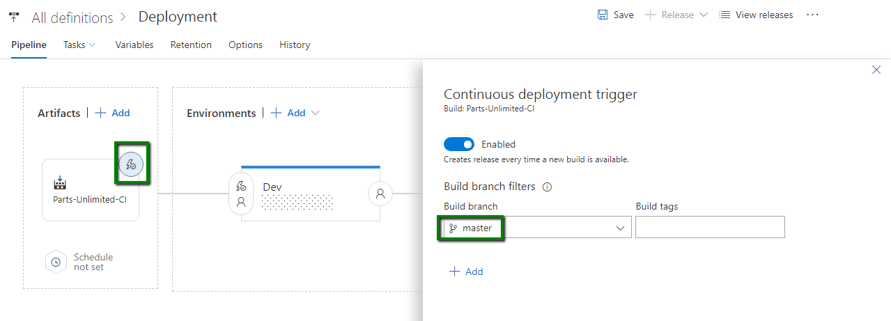

2. With the Environment you have been setting up the triggers as you went through. When filling out the following.

	

	> **Note:** Since the incoming build for this release is a CI build, you probably don't want to deploy the build all the way to Production. Setting the Release to stop at Dev means that you will need to create a new Release with Production as the target environment if you want to deploy to Production. This is of course configurable according to your own preference.

### Task 5: Create a Release
Now that you have configured the Release Pipeline, you are ready to trigger a complete
release.

1. Click on "+ Release" to create a new Release.
2. Select the latest build, click Create.

	
	> **Note**: You can adjust whether to deploy this release to a particular environment.

3. Once the Dev stage has completed deployment, you will see a notification that an approval is pending (you will also have received an email notification if you ticked "Send an email notification to the approver whom the approval is pending on" option in settings for this environment).
Check the dev slot of the PartsUnlimited site in Azure to ensure that the Dev environment is good, and then click Approve.

	

4. Optionally enter a comment and click the Approve button.

5. This will trigger the release into the Staging environment.
	> **Note**: You can reassign the approval if required.

6. Once the Staging deployment has completed, you will need to approve that
staging is OK.

7. This will then trigger the pre-approval for Production. Once you've approved
that, deployment into the Production environment will begin.

8. To see all your releases and where they are in their respective pipelines, click on All Releases and then click the Overview link.

	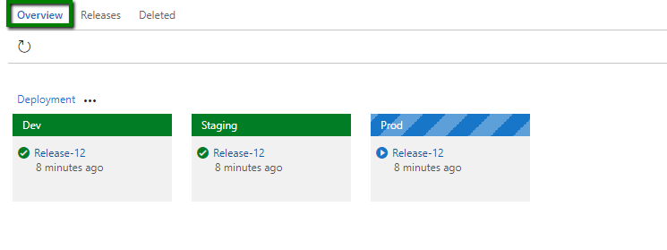

## Congratulations!
You've completed this Lab Task!


<h3><span style="color: #0000CD;"> Summary</span></h3>
In this lab, you learned how to create a service endpoint to allowyou deploy resources from VSTS directly inot Azure, created a release defiition and pipeline and verified continuous deployment pipeline suucessfulyl deploys on an trigger event. You successfully completed the following tasks.


- Modified the CI Build to include ARM Templates
- Create a Service Endpoint in Visual Studio Team Services to an Azure Account.
- Create a Release Pipeline for the Parts Unlimited Website.
- Trigger a Release and verified the release pipeline works successfully


>**Note:** Deployment of schemas and data is beyond the scope of this HOL. It is recommended that you investigate
[SQL Server Data Tools](https://msdn.microsoft.com/en-us/library/hh272686(v=vs.103).aspx) for
managing database schema deployments.

<h3><span style="color: #0000CD;">Further Reading</span></h3>

1. [Release Management for Visual Studio Team Services](https://msdn.microsoft.com/Library/vs/alm/release/overview-rmpreview)
2. [Cloud Load Testing in Visual Studio Team Services](https://channel9.msdn.com/Events/Visual-Studio/Connect-event-2015/Cloud-Loading-Testing-in-Visual-Studio-Team-Service)
3. [User Telemetry and Application Performance Monitoring with Application Insights](../HOL_User_Telemetry_APM_With_App_Insights/README.md)
4. [Testing in Production with Azure Websites - PartsUnlimited](../HOL-HDD_Testing_in_Production/README.md)
