---
layout: page
title:  Create a Selenium Coded UI Test in Visual Studio
category: Testing
order: 7
---

If you performed the previous lab, you will have used a screen recorder to create a coded UI test. While screen recorders are convenient, they often do not provide the level of control needed for more sophisticated testing.

In this lab, you will learn to create a coded UI test based on Selenium. The Selenium automation tools speak a language known as Selenese. Rather than issuing Selenese directly to the different types of browsers, web drivers are used to perform the translation. In this lab, you will install the Chrome, IE, and Firefox drivers, then automate the code from within the C# language in Visual Studio. 

>Note that there is a Selenium IDE that can be used for recording web actions but using it is not currently recommended. It only works with older insecure versions of FireFox (up to version 5.4). In this lab, we will use the drivers and classes directly from code.

For the purposes of the lab, we will use the [PartsUnlimited web application](http://cdrm-pu-demo-dev.azurewebsites.net/) hosted on Azure to run this lab. 

There have been reports that the keyword search on the home page is intermittently performing poorly. We will investigate how the keyword search on the home page performs, both by entering values into the box and clicking the search icon, and by directly referencing the search term a URL.

<h3>DevOps MPP Course Source </h3>

- This lab is used in course <a href="https://www.edx.org/course/devops-testing-microsoft-devops200-5x-0" target="_blank">DevOps200.5x: DevOps Testing</a> - Module 5.

<h3> Pre-requisites:</h3>

- Visual Studio 2017
- Google Chrome (recent edition) <a href="https://www.google.com.au/chrome/browser/features.html" target="_blank">https://www.google.com.au/chrome/browser/features.html</a>
- Access to the PartsUnlimited website deployed at <a href="http://cdrm-pu-demo-dev.azurewebsites.net/" target="_blank">http://cdrm-pu-demo-dev.azurewebsites.net/</a>

<h3> Lab Tasks:</h3>

- Create a coded UI web test in C#

<h3>Estimated Lab Time:</h3>

- approx. 30 minutes  

**Learn to use the Parts Unlimited Search Functionality**

1. In a Chrome browser, launch the PartsUnlimited web application by going to the URL <a href="http://cdrm-pu-demo-dev.azurewebsites.net/" target="_blank">http://cdrm-pu-demo-dev.azurewebsites.net/</a>
2. This opens the PartsUnlimited application as shown below. 

    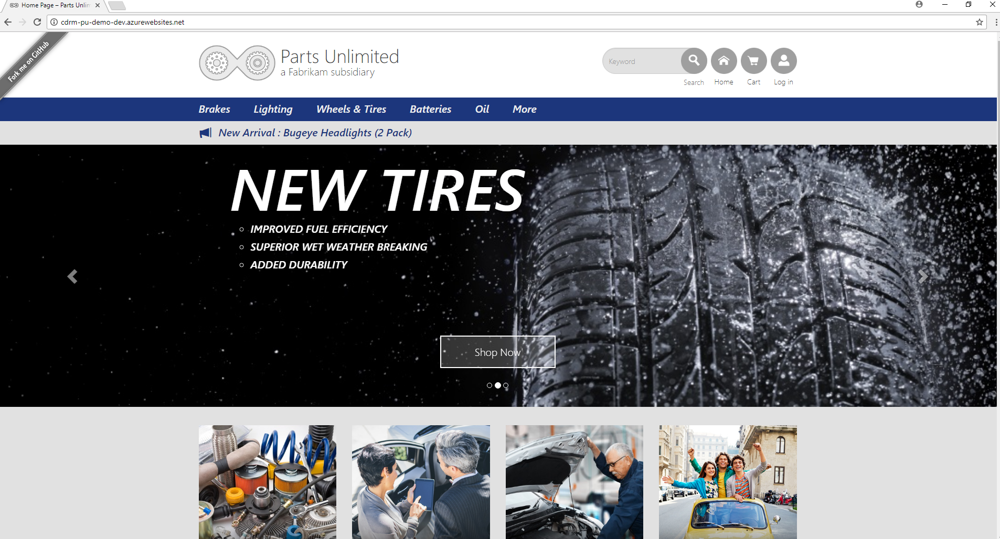

    Ensure that the website opens succesfully.

3. On the home page, in the **Search** box, enter **light** and click the **Search** icon.

    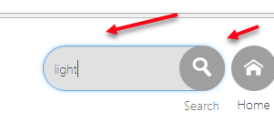

4. Note that three products are returned as expected.

    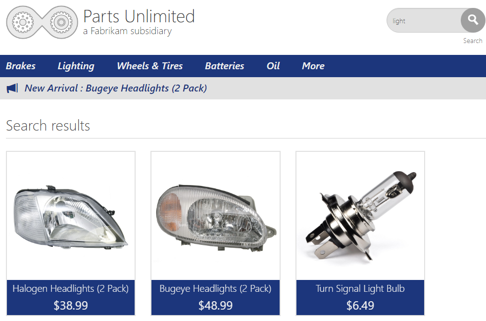

5. Also note in the browser search bar that the search item has been added to the URL. We also want to test that direct access to the search works.
 
    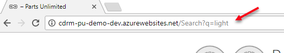

6. Click the **Parts Unlimited** heading to return to the home page.

    

**Locate the IDs of the required elements**

7. While in the home page, click **F12** to open the developer tools. 
 
    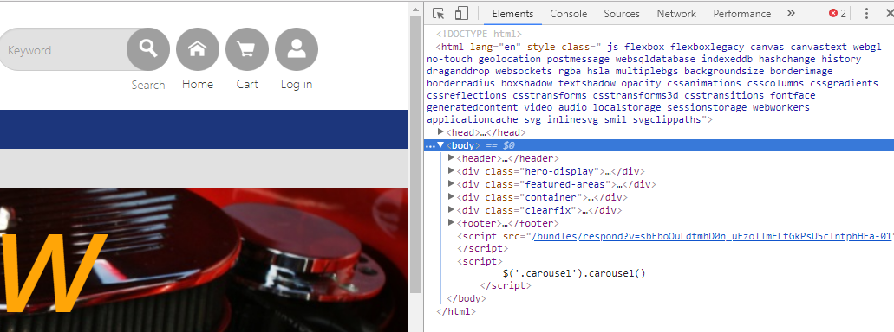

8. In the top section of the developer tools, click on the tool to select screen elements.

    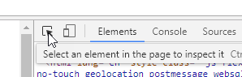

9. Hover over the search box and note its ID.

    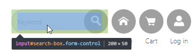
    
    Note that the name is "search-box".

10. Hover over the search icon and note its ID.

    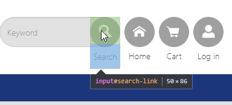
    
    Note that the name is "search-link".
    
    These are the elements that we will automate.

**Create the test in Visual Studio**

11. Launch **Visual Studio Enterprise**. 

12. From the **File** menu, click **New** then **Project**. In the **New Project** window, choose a **Unit Test Project** from the **Test** category.
 
    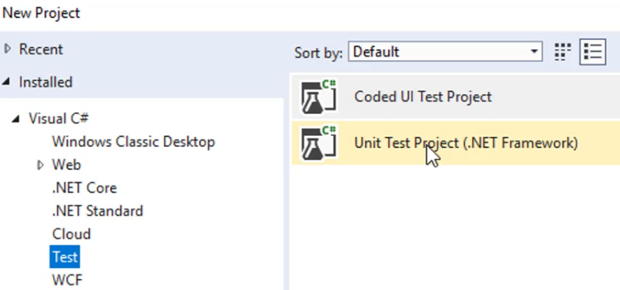

13. Add a name for the project, and solution, and a location for the project.

    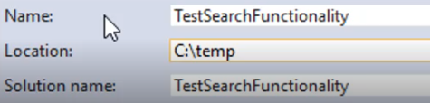

14. In **Solution Explorer**, right-click **References** and click **Manage NuGet Packages**.
 
    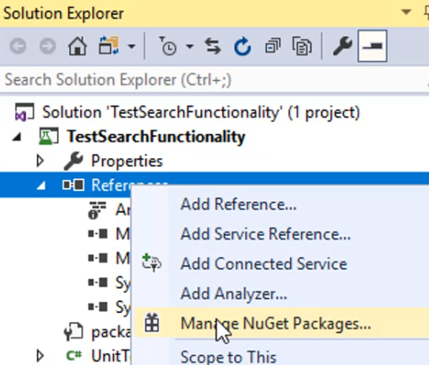

15. In the NuGet manager, click **Browse**, enter **selenium** as the search term and hit **Enter** to start the search.

    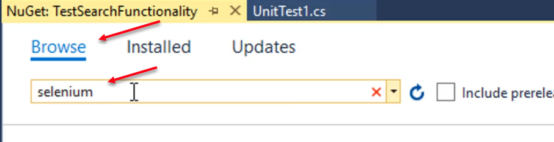

16. Install the following packages, then close the NuGet manager window:
* Selenium.WebDriver
* Selenium.WebDriver.ChromeDriver
* Selenium.WebDriver.IEDriver
* Selenium.Firefox.WebDriver
* Selenium.WebDriver.PhantomJS.Xplatform

17. In **Solution Explorer**, right-click UnitTest1.cs and rename it to PU_SearchTests.cs.

    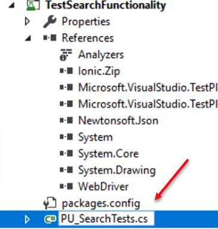

18. When prompted to rename all references, click **Yes**.

    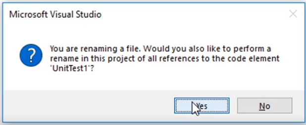

19. Add the following using statements after the ones that are already there:

        using OpenQA.Selenium;
        using OpenQA.Selenium.Chrome;
        using OpenQA.Selenium.Firefox;
        using OpenQA.Selenium.IE;
        using OpenQA.Selenium.Remote;
        using OpenQA.Selenium.PhantomJS;

20. Your code should look like this:

    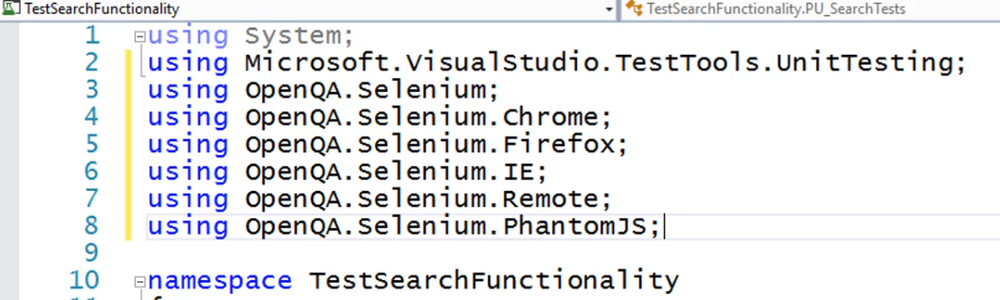

21. Add the following declarations to the beginning of the class. Note that the websiteURL and the required browser should really be parameters but this will be ok for our test:

        private string websiteURL = @"http://cdrm-pu-demo-dev.azurewebsites.net";
        private RemoteWebDriver browserDriver;
        public TestContext TestContext { get; set; }
        
22. Your code should look like this:

    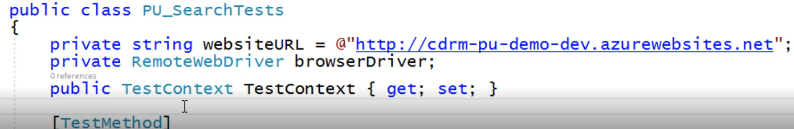

23. Add the following initialize and cleanup methods:

        [TestInitialize()]
        public void PU_SearchTests_Initialize()
        {
            // nothing for now
        }

        [TestCleanup()]
        public void PU_SearchTests_Cleanup()
        {
            browserDriver.Quit();
        }

24. Your code should look this this:

    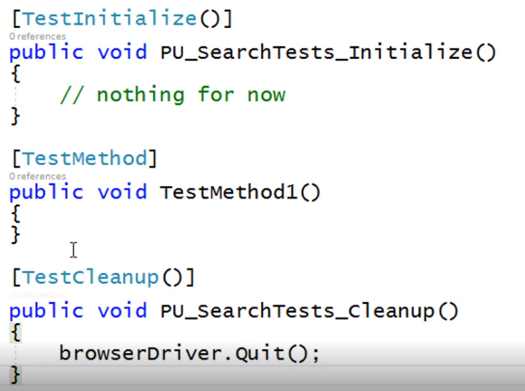

25. Replace the test method with the following code:

        [TestMethod]
        [TestCategory("Selenium")]
        public void SearchForLights()
        {
            browserDriver = new ChromeDriver();
            browserDriver.Manage().Window.Maximize();
            browserDriver.Manage().Timeouts().ImplicitlyWait(TimeSpan.FromSeconds(20));
            browserDriver.Navigate().GoToUrl(this.websiteURL);
        }

26. Your code should look this this:

    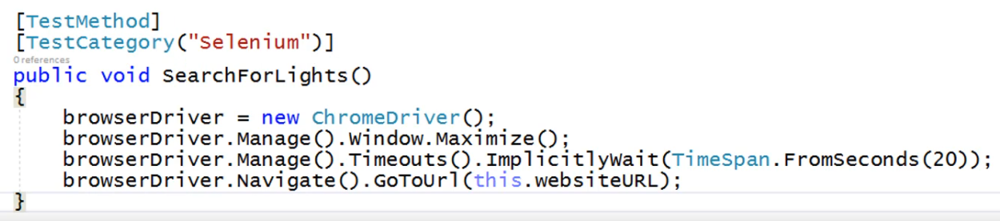

At this point, we have a test that should just start the browser (a Chrome browser), maximize the window, set the timeout, and go to the Parts Unlimited website. We can test it up to this point.

27. From the **Build** menu, click **Build Solution** and make sure the solution builds correctly.

28. In **Test Explorer** (if not visible, from the **View** menu, click to open it), right-click the **SearchForLights** test, and click **Run Selected Tests** to execute the test.

    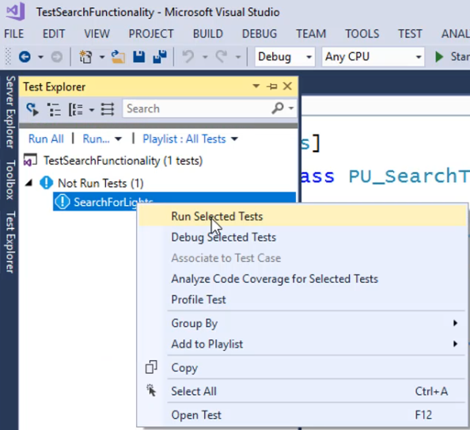

29. You should see the browser open, maximize (if not already), then go to the Parts Unlimited home page.

30. Add the following statements to the test method:

            browserDriver.FindElementById("search-box").Clear();
            browserDriver.FindElementById("search-box").SendKeys("light");
            browserDriver.FindElementById("search-link").Click();

31. Your code should look like this:

    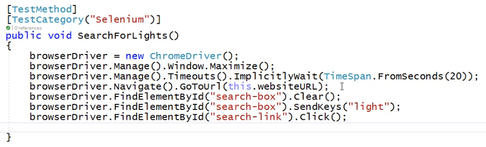

32. This will now clear the search box, type the value "light" and search for it.

33. From the **Build** menu, click **Build Solution** and make sure the solution builds correctly.

34. In **Test Explorer**, right-click the **SearchForLights** test, and click **Run Selected Tests** to execute the test.

You should see the browser open, maximize (if not already), then go to the Parts Unlimited home page, then search for the lights. You will briefly see the search results page appear before the browser closes. 

We also needed to check a direct URL search. 

35. Add another test method below the current one:

        [TestMethod]
        [TestCategory("Selenium")]
        public void DirectSearchForLights()
        {
            string lightSearchQuery = this.websiteURL + @"/Search?q=light";

            browserDriver = new ChromeDriver();
            browserDriver.Manage().Window.Maximize();
            browserDriver.Manage().Timeouts().ImplicitlyWait(TimeSpan.FromSeconds(20));
            browserDriver.Navigate().GoToUrl(lightSearchQuery);
        }
36. Your code should look like this:

    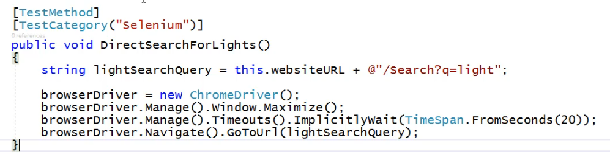

37. From the **Build** menu, click **Build Solution** and make sure the solution still builds correctly.

34. In **Test Explorer**, right-click the **DirectSearchForLights** test, and click **Run Selected Tests** to execute the test.

Your new test should also run as expected.

Congratulations! You've now completed this lab. 

For more information , you can see: 
Visual Studio: [https://aka.ms/edx-devops200.5x-vs01](https://aka.ms/edx-devops200.5x-vs01) 
Web Apps: [https://aka.ms/edx-devops200.5x-az03](https://aka.ms/edx-devops200.5x-az03)