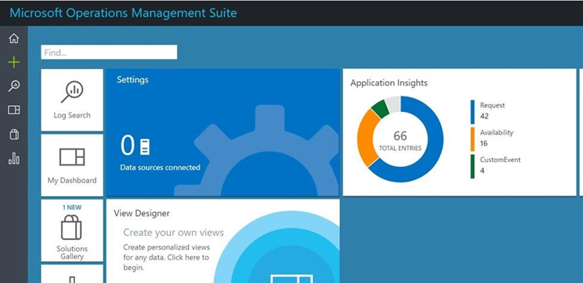
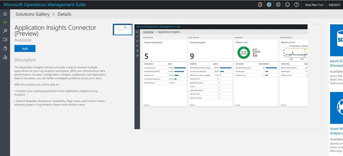
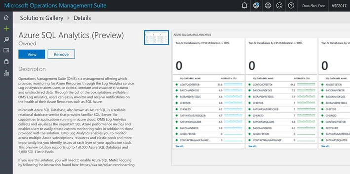
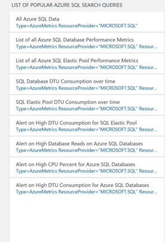
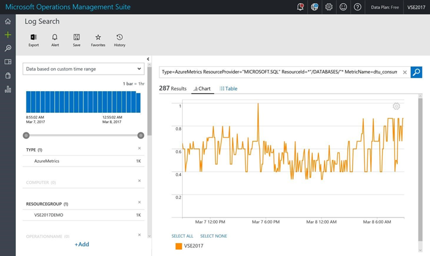
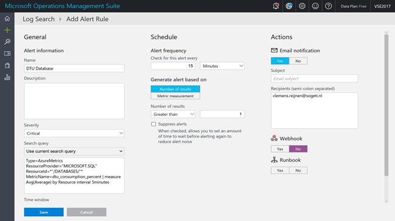

The product owner and sales colleagues who are responsible for the PartsUnlimited website and sales want to access to the usages telemetry data so they can investigate the pages visited and make queries and reports themselves.  

As a PartsUnlimited team member, enable Application Insights usages data to be available in PowerBI.  


<h3><span style="color: #0000CD;">DevOps MPP Course Source </span></h3>

- This lab is used in course <a href="https://www.edx.org/course/application-monitoring-feedback-loops-microsoft-devops200-7x-0" target="_blank"><span style="color: #0066cc;" color="#0066cc"> Application Monitoring and Feedback Loops</span></a> - Module 3.


<h3><span style="color: #0000CD;">Prerequisites:</span></h3>

- An Azure subscription
- Complete the earlier lab <a href="https://microsoft.github.io/PartsUnlimited/apm/200.7x-APM-HealthandPerfMonitoring.html" target="_blank"><span style="color: #0066cc;" color="#0066cc"> Health and Perf Mon with Ping, Web and Load Tests in Visual Studio  </span></a> 


<h3><span style="color: #0000CD;">Lab Tasks: </span></h3>

- Setup and OMS with Application Insights  
- Add SQL Data to the OMS Workspace  


<a href="http://microsoft.com/oms" target="_blank"><span style="color: #0066cc;" color="#0066cc">http://microsoft.com/oms</span></a> 


<h3><span style="color: #0000CD;">Estimated Lab Time:</span></h3>

- approx. 30 minutes  


### Task 1: Setup and OMS with Application Insights  


1.	Setup and OMS Workspace by navigating to <a href="http://microsoft.com/oms" target="_blank"><span style="color: #0066cc;" color="#0066cc">http://microsoft.com/oms</span></a>  and click the Try for free button. 

2. Sign in with your Microsoft account such as Outlook.com, or with an Organizational account provided by your company or educational institution to use with Office 365 or other Microsoft services.    

3. Provide a unique Workspace Name. A workspace is a logical container where your management data is stored. It provides you a way to partition data between different teams in your organization, as the data is exclusive to its workspace. 

4. Specify an email address and the region where you would like to have your data reside.  

5. Next, you can create a new Azure subscription or link to an existing Azure subscription.  


    


6.	Add the Application Insights Collector to the OMS workspace.  

    


7.	Configure the Application Insights Connector by linking the PartsUnlimitedWebsite Azure Resource.  

8.	Click on the Application Insights widget to see the charts and metrics right within OMS.  


### Task 2: Add SQL Data to the OMS Workspace  


1.	Open the OMS Workspace you just created 

2.	Add the Azure SQL Analytics solution to the workspace.  

    


3.	Configure OMS to monitor the PartsUnlimited SQL Server (See also steps in this blog <a href="https://blogs.technet.microsoft.com/msoms/2017/01/17/enable-azure-resource-metrics-logging-using-powershell/" target="_blank"><span style="color: #0066cc;" color="#0066cc"> Enable Azure resource metrics logging using PowerShell </span></a> )
  


4. Install the latest set of **AzureRM** modules on your workstation: 

    ```
    install-module -Name AzureRM -Force  
    ```

5. Open PowerShell in Administrator mode: Run as Administrator.  

6. Save the **Enable-AzureRMDiagnostics.ps1** script file locally, run the following command, providing a path to store the script: 

    ```
    save-script -Name Enable-AzureRMDiagnostics -Path  "C:\users\<username>\desktop\temp"  
    ```

    This downloads this powershell script. You should open it and have a quick browse through it

7. Go to the folder where you saved the script, and execute the command

    ```
    Enable- 
    AzureRMDiagnostics.ps1. PS C:\users\<username>\Desktop\temp> .\Enable- AzureRMDiagnostics.ps1   
    ```

    **Note:** Narrow down the monitoring to PartsUnlimited with the resource group switch in the command -ResourceGroup " PartsUnlimited-RG"  i.e. the resource group where you placed ParstUnlimited infrastructure


4.	Configure alerting on high DTU consumption by selecting, in the list of popular SQL queries, **Alert on High DTU Consumption for SQL Databases** 

    


5. 	Select the **Alert** option to configure the alert.  

    


6. Set the required fields. 

    


<h3><span style="color: #0000CD;"> Summary</span></h3>

In this lab you completed the following tasks:
- Setup and OMS with Application Insights  
- Add SQL Data to the OMS Workspace  