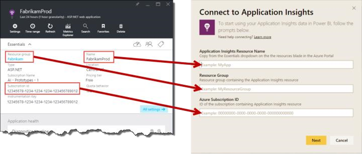
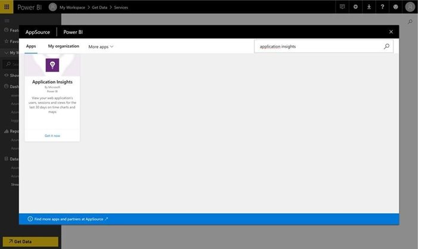
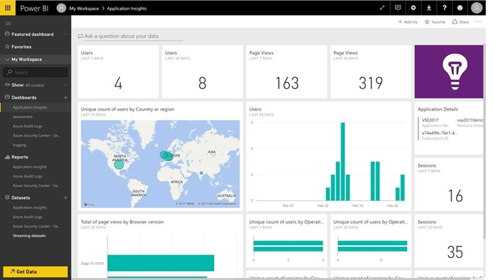

The product owner and sales colleagues who are responsible for the PartsUnlimited website and sales want to access to the usages telemetry data so they can investigate the pages visited and make queries and reports themselves.  

As a PartsUnlimited team member, enable Application Insights usages data to be available in PowerBI.  

<h3>DevOps MPP Course Source </h3>

- This lab is used in course <a href="https://www.edx.org/course/application-monitoring-feedback-loops-microsoft-devops200-7x-0" target="_blank"> Application Monitoring and Feedback Loops</a> - Module 2.

<h3>Prerequisites:</h3>

- An Azure subscription
- Complete the earlier lab <a href="https://microsoft.github.io/PartsUnlimited/apm/200.6x-APM-HealthandPerfMonitoring.html" target="_blank"> Health and Perf Mon with Ping, Web and Load Tests in Visual Studio  </a> 

<h3>Lab Tasks: </h3>

- Configure Telemetry Data for use in Power BI  

<h3>Estimated Lab Time:</h3>

- approx. 30 minutes  

### Task 1: Configure Telemetry Data for use in Power BI  

1. Sign up for PowerBI or sign in to an existing PowerBI instance. Follow the steps on:  <a href="https://docs.microsoft.com/en-us/power-bi/service-self-service-signup-for-power-bi " target="_blank"> https://docs.microsoft.com/en-us/power-bi/service-self-service-signup-for-power-bi </a> 

    There are some basic details and additional information available on the page <a href="https://docs.microsoft.com/en-us/power-bi/service-basic-concepts" target="_blank"> Power BI - basic concepts for Power BI service</a> 

2. Add PowerBI.  

    

    

3.	Authenticate PowerBI to access Application Insights.  

4.	Investigate the created dashboard.  

    

<h3> Summary</h3>

In this lab you completed the following tasks:
- Configure Telemetry Data for use in Power BI  