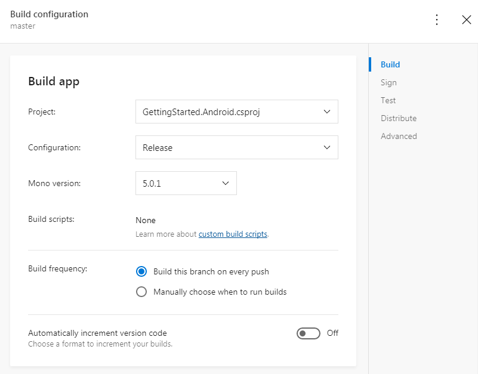

In this lab we will Connect, Configure and Build Android and iOS Apps in Visual Studio App Center (VSAC). The lab is broken into two components and you can complete one of both of them depending on yuor preference.

<h3>DevOps MPP Course Source </h3>

- This lab is used in course <a href="https://www.edx.org/course/devops-mobile-apps-microsoft-devops200-8x" target="_blank">DevOps200.8x: DevOps for Mobile Apps</a> - Module 2.

<h3> Pre-requisites:</h3>

- Complete the earlier Mobile VSAC lab <a href="http://microsoft.github.io/PartsUnlimited/mobile/200.8x-Mobile-GettingStartedinVSAC.html" target="_blank">Getting Started in Visual Studio App Center</a>

<h3> Lab Tasks:</h3> 

- Android
    - Connect to Your Repository Service
    - Configuring and Build Your App
- iOS
    - Connect to Your Repository Service
    - Configuring and Build Your App

<h3>Estimated Lab Time:</h3>

- approx. 30 minutes  

##  Android 

### Task 1: Connect to Your Repository Service

1. Select the Android or Xamarin.Android app that you want to work with.

2. Click the Build tab on the left menu. 

3. Connect to your repository service: GitHub, Visual Studio Team System (VSTS), or BitBucket.

4. After you are connected, choose from the list of branches in your repo. 

### Task 2: Configuring and Building Your App

1. Click the Configure Build button on the branch detail blade. The Build Configuration blade will appear pre-populated with fields from your selected branch. There are five sections in the configuration of an App Center build: Build, Sign, Test, Distribute, and Advanced. See these sections in the figure below.

2. Select the project that you want to build in the project drop-down.  If no project is found, check that it’s shared and that you’ve selected the correct branch, and that everything is checked in. 

3. Choose the release configuration from the drop-down. 

4. For Xamarin.Android builds, select the Mono Version to run the build on.

5. Set the Build Freqency to the basic setting Manually Choose When to run builds.

6. For native Android projects, enter your build.gradle file. Your build.gradle file contains dependencies, build types, build tools version, and product flavors.

7. Click Save & Build. Building may take a few minutes.

8. When the build is completed, check if it succeeded.  If it did not, click on the build and click Download Logs to see what went wrong. 

9. If the build succeeded, click the build to bring up the build details. Select Download, then download build.

10. Take the .apk download and install and run the build on your own Android simulator.

##  iOS 

### Task 1: Connect to Your Repository Service

1. Select the iOS or Xamarin.iOS app you want to work with.

2. Click the Build Tab on the left menu. 

3. Connect to your repository service: GitHub, Visual Studio Team System (VSTS), or BitBucket.

4. After you have connected, choose from the list of branches in your repo. 

### Task 2: Configuring and Building 

1. Click the Configure Build button on the branch detail blade. The Build Configuration blade will appear pre-populated with fields from your selected branch. There are five sections in the configuration of an App Center build: Build, Sign, Test, Distribute, and Advanced.

2. Select the project that you want to build in the project drop-down.  If no project is found, check that it’s shared and that you’ve selected the correct branch, and that everything is checked in. 

3. Choose the Release configuration from the drop-down. 

4. Set the XCode version to run the build on.

4. For Xamarin.iOS builds, select the Mono Version to run the build on.

5. Set the Build Freqency to the basic setting Manually Choose When to run builds.

6. Select CocoaPods for a native iOS project workspace. App Center searches the branch for Podfiles to install unless a /Pod folder exists.

7. Click Save & Build. Building may take a few minutes.

8. When the build is completed, check if it succeeded.  If it did not, click on the build and click Download Logs to see what went wrong. 

9. If the build succeeded, click the build to bring up the build details. Select Download, then Download build.

10. Take the .ipa download and install and run the build on your own iOS simulator.

<h3> Summary</h3>

In this lab you completed the following tasks for both, or either, Android or iOS:

- Connected to Your Repository Service
- Configured and Built Your Android or iOS App