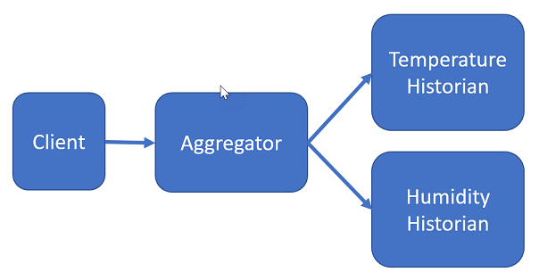
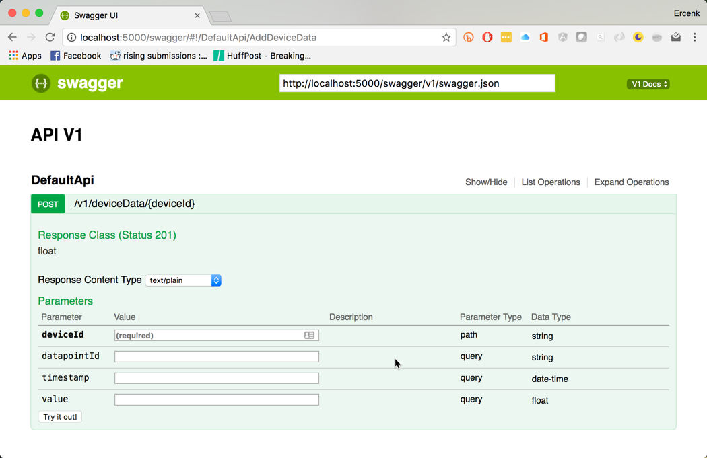
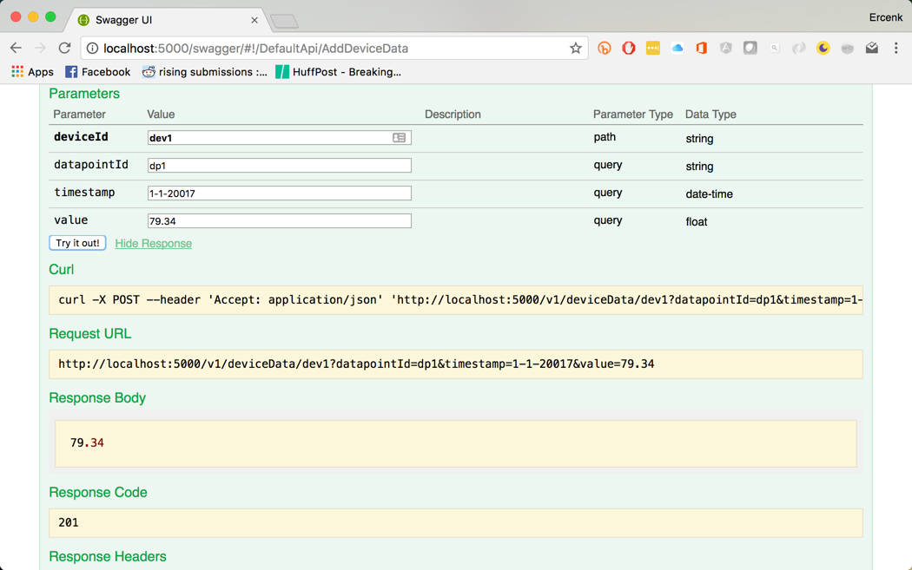

In this lab we will  go through a set of steps for building a sample application with multiple microservices.

<h3><span style="color: #0000CD;">DevOps MPP Course Source </span></h3>

- This lab is used in course <a href="https://www.edx.org/course/architecting-distributed-cloud-microsoft-devops200-9x-1" target="_blank"><span style="color: #0066cc;" color="#0066cc">DevOps200.9x: Architecting Distributed Cloud Applications</span></a> - Module 2.


<h3><span style="color: #0000CD;"> Pre-requisites:</span></h3>

This lab has a dependency on the following technologies. These will need to be installed on a development machine to complete the lab.

- <a href="https://docs.docker.com/engine/installation/" target="_blank"><span style="color: #0066cc;" color="#0066cc">Docker CE</span></a>
- <a href="https://www.microsoft.com/net/core" target="_blank"><span style="color: #0066cc;" color="#0066cc">.NET Core</span></a>
- <a href="https://code.visualstudio.com/" target="_blank"><span style="color: #0066cc;" color="#0066cc">Visual Studio Code</span></a>
- <a href="https://marketplace.visualstudio.com/items?itemName=ms-vscode.csharp" target="_blank"><span style="color: #0066cc;" color="#0066cc">VS Code C# Extension</span></a>


<h3><span style="color: #0000CD;"> Lab Tasks:</span></h3> 

- Sample application definition
- Create the folder structure
- Defining the API
- Scaffolding the Services
- Generating the Service Stubs for both Services
- Building the Internal Storage for Services
- Using the Data Stores in both Services
- Building and Testing Temperature Historian
- Running the Temperature Historian in a Container
- Generating the Client Code with AutoRest
- Building the Aggregator Service with Retries
- Building with Docker Compose


<h3><span style="color: #0000CD;">Estimated Lab Time:</span></h3>

- approx. 40 minutes  


### Task 1: Sample Application Definition

The application is a simple IoT data aggregator and a set of historians. For the sake of simplicity, we will show a single recorder implementation.  

We will specify the API, generate the code, and implement it, with networking communication mechanisms, and go through steps to implement retry logic using a library, and have an idempotent API.

The 30,000-foot view of the application is going to be as follows. Each of those services will be running in a Docker container.



We will not develop a client; rather, we use Wget to post data to the aggregator service. Here are the responsibilities of the services:

#### Aggregator service

Aggregator service's role is to collect data from various devices, and forward the data to the appropriate service, based on the device type, and keep a record of running averages for each device. It will communicate with the historian services via their endpoints. We will implement the calls to the historian services with retries.

#### Historian services

We will have a historian service for each device type. Basic functionality of those services is going to be simply recording the data points, and return a running average after each data point is received, per device. The data point create operation needs to be idempotent so the returned running average stays correct. 

### Task 2:  Create the folder structure

As we are going through the steps for this exercise, we will be creating files to form our solution. 

1. Start with creating a top level folder for the application.
2. Create two folders, one for the aggregator service, another one for the temperature historian service.

### Task 3: Defining the API

We have mentioned the community-driven standard [OpenAPI Specification](https://www.openapis.org) and the related [tools](http://swagger.io/). We will use those in this step for specifying the APIs of the services above.

There are a number of editors for authoring API definition. Swagger editor at [http://editor.swagger.io](http://editor.swagger.io) is an online editor, there is also a Node.js version you can run locally, or as a Docker image. There are also extensions for Visual Studio Code. We will use YAML for our specifications.

To pull and run the Docker image, run:

```
docker pull swaggerapi/swagger-editor && \
docker run --rm -it -p 35600:8080 swaggerapi/swagger-editor
```

The first command pulls the image form the Docker Hub, and the second command runs the image exposing port 35600 on the localhost, attaches the pseudo-tty, and removes the container once it exits automatically.

Let's start with the aggregator service. We will have two operations, one to post device data, and another to retrieve a list of running averages, per device type.

[swagger yaml](./assets/aggregator_service/aggregator.yaml)
```YAML
swagger: '2.0'
info:
  version: 1.0.0
  title: IoT Aggregator API
  description: >-
    Sample API for aggregating data from multiple IoT devices and returning
    stored running averages.
  license:
    name: Apache 2.0
    url: 'http://www.apache.org/licenses/LICENSE-2.0.html'
schemes:
  - http
host: aggregator.api
basePath: /v1
produces:
  - application/json
consumes:
  - application/json
paths:
  /deviceData/{deviceType}/{deviceId}:
    post:
      summary: Add data generated from a device to the aggregator
      description: >-
        Adds a data point from an IoT device. The aggregator selects the
        historian service, posts data to it, and receives the running average.
        Then updates its store for the history of running averages by device id
        and type.
      operationId: addDeviceData
      produces:
        - application/json
      consumes:
        - application/json
      parameters:
        - $ref: '#/parameters/DeviceTypeParameter'
        - $ref: '#/parameters/DeviceIdParameter'
        - $ref: '#parameters/DataPointIdParameter'
        - in: query
          name: value
          description: 'Value registered by the device.'
          required: true
          type: number
          format: float
      responses:
        201:
          description: Data added successfully.
        401:
          $ref: '#/responses/Standard401InvalidInput'
        500:
          $ref: '#/responses/Standard500ErrorResponse'
  /averageByDeviceType/{deviceType}:
    get:
      summary: Get the running averages of a device type given a date range.
      description: >-
        Returns the running average of a device type given a date range,
        averaged by the minute.
      parameters:
        - $ref: '#/parameters/DeviceTypeParameter'
        - in: query
          name: fromTime
          description: Start of the date range.
          required: true
          type: string
          format: date-time
        - in: query
          name: toTime
          description: End of the date range.
          required: true
          type: string
          format: date-time
      responses:
        200:
          description: Running averages per minute
          schema:
            $ref: '#/definitions/DeviceDataPoints'
        400:
          $ref: '#/responses/Standard401InvalidInput'
        500:
          $ref: '#/responses/Standard500ErrorResponse'
parameters:
  DeviceTypeParameter:
    in: path
    name: deviceType
    description: Device type
    required: true
    type: string
    enum:
      - temperature
      - humidity
      - barometricPressure
  DeviceIdParameter:
    in: path
    name: deviceId
    description: 'Device ID'
    required: true
    type: string
    pattern: '^[0-9a-f]{8}-[0-9a-f]{4}-[1-5][0-9a-f]{3}-[89ab][0-9a-f]{3}-[0-9a-f]{12}$'
    minLength: 36
    maxLength: 36
  DataPointIdParameter:
    in: query
    name: dataPointId
    description: 'Each data point needs to have a unique ID'
    required: true
    type: string
    pattern: '^[0-9a-f]{8}-[0-9a-f]{4}-[1-5][0-9a-f]{3}-[89ab][0-9a-f]{3}-[0-9a-f]{12}$'
    minLength: 36
    maxLength: 36
definitions:
  Error:
    type: object
    properties:
      code:
        type: string
      message:
        type: string
  DeviceData:
    type: object
    properties:
      deviceId:
        type: string
      timestamp:
        type: string
        format: date-time
      value:
        type: number
        format: double
  DeviceDataPoints:
    type: array
    items:
      $ref: '#/definitions/DeviceData'
responses:
  Standard500ErrorResponse:
    description: An unexpected error occurred.
    schema:
      $ref: '#/definitions/Error'
  Standard401InvalidInput:
    description: Invalid input parameter.
    schema:
      $ref: '#/definitions/Error'

```


Continuing with the historian service, we will have only one operation, for adding data.


[swagger yaml](./assets/historian_services/historian.yaml)
```YAML
swagger: '2.0'
info:
  version: 1.0.0
  title: IoT Historian API
  description: >-
    Sample API for keeping a history of IoT devices.
  license:
    name: Apache 2.0
    url: 'http://www.apache.org/licenses/LICENSE-2.0.html'
schemes:
  - http
host: historian.api
basePath: /v1
produces:
  - application/json
consumes:
  - application/json
paths:
  /deviceData/{deviceId}:
    post:
      summary: Add data to the device history
      description: >-
        Adds a data point from an IoT device. Once saved, calculates the running average of the existing data, saves it idempotentently and returns it.
      operationId: addDeviceData
      produces:
        - application/json
      consumes:
        - application/json
      parameters:
        - in: path
          name: deviceId
          description: 'Device Id'
          required: true
          type: string
          pattern: '^[0-9a-f]{8}-[0-9a-f]{4}-[1-5][0-9a-f]{3}-[89ab][0-9a-f]{3}-[0-9a-f]{12}$'
          minLength: 36
          maxLength: 36
        - in: query
          name: datapointId
          description: 'Each data point needs to have a unique ID'
          required: true
          type: string
          pattern: '^[0-9a-f]{8}-[0-9a-f]{4}-[1-5][0-9a-f]{3}-[89ab][0-9a-f]{3}-[0-9a-f]{12}$'
          minLength: 36
          maxLength: 36
        - in: query
          name: timestamp
          description: 'Timestamp when received from the device.'
          required: true
          type: string
          format: date-time
        - in: query
          name: value
          description: 'Value registered by the device.'
          required: true
          type: number
          format: float  
      responses:
        201:
          description: Data added successfully.
          schema:
            type: number
            format: float
        400:
          $ref: '#/responses/Standard401InvalidInput'
        500:
          $ref: '#/responses/Standard500ErrorResponse'
definitions:
  Error:
    type: object
    properties:
      code:
        description: 'Error code set by the operation.'
        type: string
      message:
        description: 'Message related with the error.'
        type: string
responses:
  Standard500ErrorResponse:
    description: An unexpected error occurred.
    schema:
      $ref: '#/definitions/Error'
  Standard401InvalidInput:
    description: Invalid input parameter.
    schema:
      $ref: '#/definitions/Error'
```
Create the API specification files as described above, and place them in their respective folders for the services.

###  Task 4:  Scaffolding the Services

In this step, we will use Visual Studio Code and ASP.NET Core for building the application

1. Change into the aggregator service directory. Scaffold a new project with `dotnet new webapi`
2. Repeat the previous step for the Temperature Historian service.

###  Task 5: Generating the Service Stubs for both Services

1. Launch the Swagger editor if it is closed, and load in the API specification for the service, and generate the code using `aspnetcore` generator for both services. Unless otherwise specified, following steps are for both services.

  

2. Swagger code generation targets ASP.NET Core 1.0. We will need to borrow the generated code, and put it in our project to use it in a .NET Core 1.1 solution.

3. Make sure you have the "Nuget Package Manager" extension installed on Visual Studio Code.

4. Install the following packages:
    * `Microsoft.AspNetCore.StaticFiles` version 1.1.2
    * `Swashbuckle.AspNetCore` version 1.0.0

5. Modify the `Program.cs` code to set logging for the Kestrel service, and start listening a port as follows:
```csharp
    .UseKestrel(
        options =>
        {
            options.UseConnectionLogging();
        }
    )
    .UseUrls("http://+:5000")
```

6. Edit the Startup.cs code to add the following using statements:

```csharp
using Newtonsoft.Json.Serialization;
using Swashbuckle.AspNetCore.Swagger;
```
7. Replace the implementation of Startup class with the following block. With these changes, will start using the Swashbuckle package, and its UI for the APIs. Notice we are also removing the setup for using configuration files, but leaving the support for environment variables only.

```csharp
public class Startup
    {
        public Startup(IHostingEnvironment env)
        {
            var builder = new ConfigurationBuilder()
                .AddEnvironmentVariables();
            Configuration = builder.Build();

            this.hostingEnvironment = env;
        }

        public IConfigurationRoot Configuration { get; }

        protected IHostingEnvironment hostingEnvironment;

        // This method gets called by the runtime. Use this method to add services to the container.
        public void ConfigureServices(IServiceCollection services)
        {
            // Add framework services.
            services.AddMvc()
                .AddJsonOptions(
                    opts =>
                    {
                        opts.SerializerSettings.ContractResolver = new CamelCasePropertyNamesContractResolver();
                    });

            services.AddSwaggerGen(c =>
            {
                c.SwaggerDoc("v1", new Info { Title = "API V1", Version = "v1" });
            });
        }

        // This method gets called by the runtime. Use this method to configure the HTTP request pipeline.
        public void Configure(IApplicationBuilder app, IHostingEnvironment env, ILoggerFactory loggerFactory)
        {
            loggerFactory.AddConsole(Configuration.GetSection("Logging"));
            loggerFactory.AddDebug();

            app.UseMvc();

            app.UseDefaultFiles();
            app.UseStaticFiles();

            app.UseSwagger();
            app.UseSwaggerUI(c =>
            {
                c.SwaggerEndpoint("/swagger/v1/swagger.json", "V1 Docs");
            });
        }
    }
```
8. Copy the contents of `Models` and `Controller` folders from the generated service code to the corresponding folders to your newly scaffolded project.

9. Fix the namespaces in the copied files accordingly to your project's.

10. Change the using statement in `DefaultApi.cs` from

```csharp
using Swashbuckle.SwaggerGen.Annotations
```


   to

```csharp
using Swashbuckle.AspNetCore.SwaggerGen;
```
11. After building and running the project, you can navigate to `http://localhost:5000/swagger/` for displaying your API's swagger documentation.

###  Task 6: Building the Internal Storage for Services

1. We will be holding state in both of the services, and for demonstration purposes, it will be in-memory.
2. Let's start with defining the interface. We clearly do not have to have the exact same interface for the internal storage for both of the services, but for simplicity sake, we will use the same.
3. Add the following interface to both services.
```csharp
using System.Collections.Generic;

namespace ServiceStore
{
    public interface IStore
    {
        void Add(string key, float value);

        float Get(string key);

        bool Exists(string key);

        IDictionary<string, float> GetAll();

        void Update(string key, float value);
    }
}
```
4. Add the following class to both services.
```csharp
using System;
using System.Collections.Generic;

namespace ServiceStore
{
  public class Store : IStore
    {
        private readonly Dictionary<string, float> internalSore;

        public Store()
        {
            this.internalSore = new Dictionary<string, float>();
        }
        public void Add(string key, float value)
        {
            this.internalSore.Add(key, value);
        }

        public float Get(string key)
        {
            if (!this.internalSore.ContainsKey(key))
            {
                throw new InvalidOperationException($"No record for key {key}.");
            }

            return this.internalSore[key];
        }

        public bool Exists(string key)
        {
            return this.internalSore.ContainsKey(key);
        }

        public IDictionary<string, float> GetAll()
        {
            return this.internalSore;
        }

        public void Update(string key, float value){
            if (this.Exists(key)){
                this.internalSore[key] = value;
            }
        }
    }
}
```

###  Task 7: Using the Data Stores in both Services

1. We will need to make the instances of those classes singletons, available during the lifetime of the service. To repeat, since this is an exercise, we want to keep the details as simple as possible.
2. Insert the following line as the first line of code in the `ConfigureServices` method in the Startup.cs file for both of the services.

```csharp
            // Add the store as a singleton
            services.AddSingleton<IStore>(new Store());
```

3. Add a constructor to the Controller classes on both services, that accept the singleton instance of the store and a logger. Also declare private readonly fields to hold them as follows:
```csharp
        private readonly IStore store;
        private readonly ILogger logger;

        public DefaultApiController(IStore store, ILogger<DefaultApiController> logger)
        {
            this.store = store;
            this.logger = logger;
        }
```

###  Task 8: Building and Testing Temperature Historian

1. Modify the only action on the controller as follows. Please note the result value on the SwaggerResponse attribute, it should be 201. The version of the code generator we used while developing this exercise was generating a 200. Also notice the implementation to make this an idempotent operation.

```csharp
       [HttpPost]
        [Route("/v1/deviceData/{deviceId}")]
        [SwaggerOperation("AddDeviceData")]
        [SwaggerResponse(201, type: typeof(float?))]
        public virtual IActionResult AddDeviceData([FromRoute]string deviceId, [FromQuery]string datapointId, [FromQuery]DateTime? timestamp, [FromQuery]float? value)
        {
            var key = $"{deviceId};{datapointId}";

            if (!this.store.Exists(key) && value.HasValue)
            {
                this.store.Add(key, value.Value);
                this.logger.LogInformation($"Added {value.Value} for {key} to the store at {timestamp}.");
            }

            if (!value.HasValue){
                this.logger.LogError($"No value found for {key}.");
                return BadRequest($"No data value for device: {deviceId} and datapoint {datapointId}");
            }

            var average = this.store.GetAll().Where( i => i.Key.StartsWith(deviceId)).Average( v => v.Value);

            this.logger.LogInformation($"Returning {average}.");
            return Created("", average);
        }
```
2. Now run the code, and navigate to `http://localhost:5000/swagger`to display the Swagger UI. 
  
3. Enter random values in the fields on the form, and submit.

4. You should see the response received
  


###  Task 9: Running the Temperature Historian in a Container

1. The existing tools for debugging ASP.NET Core applications in Docker containers with Visual Studio Core does not yet support .NET Core 1.1. We will debug the code standalone, and build the container as a separate step.
2. Open the Terminal pane on Visual Studio Code and publish the code
```
dotnet restore && dotnet publish -o ./publish
```
3. Create the Dockerfile as:
```Docker
FROM microsoft/aspnetcore:1.1
WORKDIR /app
EXPOSE 5000
COPY ./publish .
ENTRYPOINT ["dotnet", "TemperatureHistorian.dll"]
```
4. Build the Docker image "`docker build -t lab2/temperaturehistorian:1.0 .`"

5. Create a new container from the image and run it "`docker run --rm -it -p 8181:5000 lab2/temperaturehistorian:1.0`"

6. Navigate to `http://localhost:8181/swagger/` and verify the container works

7. Terminate the container with Ctrl-C

###  Task 10: Generating the Client Code with AutoRest

AutoRest is a tool that generates client libraries for RESTful services. It is also available as a Docker image. Swagger code generation tool also offers a client generation option, but the generated code does not lend itself well with .NET Core 1.1. We will use AutoRest for client code generation instead.

1. Pull the image with "`docker pull azuresdk/autorest:latest`"

2. Start a TemperatureHistorian container to the network "`docker run -p 8181:5000 --rm --name temphistorian lab2/temperaturehistorian:1.0`"

3. Inspect the new container with "`docker inspect temphistorian`" to see its ID address. Let's assume it is 172.17.0.2. 

4. Change the directory to the Aggregator service

5. Create a directory for the client, let's call it ServiceClients

6. Create an AutoRest container, and connect it to the historian container. Docker creates a bridge network by default and we can use that between the containers. "`docker run -it -v ${PWD}:/local  azuresdk/autorest mono ./AutoRest.exe -Namespace ServiceClients -CodeGenerator CSharp -Modeler Swagger -Input http://172.17.0.2:5000/swagger/v1/swagger.json -OutputDirectory /local/ServiceClients -ClientName TemperatureHistorian`"


###  Task 11: Building the Aggregator Service with Retries

We will be using the historian service, when a request for adding a datapoint is received to add the data subsequently to the historian service. In order to do that, we will first instantiate a historian client, and call its only operation with retries.

1. We will need to bring in the endpoint for the Historian service from configuration. 

2. Add a class named ServiceOptions in a file named ServiceOptions.cs in the Aggregator project's Models directory and paste the following:
```csharp
namespace Aggregator.Models
{
    public class ServiceOptions
    {
        public string TEMPHISTORIAN {get; set;}
    }
}
```

3. Open Startup.cs file for the Aggregator service, and add the following line, right after the store singleton registration in the ConfigureServices method. Also notice how we are registering the Temperature historian client.
```csharp
        public void ConfigureServices(IServiceCollection services)
        {
            // Add the store as a singleton
            services.AddSingleton<IStore>(new Store());

            // Add the historian client
            services.AddTransient<ITemperatureHistorian>( 
                (s) => new TemperatureHistorian(new Uri(Configuration["TEMPHISTORIAN"])));

```
4. Open the DefaultApi.cs file for the Aggregator service, and modify the constructor as follows, also adding a read only field for the historian client.
```csharp
        private readonly IStore store;
        private readonly ILogger<DefaultEventAttribute> logger;
        private readonly ITemperatureHistorian historian;

        public DefaultApiController(IStore store, ILogger<DefaultEventAttribute> logger, ITemperatureHistorian historian)
        {
            this.store = store;
            this.logger = logger;
            this.historian = historian;
        }
```

5. We will use the Polly library for implementing retries, and use exponential backoff. Add the package `Polly` to the project.

6. Modify the `AddDeviceData` method as follows. What is happening here is....
```csharp
            if (!deviceType.Equals("TEMP"))
            {
                this.logger.LogError($"Device type {deviceType} is not supported.");
                return BadRequest($"Unsupported device type {deviceType}");
            }
            float? averageValue = default(float?);

            var retryPolicy = Policy
                .Handle<HttpOperationException>()
                .WaitAndRetry(5, retryAttempt =>
                    TimeSpan.FromSeconds(Math.Pow(2, retryAttempt))
                );

            averageValue = retryPolicy.Execute(() =>
               this.historian.AddDeviceData(deviceId, dataPointId, DateTimeOffset.UtcNow.DateTime, value));

            if (!averageValue.HasValue)
            {
                var message = $"Cannot calculate the average.";
                this.logger.LogError(message);
                return BadRequest(message);
            }

            var key = $"{deviceType};{deviceId}";
            if (this.store.Exists(key))
            {
                this.logger.LogInformation($"Updating {key} with {averageValue.Value}");
                this.store.Update(key, averageValue.Value);
            }
            else
            {
                this.logger.LogInformation($"Added {key} with {averageValue.Value}");
                this.store.Add(key, averageValue.Value);
            }

            return Ok(averageValue.Value);
```
7. We can test both of the services locally. Make sure the services listen on different ports by modifying the corresponding Program.cs files. If you change the port of the historian, make sure the environment variable (if using Visual Studio Code, it is in launch.json file) "TEMPHISTORIAN" is defined and pointing to the right endpoint of the historian for the aggregator service.

###  Task 12: Building with Docker Compose
Now it is time to bring the services together on Docker. To do this, we will use docker-compose.

1. Add a file named docker-compose.yaml at the solution directory. Notice the port mappings, (if you have changed the ports in the services, make sure the docker-compose values and the ports the services listen on are the same) and environment variable setting)
```yaml
version: '3'
services:
  temphistorian:
    build: 
      context: ./TemperatureHistorian
    ports:
      - "5000:5000"
  aggregator:
    build: 
      context: ./Aggregator
    ports:
      - "36768:5000"
    environment: 
      TEMPHISTORIAN: http://temphistorian:5000
```
2. Now bring the solution up with `docker-compose up`

3. Access the Swagger ui at `http://localhost:36768/swagger` and submit the request.


<h3><span style="color: #0000CD;"> Summary</span></h3>

In this lab you completed the following tasks:

- Sample application definition
- Created the folder structure
- Defined the API
- Scaffolded the Services
- Generated the Service Stubs for both Services
- Built the Internal Storage for Services
- Used the Data Stores in both Services
- Built and Tested Temperature Historian
- Ran the Temperature Historian in a Container
- Generated the Client Code with AutoRest
- Built the Aggregator Service with Retries
- Built with Docker Compose


