HOL - Fault Injection for Azure PaaS
====================================

Your manager has expressed interest in the stability and fault-tolerance of the new cloud based infrastructure. It's your task to determine how and if the system will still operate after injecting faults into the environment. The estimated number of concurrent users for this system is 600 people.
> **Note:** In this lab, knowledge of how to deploy a Azure Resource Management (ARM) template and how to publish a website to App Service in Azure is assumed.


## Pre-requisites:

* [Visual Studio 2015 Update 3](https://www.visualstudio.com/downloads/)

* Latest [Azure SDK 2.9.5](https://www.microsoft.com/en-us/download/details.aspx?id=53600) installed


## Tasks Overview:
**1. Set up a scalable and highly available environment** This will walk you through deploying main cluster and failover cluster to Azure using ARM template. You will also configure traffic manager and Geo-Replication of the production database from the main cluster to the failover cluster database.

**2. Set up Application Insights** In this task you will connect your main cluster's App Service to an Application Insights instance.

**3. Fault injection into the main cluster** In this task you will configure a load test to simulate users browsing your website and then you will start to decrease number of VM instances run in your App Service.

**4. Analyze results of the load test** In this task you will collect data from different sources, like build-in App Service's metrics, Application Insights' metrics and VSTS's load test metrics, then use it to draw a conclusion.

**5. Test the traffic manager's functionality** In this task you will disable main cluster's App Service, and confirm that traffic manager will start redirecting to your failover cluster.


## HOL:
### Task 1: Set up a scalable and highly available environment

In this task you can use any two regions for your clusters as long as [Geo-Replication](https://azure.microsoft.com/en-us/documentation/articles/storage-redundancy/) is supported.

**Step 1.** Clone the PartsUnlimited repository to a local directory.

1. Open a command line (one that supports Git) and navigate to the directory where you want to store your local repositories. For example in a Windows OS, you can create and navigate to `C:\Source\Repos`.

2. Clone the repository with the following command:

    ```
    git clone https://github.com/Microsoft/PartsUnlimited.git
    ```
    > After a few seconds of downloading, all of the code should now be on your local machine.

3. Move into the repository directory that was just created. In a Windows OS, you can use this command:

    ```
    cd PartsUnlimited
    ```


**Step 2.** Open the PartsUnlimited solution with Visual Studio

In the command line, type the following:

```
start PartsUnlimited.sln
```
Alternatively, navigate to where you cloned the repository to e.g. `C:\Source\Repos\PartsUnlimited` with explorer and double click on PartsUnlimited.sln


**Step 3.** Deploying an ARM template for the main cluster.

1. Right click on `PartsUnlimitedEnv` project, select `Deploy` and click on `New...`

    

2. In the "Resource group" dropdown click on `<Create new...>`. Select your subscription, enter a name, select `East US` in the "Resource group location" dropdown and click on "Create".

    

3. Select the "FullEnvironmentSetupMerged.json" template and the corresponding param file to deploy. Both files are located at `env` >`Templates` folder of your local repository.

    

4. Click on "Edit Parameters..." and enter the details for the main cluster. Click on "Save" and then "Deploy".

    
    > **Note:** Make sure that:<br> 1) All of the names will be specific to the main cluster and unique across Azure.<br> 2) "PartsUnlimitedDBEdition" must be set to "Standard" for Geo-Replication to work.


**Step 4.** Deploying an ARM template for the standby cluster.

1. Right click on `PartsUnlimitedEnv` project, select `Deploy` and click on `New...`

    

2. In the "Resource group" dropdown click on `<Create new...>`. Select your subscription, enter a name, select `West US` in the "Resource group location" dropdown and click on "Create".

    

3. Select the "FullEnvironmentSetupMerged.json" template and the corresponding param file to deploy.

    

4. Click on "Edit Parameters..." and enter the details for the standby cluster. Click on "Save" and then "Deploy".

    
    > **Note:** Make sure that:<br> 1) All of the names will be specific to the main cluster and unique across Azure.<br> 2) "PartsUnlimitedDBEdition" must be set to "Standard" for Geo-Replication to work.


**Step 5.** Publish PartsUnlimited to the main and standby clusters.

1. Right click on `PartsUnlimitedWebsite` project and select `Publish...`

    

2. Click on "Microsoft Azure App Service".

    

3. Select the main cluster, click "OK", then "Publish".

    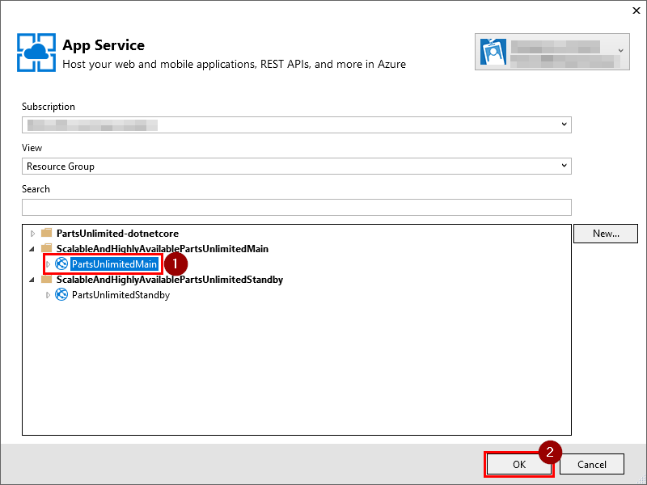

4. Similarly, repeat the previous steps for the standby cluster.


**Step 6.** Set up the scalability of the App Service.

1. Open the resource group of your main cluster and click on the "App Service" instance.

    

2. Click on "Scale out (App Service plan)", make sure that "Scale by" is set to "an instance count that I enter manually", increase the number of instances to 4, then click "Save".

    

3. In this lab we will leave the number of instances in the failover cluster at 1.
  > **Note:** In this lab we want to control the number of instances running in the App Service, then we can simulate an instance fault by decrementing the total available number of instances. Usually we would prefer to define rules such that the number of instances will scale automatically based on their metrics.

**Step 7.** Set up the Geo-Replication of the production database.

1. Navigate to the "Overview" page of the main cluster's resource group and click on the production database server.

    

2. Click on your database in the list of available databases.

    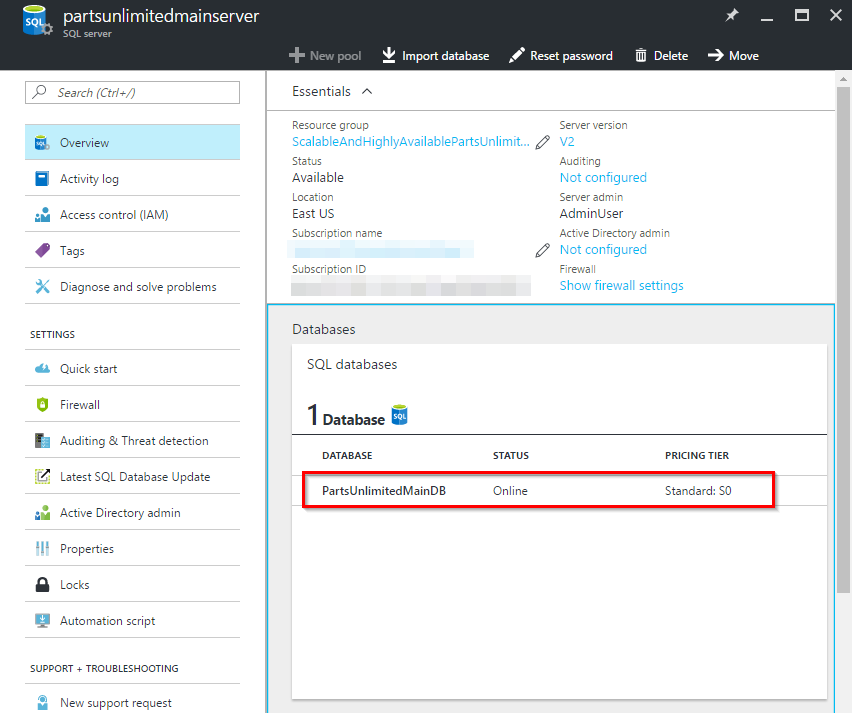

3. Click on "Geo-Replication" and select "West US" in the "Target Regions" list.

    

4. Set "Secondary type" to "Readable", select the production database in the standby cluster as a "Target server" and click "OK".

    

5. Once the database has been copied, you should be able to see it on the overview page of the standby cluster's resource group. Note that the production SQL server now has two databases in it.

    

6. Since we do not intend to use the production database in the standby cluster deployed by the ARM template, let's delete it. Click on the production database, then on "Delete" and "OK" to confirm.

    

7. Finally, update the database connection string for the App Service in the standby cluster. Click on the App Service and select "Application settings". Click on "< Hidden for Security >" to reveal your database connection string.

    

    **Note:** You should find the data in the following format:

        Data Source=tcp:<DBServerName>.database.windows.net,1433;Initial Catalog=<DBName>;User Id=<UserName>@<DBServerName>;Password=<YourPassword>;

8. Modify the username and password to match those selected during the ARM template deployment of the main cluster. Update the DBName to the newly migrated DBName (e.g. PartsUnlimitedMainDB in this Lab).

    **Note:** The final version of the database connection string in this lab should look as follows:

        Data Source=tcp:partsunlimitedstandbyserver.database.windows.net,1433;Initial Catalog=PartsUnlimitedMainDB;User Id=AdminUser@partsunlimitedstandbyserver;Password=************;


**Step 8.** Creating and configuring the traffic manager in Azure.

1. Create a new resource group for the traffic manager.

    * Click on "Resource Groups" and then click on "Add".

      

    * Enter the group name, select subscription, specify "East US 2" as a resource group location and click "Create".

      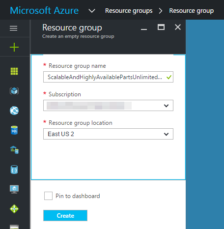

2. Open the newly created resource group.

    

3. Click on the "Add" button.    

    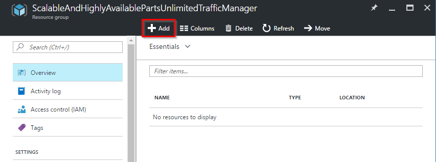

4. Type "traffic manager" and press "Enter". This will filter the options. Select "Traffic Manager profile" and click on the "Create" button.

    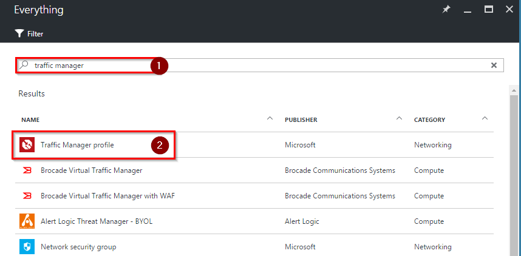

5. Enter the name, select "Priority" as the routing method and click "Create".
    > **Note:**
    <br> **Priority:** Traffic Manager will use a primary service endpoint for all traffic, and provide backups in case the primary endpoints are unavailable.
    <br> **Weighted:** Traffic Manager will distribute traffic across a set of endpoints, either evenly or according to weights, which you define.
    <br> **Performance:** Traffic Manager will redirect to the "closest" endpoint in terms of the lowest network latency for each user.

    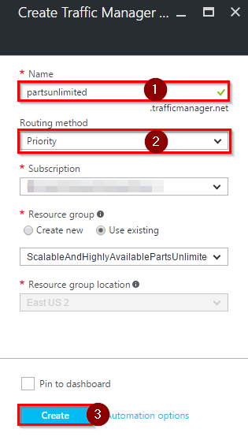

6. Navigate to the resource group where the new traffic manager was created and click on it.

    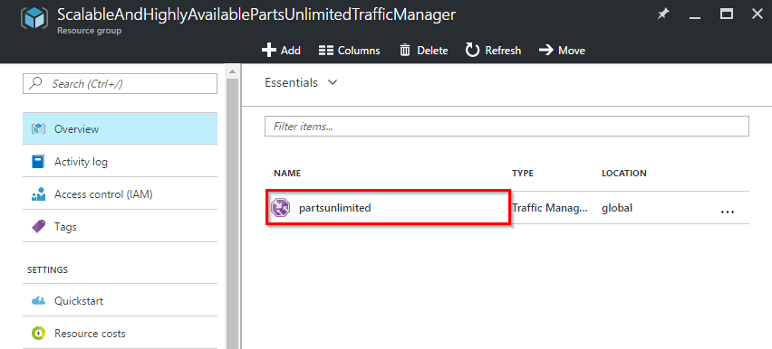

7. Add an endpoint to the App Service in the main cluster by clicking on "Add", configuring the endpoint with the settings below, then clicking "OK".
    * Type: "Azure endpoint"
    * Name: "PartsUnlimitedMain"
    * Target resource type: "App Service"
    * Target resource: Select the App Service in your main cluster
    * Priority: 1

      

8. Similarly, add the standby cluster endpoint, with the corresponding settings:
    * Type: "Azure endpoint"
    * Name: "PartsUnlimitedStandby"
    * Target resource type: "App Service"
    * Target resource: Select the App Service in your standby cluster
    * Priority: 2

      

9. Navigate to "Configuration" page, change 'DNS time to live (TTL)" from 300s to 60s and click on "Save". Lower TTL is preferable in this case because it defines how often traffic manager will update DNS records and start redirecting to failover cluster in circumstances of the main cluster going offline.

      

10. Navigate to the "Overview" page of this traffic manager. Click on the link under "DNS name". The traffic manager will redirect traffic to the main cluster if it's available, otherwise it will navigate traffic to the standby cluster.

    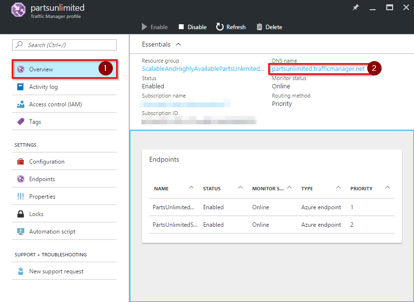

Congratulations, the scalable and highly available environment is now set up.
> **Note:** In a real life situation you might also have a domain name for your website which will need to be set up as a CNAME to the traffic manager's DNS name.


### Task 2: Set up Application Insights

**Step 1.** Navigate to App Service in your main cluster and click on "Application Insights", then select your production Application Insights instance in the main cluster and click "OK". Azure will connect this App Service to the Application Insights instance and will start collecting data.

  


### Task 3: Fault injection into the main cluster

In this task you will simulate a fault in the main cluster by decreasing the number of instances available in your App Service.

**Step 1.** Set up a Performance test in Azure.
In this step, we will run a load test to simulate traffic for the App Service.

1. Navigate to the resource group of your main cluster and click on the App Service instance.

    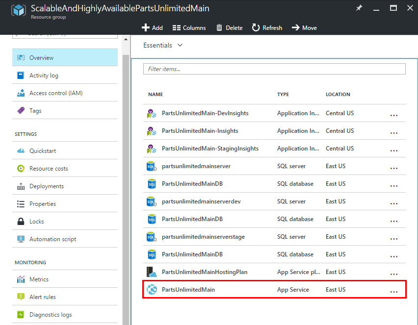

2. Click on "Performance test" and then on "New".

    

3. Click on "CONFIGURE TEST USING", ensure the URL specified is your traffic manager's URL, then select "Done". Set "GENERATE LOAD FROM" to the closest region to your App Service to reduce latency. Enter 600 as your "USER LOAD" and 20 as your "Duration (MINUTES)". Click "Run test". The load test will be run from a linked VSTS account (which will be created if necessary) in 10-15 minutes.

    > **Note:** Make sure you familiarize yourself with the costs associated with load testing ([Visual Studio Team Services Pricing](https://azure.microsoft.com/en-us/pricing/details/visual-studio-team-services/)).

    


4. Allow the load test to run for five minutes, then decrement the number of instances every five minutes to simulate a series of faults. Do this by scrolling down on the load test page and clicking on the scale of your hosting plan for the main cluster. Decrease the number of instances as appropriate, and click "Save".

    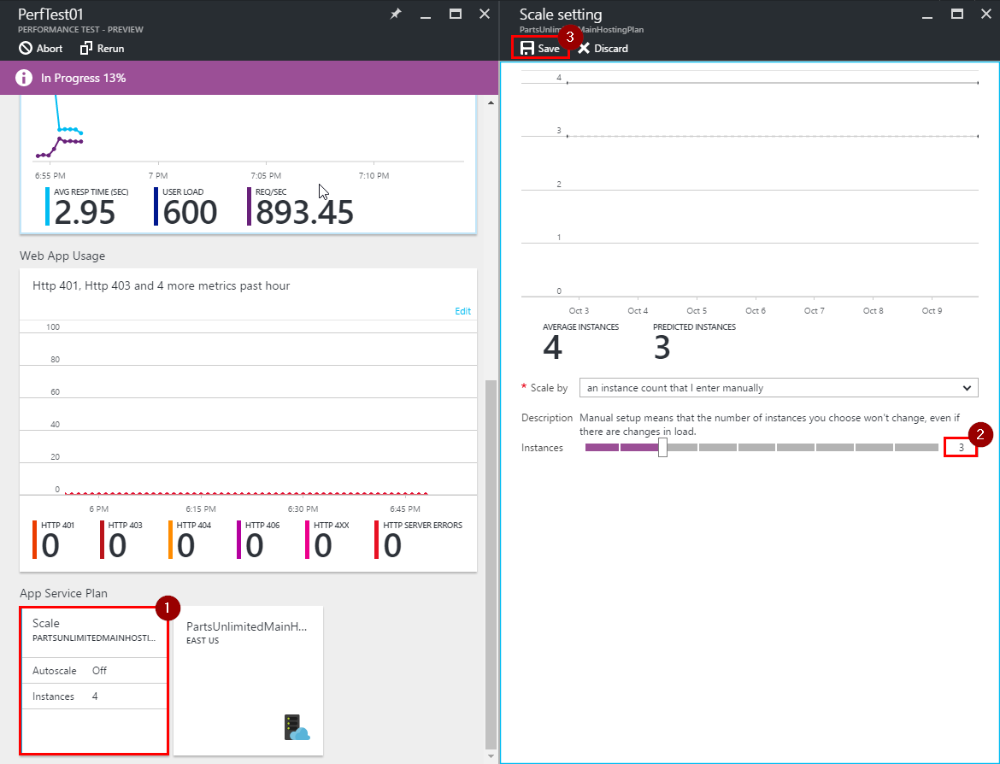


### Task 4: Analyze results of the load test
In this task we will analyze the information received from the load test and attempt to determine the optimal number of instances for the App Service.

**Step 1.** Navigate to the App Service in the main cluster, click on "Performance test" and then on the load test itself.

  

  

**Step 2.** Application Insights collected data can be found by navigating to the resource group of the main cluster and selecting the production instance.

  

**Step 3.** Navigate to the "Overview" of your App Service and click on "edit" on the monitoring graph. Select "past hour", tick all of the http error codes, as well as "Http Server Errors" and click "OK".


**Step 4.** Navigate to "Metrics per Instance (App Service plan)" in your App Service for more general performance analyses of the load test.


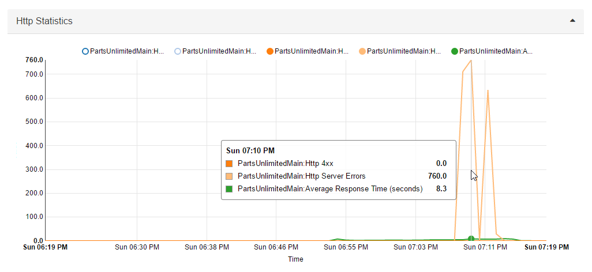

Based on the graphs above you can see that with 4 instances in the App Service (first 5 mins), the load was manageable but once one of the instance "stopped" responding to the requests, "Http queue" started to build up. If we ran load test with 3 instance for longer than 10-15 minutes, we would start seeing timeouts for some requests even though request queue was building up relatively slowly. Once the second VM "faulted", traffic became unmanageable for the other 2 instances and we saw about a thousand failed requests. Finally with one instance left response time raised to 9.5 seconds and we continued seeing more and more errors. Based on analysis above we can conclude that if you expect this website to have around 600 concurrent users, then you should absolute minimum of 3 instances and a recommended number of 4 or 5 instances running in your App Service.


### Task 5: Test the traffic manager's functionality

Here we're looking at how traffic manager can be used to handle fail over events where a datacenter is lost for some reason, perhaps a natural disaster. Main cluster will be simulated to go offline by turning its App Service off.

**Step 1.** Open your traffic manager's URL in a browser. It can be found on the "Overview" page of your traffic manager under "DNS name".


**Step 2.** Navigate to your App Service in the main cluster. Open the "Overview" page, click on "Stop" and confirm by clicking "Yes".


**Step 3.** Return to the tab in your browser with your traffic manager's URL. Refresh the page until the traffic manager redirects you to the standby cluster's App Service. You will encounter 403 errors until the DNS changes are propagated.
> **Note:** The amount of time it takes for DNS changes to propagate through the system can be changed in traffic manager's settings. By default, the refresh time is 300 seconds.


## Congratulations!
You've completed this HOL! In this lab you have learned how to inject a fault into a PaaS infrastructure, how to set up a failover cluster, run a load test and analyze the results.


## Further Readings
1. [Traffic Manager documentation](https://azure.microsoft.com/en-us/documentation/services/traffic-manager)
