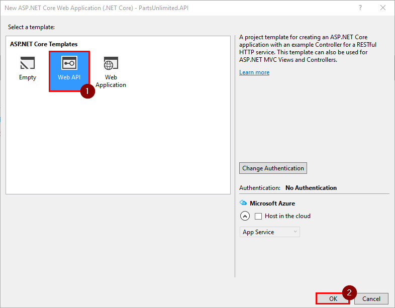
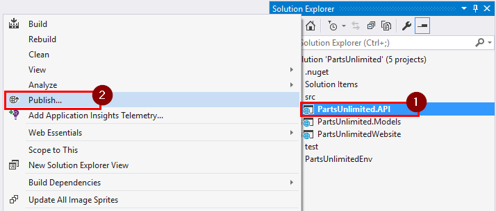
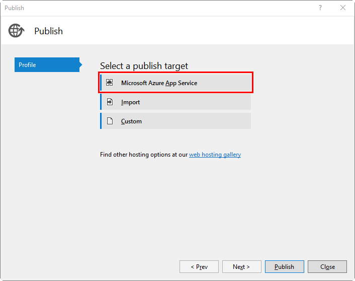
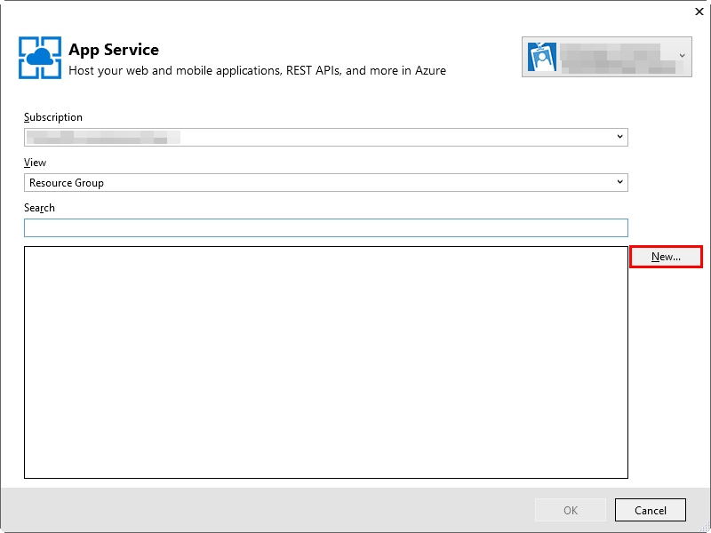
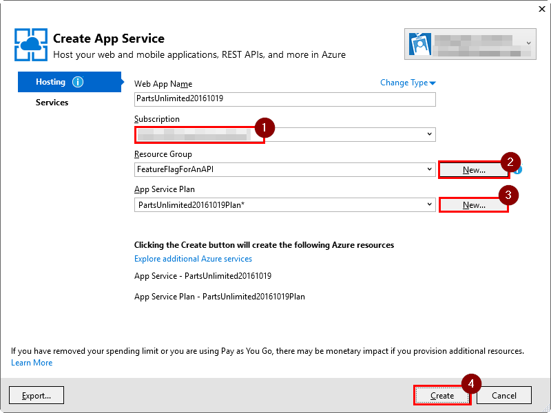
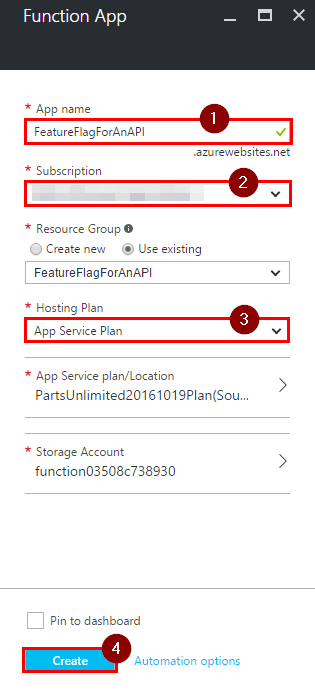
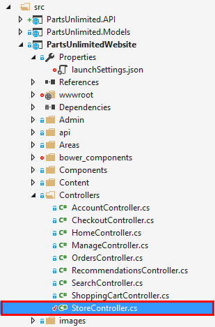
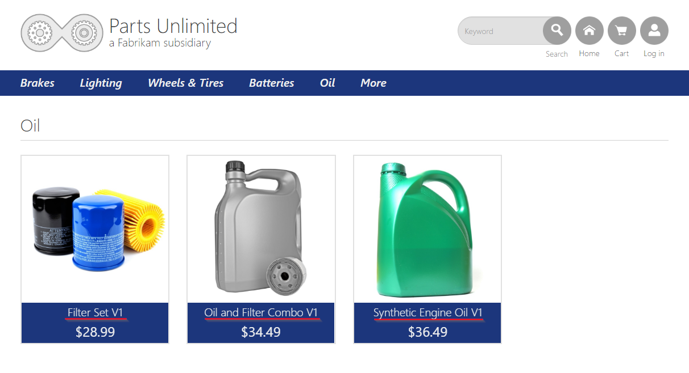
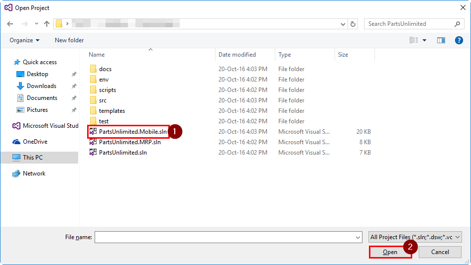

HOL - Feature Flag for an API
=============================

The project manager decided to roll out a new feature but it has to be done one group of users at the time for a couple reasons. First of all, the marketing team needs more time to localize their tactics for different countries; and second, the data analytics team want to make sure that the new feature will not have a negative impact on the number of users. Your task is to implement an API which returns different information based on the user id specified as a parameter in a URL.

## Pre-requisites: ##

- Azure account with an active subscription.

- Visual Studio 2015 Update 3

- [.Net Core 1.0.1 SDK](https://www.microsoft.com/net/core#windows) installed

- [Windows SDK and emulator](https://developer.microsoft.com/en-us/windows/downloads/sdk-archive) installed  

- [Android SDK](https://developer.android.com/studio/index.html) and [Java JDK](http://www.oracle.com/technetwork/java/javase/downloads/index.html) installed

- [Visual Studio Emulator for Android](https://www.visualstudio.com/vs/msft-android-emulator/ ) installed.

- [Xamarin](https://developer.xamarin.com/guides/cross-platform/windows/visual-studio/) installed and set up for Visual Studio.

	> **Note:** This includes [Mac setup](https://developer.xamarin.com/guides/ios/getting_started/installation/windows/connecting-to-mac/), if you have intentions to run iOS app.


## Tasks Overview: ##

**1. Clone repository using Git.** In this task you will get the source code for the PartsUnlimited solution.

**2. Create API endpoints.** In this task you will create two versions of an API. The first one is the original API, the second one is the API with the new functionality.

**3. Set up Azure function.** In this task you will create an Azure function which will retrieve data from either v1 or v2 of the API based on the user ID.

**4: Update Website to retrieve products on special from API.** In this step you will update the PartsUnlimited website to make calls to your API controllers.

**5: Update Xamarin app to retrieve products on special from API.** In this step you will update the PartsUnlimited Xamarin app to make requests to the API controller.

## Tasks
### Task 1: Clone repository using Git ###
Let's get the PartsUnlimited's source code. If you already have the source code on your machine then skip to the next task.

**Step 1.** Open a command line (one that supports Git) and navigate to the directory where you want to store your local repositories. For example you can create and navigate to `C:\Source\Repos`.

**Step 2.** Clone the repository with the following command:

		git clone https://github.com/Microsoft/PartsUnlimited.git

> After a few seconds of downloading, all of the code should now be on your local machine.


### Task 2: Create API endpoints ###

**Step 1.** Open Visual Studio as administrator. Open Start menu, locate Visual Studio 2015, right click on it, select "More" and then click on "Run as administrator".


**Step 2.** Open PartsUnlimited solution.

1. Click on "File", "Open", then on "Project/Solution...".

    

2. Navigate to the directory where you cloned the repository, select "PartsUnlimited.sln" and click on "Open".

     

**Step 3.** Create a new API project in this solution.

1. Right click on "src" folder, then click on "Add" and select "New Project...".

     

2. Select "Web" under "Visual C#" category, select `ASP.NET Core Web Application (.NET Core)` as the type of this project, enter `PartsUnlimited.API` into the name field and append `\scr` at the end of the location, then click on "OK".

     

3. Select `Web API` template, uncheck the "Host in the cloud" box and click on "OK".

     

**Step 4.** Reference PartsUnlimited.Models from your API project.

1. Right click on your API project's "References", then click on "Add Reference...".

    

2. Tick a box next to <b>PartsUnlimited.Models</b> and click on "OK".

    


**Step 5.** Define the original API.

1.  Right click on "Controllers" folder, click on "Add", then "Class...".

    

2. Enter `SpecialsController.cs` as the name of this class and click on "Add".

3. Replace class with the following code:

    ```csharp
    using System.Collections.Generic;
    using Microsoft.AspNetCore.Mvc;
    using PartsUnlimited.Models;

    namespace PartsUnlimited.API.Controllers
    {
        [Route("api/v1/specials")]
        public class SpecialsController : Controller
        {
            [HttpGet("{id}")]
            public IEnumerable<Product> GetSpecialsByUserId(int id)
            {
                var productsOnSpecial = new List<Product>
                {
                    new Product
                    {
                        SkuNumber = "OIL-0001",
                        Title = "Filter Set V1",
                        CategoryId = 5,
                        Price = 28.99M,
                        SalePrice = 28.99M,
                        ProductArtUrl = "https://raw.githubusercontent.com/Microsoft/PartsUnlimited/master/src/PartsUnlimitedWebsite/images/product_oil_filters.jpg",
                        ProductDetails = "{ \"Filter Type\" : \"Canister and Cartridge\", \"Thread Size\" : \"0.75-16 in.\", \"Anti-Drainback Valve\" : \"Yes\"}",
                        Description = "Ensure that your vehicle's engine has a longer life with our new filter set. Trapping more dirt to ensure old freely circulates through your engine.",
                        Inventory = 3,
                        LeadTime = 0,
                        RecommendationId = 16
                    },
                    new Product
                    {
                        SkuNumber = "OIL-0002",
                        Title = "Oil and Filter Combo V1",
                        CategoryId = 5,
                        Price = 34.49M,
                        SalePrice = 34.49M,
                        ProductArtUrl = "https://raw.githubusercontent.com/Microsoft/PartsUnlimited/master/src/PartsUnlimitedWebsite/images/product_oil_oil-filter-combo.jpg",
                        ProductDetails = "{ \"Filter Type\" : \"Canister\", \"Thread Size\" : \"0.75-16 in.\", \"Anti-Drainback Valve\" : \"Yes\", \"Size\" : \"1.1 gal.\", \"Synthetic\" : \"No\" }",
                        Description = "This Oil and Oil Filter combo is suitable for all types of passenger and light commercial vehicles. Providing affordable performance through excellent lubrication and breakdown resistance.",
                        Inventory = 5,
                        LeadTime = 0,
                        RecommendationId = 17
                    },
                    new Product
                    {
                        SkuNumber = "OIL-0003",
                        Title = "Synthetic Engine Oil V1",
                        CategoryId = 5,
                        Price = 36.49M,
                        SalePrice = 36.49M,
                        ProductArtUrl = "https://raw.githubusercontent.com/Microsoft/PartsUnlimited/master/src/PartsUnlimitedWebsite/images/product_oil_premium-oil.jpg",
                        ProductDetails = "{ \"Size\" :  \"1.1 Gal.\" , \"Synthetic \" : \"Yes\"}",
                        Description = "This Oil is designed to reduce sludge deposits and metal friction throughout your cars engine. Provides performance no matter the condition or temperature.",
                        Inventory = 11,
                        LeadTime = 0,
                        RecommendationId = 18
                    }
                };
                return productsOnSpecial;
            }
        }
    }

    ```

**Step 6.** Define an API with a new feature.

1. Similarly create a new controller, name it `V2SpecialsController.cs` and copy the following code into it:

    ```csharp
    using System.Collections.Generic;
    using Microsoft.AspNetCore.Mvc;
    using PartsUnlimited.Models;

    namespace PartsUnlimited.API.Controllers
    {
        [Route("api/v2/specials")]
        public class V2SpecialsController : Controller
        {
            [HttpGet("{id}")]
            public IEnumerable<Product> GetSpecialsByUserId(int id)
            {
                var productsOnSpecial = new List<Product>
                {
                    new Product
                    {
                        SkuNumber = "OIL-0001",
                        Title = "Filter Set V2",
                        CategoryId = 5,
                        Price = 28.99M,
                        SalePrice = 28.99M,
                        ProductArtUrl = "https://raw.githubusercontent.com/Microsoft/PartsUnlimited/master/src/PartsUnlimitedWebsite/images/product_oil_filters.jpg",
                        ProductDetails = "{ \"Filter Type\" : \"Canister and Cartridge\", \"Thread Size\" : \"0.75-16 in.\", \"Anti-Drainback Valve\" : \"Yes\"}",
                        Description = "Ensure that your vehicle's engine has a longer life with our new filter set. Trapping more dirt to ensure old freely circulates through your engine.",
                        Inventory = 3,
                        LeadTime = 0,
                        RecommendationId = 16
                    },
                    new Product
                    {
                        SkuNumber = "OIL-0002",
                        Title = "Oil and Filter Combo V2",
                        CategoryId = 5,
                        Price = 34.49M,
                        SalePrice = 34.49M,
                        ProductArtUrl = "https://raw.githubusercontent.com/Microsoft/PartsUnlimited/master/src/PartsUnlimitedWebsite/images/product_oil_oil-filter-combo.jpg",
                        ProductDetails = "{ \"Filter Type\" : \"Canister\", \"Thread Size\" : \"0.75-16 in.\", \"Anti-Drainback Valve\" : \"Yes\", \"Size\" : \"1.1 gal.\", \"Synthetic\" : \"No\" }",
                        Description = "This Oil and Oil Filter combo is suitable for all types of passenger and light commercial vehicles. Providing affordable performance through excellent lubrication and breakdown resistance.",
                        Inventory = 5,
                        LeadTime = 0,
                        RecommendationId = 17
                    },
                    new Product
                    {
                        SkuNumber = "OIL-0003",
                        Title = "Synthetic Engine Oil V2",
                        CategoryId = 5,
                        Price = 36.49M,
                        SalePrice = 36.49M,
                        ProductArtUrl = "https://raw.githubusercontent.com/Microsoft/PartsUnlimited/master/src/PartsUnlimitedWebsite/images/product_oil_premium-oil.jpg",
                        ProductDetails = "{ \"Size\" :  \"1.1 Gal.\" , \"Synthetic\" : \"Yes\"}",
                        Description = "This Oil is designed to reduce sludge deposits and metal friction throughout your cars engine. Provides performance no matter the condition or temperature.",
                        Inventory = 11,
                        LeadTime = 0,
                        RecommendationId = 18
                    }
                };
                return productsOnSpecial;
            }
        }
    }

    ```
     >**Note:** For the demo purposes the new feature here is just modified text for each product on special.

**Step 7.** Deploy API to Azure.

1. Right click on your API project, then click on "Publish...".

    

2. Select `Microsoft Azure App Service` as a deployment target.

    

3. Click on "New...".
  
    

4. Select your subscription, create a new "Resource Group" and "App Service Plan", then click on "Create".

    

5. After the new resource group and app service is created, click on "Publish".

    

6. After deployment is finished, URL link to the App Service will be opened in your default browser. Add `api/v1/specials/getbytheuserid?id=1` at the end and see the output of your API. Try out `api/v2/specials/getbytheuserid?id=1` as well, it should return a slightly different JSON back. Note the URI, you will need it later on for Azure Function.

    
    


### Task 3: Set up an Azure Function.

The Azure Function created in this task is acting as a switching proxy to send certain users to the API v1 and others to the API v2. Although we use a simple condition here, this could also use more complex rules which could potentially be hidden behind another web api call.


**Step 1.** Open [Azure Portal](https://portal.azure.com/) and login with your account.

**Step 2.** Click on "Resources Groups", select the resource group you deployed your API project to, then on "Overview" page click on "Add".

  

**Step 3.** Filter down options by typing "Function App", click on "Function App" option, then on "Create".


**Step 4.** Enter a name for your Function App, choose your subscription, select "App Service Plan" as your "Hosting plan" and click on "Create".
>**Note:** We selected "App Service Plan" because in this demo our App Service is running on a VM which is not fully utilized. Visit [How to scale Azure Functions](https://azure.microsoft.com/en-us/documentation/articles/functions-scale/) to find out more about `App Service plan` and `Dynamic Service plan` differences.



**Step 5.** Navigate to the resource group where you added your Azure function and click on it.


**Step 6.** Click on "New Function", filter options down by picking `C#` as the `Language` and `API & Webhooks` as the `Scenario`,  select "HttpTrigger-CSharp" template, enter a name for your function and click on "Create".


**Step 7.** Enter the following code and click on "Save":

```csharp
public static async Task<HttpResponseMessage> Run(HttpRequestMessage req, TraceWriter log)
{
    var userIdKey = req.GetQueryNameValuePairs().FirstOrDefault(q => string.Equals(q.Key, "UserId", StringComparison.OrdinalIgnoreCase));
    var userId = string.IsNullOrEmpty(userIdKey.Value) ? int.MaxValue : Convert.ToInt64(userIdKey.Value);
    var url =$"http://YourAppServiceUrl.azurewebsites.net/api/{(userId > 10 ? "v1" : "v2")}/specials/GetSpecialsByUserId?id={userId}";
    using (HttpClient httpClient = new HttpClient())
    {
        return await httpClient.GetAsync(url);
    }
}
```
>**Note:**<br>
> 1) Replace `YourAppServiceUrl` in `url` variable with URL for the App Service with your API. <br>
> 2) Users with IDs < 10 will be redirected to the new v2 version of the specials controller, while the rest of users will be redirected to v1 controller.<br>
> 3) Function's URL is used to trigger the execution of this piece of code (Azure Function) and can be found above the section where you have entered the function's code.<br>
 


**Step 8.** Test Azure Function by navigating to the Function's URL with `&userid=15` at the end. This should return version V1 of the data back. If you change `userid` to 5, then it should return V2 of the data back. This Azure Function is acting as a switching proxy to send certain users to the API v1 and others to the API v2, allowing us to turn on the feature for specific groups of users. Although we use a simple condition here, this could also use more complex rules which could potentially be hidden behind another web api call.


### Task 4: Update Website to retrieve products on special from API.

At the current time of this feature deployment we want only administrator to see it, so you will assign UserID 1 to administrator's account, every other account will have UserID 50.
> **Note:** For demo purposes only admin will be redirected to v2 controller. Ideally users should be assigned to some groups, each representing either a region or some other factor the products on special could differ on.

**Step 1.** Open <b>StoreController</b> located at <b> PartsUnlimitedWebsite > Controllers > StoreController.cs</b>




**Step 2.** Add the following using statements at the top of the class:
```csharp
using System.Collections.Generic;
using System.Net.Http;
using System.Threading.Tasks;
using Newtonsoft.Json;
```


**Step 3.** Replace `Browse` method with the following code:

```csharp
// GET: /Store/Browse?category=Brakes
public async Task<IActionResult> Browse(int categoryId)
{
    // Retrieve category and its associated products from database
    // TODO [EF] Swap to native support for loading related data when available
    var categoryModel = _db.Categories.Single(g => g.CategoryId == categoryId);

    if (categoryModel.Name.ToLower().Equals("oil"))
    {
        var url = "https://<YourAzureFunctionUrl>.azurewebsites.net/api/SpecialsProxy?code=XXXXXXXXXXXXXXXXXXXXXXXXXXXXXXXXXXXXXXXXXXXXXXXXXXXXXXXXXXXXXXXXXXXXXXXXXXXXXXXXXXX";
        if (HttpContext.User.Identity.IsAuthenticated)
        {
            url += HttpContext.User.Identity.Name.Equals("Administrator@test.com") ? "&UserID=1" : "&UserID=50";
        }
        using (HttpClient client = new HttpClient())
        {
            var jsonProducts = await client.GetStringAsync(url);
            var products = JsonConvert.DeserializeObject<List<Product>>(jsonProducts);
            foreach (Product product in products)
            {
                product.ProductId = _db.Products.First(a => a.SkuNumber == product.SkuNumber).ProductId;
            }

            categoryModel.Products = products;
        }
    }
    else
    {
        categoryModel.Products = _db.Products.Where(a => a.CategoryId == categoryModel.CategoryId).ToList();
    }
    return View(categoryModel);
}
```

>**Note:** <br>
> 1) You have to replace `url` variable's value with your full Azure Function's URL including its code parameter at the end.<br>
> 2) Only `Administrator@test.com` will be able to see version 2 of the API output. Credentials for this account can be found bellow or in `config.json` file which is located in the root of `PartsUnlimitedWebsite` project:<br>
```json
"AdminRole": {
    "UserName": "Administrator@test.com",
    "Password": "YouShouldChangeThisPassword1!"
}
```

**Step 4.** Previously all images were local, so now we need to update the view to deal with two sources of images. Open <b>\_ProductList.cshtml</b> located at <b> PartsUnlimitedWebsite > Views > Shared > \_ProductList.cshtml </b>.


**Step 5.** Replace everything in the file with the following code:

```csharp
@model IEnumerable<PartsUnlimited.Models.Product>

@if ((Model == null)
     || !Model.Any())
{
    <div class="alert alert-warning" role="alert">No products found!</div>
}
else
{
    <div class="row">
        @foreach (var product in Model)
        {
            if (!product.ProductArtUrl.StartsWith("http://", StringComparison.OrdinalIgnoreCase)
                && !product.ProductArtUrl.StartsWith("https://", StringComparison.OrdinalIgnoreCase))
            {
                product.ProductArtUrl = $"/images/{product.ProductArtUrl}";
            }

            <div class="col-lg-3 col-md-3 col-sm-3 col-xs-12">
                <div class="list-item-part">
                    <a href="@Url.Action("Details", "Store", new { id = product.ProductId })" title="@product.Title">
                        <div class="product-image-container hover-over hidden-xs">
                            <div class="image">

                                
                            </div>
                            <div class="detail">
                                <h4>@product.Title</h4>
                                <h5>@product.Price.ToString("C")</h5>
                            </div>
                            <div class="mouse-over hidden-xs">
                                <div class="image-second">
                                    
                                </div>

                                <div class="shop-now">
                                    <span class="glyphicon glyphicon-shopping-cart"></span>&nbsp;<span>Shop Now</span>
                                </div>
                            </div>
                        </div>

                        <div class="row visible-xs">
                            <div class="col-xs-4 col-sm-12 col-md-12 no-gutter-sm no-gutter image">
                                
                            </div>
                            <div class="col-xs-8 col-sm-12 col-md-12 detail">
                                <h4>@product.Title</h4>
                                <h5>@product.Price.ToString("C")</h5>
                            </div>
                        </div>
                    </a>
                </div>
            </div>
        }
    </div>
}
```


**Step 6.** Deploy Website to Azure to confirm use of the API

* Right click on `PartsUnlimitedWebsite`, then on "Publish..."

  

* Create a new App Service for the website, similarly to how you created an App Service for the API project. Once you created the new App Service, click on "Publish" button to deploy the PartsUnlimited website.


**Step 7.** Verify Website you deployed calls your APIs

* Navigate to `Oil` category without logging in, notice that products have `V1` in their names, indicating they have been received from the original V1 controller.

  

* Log in as `Administrator@test.com` and navigate to `Oil` category again. You will notice that for this user Azure function proxies us to V2 controller.

  

* Create another account and login as that user. You will see V1 returned again.

  

Congratulations, you have connected PartsUnlimited website to your API!


### Task 5: Update Xamarin app to retrieve products on special from API.

**Step 1.** Open `PartsUnlimited.Mobile` solution.

1. Press `Ctrl+Shift+O` to open `Open Project` window.

2. Navigate to the directory where you cloned the repository, select "PartsUnlimited.Mobile.sln" and click on "Open".

    

**Step 2.** You will be prompted to connect to Mac machine if you haven't done so before. You can just close it, all examples are going to be shown on Android emulator, so you don't need to connect to Mac machine just to follow this lab.

>**Note:** Mac machine is required only if you want to run the iOS app.


**Step 3.** Build this solution.
>**Note:** The first build usually takes a few minutes. Do not stop/cancel it or you will corrupt the zip archive it generates for all of the packages and cause errors on the next build.


**Step 4.** Install Newtonsoft.Json package.

1. Right click on `PartsUnlimited.Mobile` solution and click on `Manage NuGet Packages for Solution...`

    

2. Navigate to "Browse" tab, enter "Newtonsoft.Json" into filter/search field, select Newtonsoft.Json package, tick checkbox next to each project and click on "Install".

    


**Step 5.** Add a new "ProductDto" class. Right click on PartsUnlimited (Portable) project, click on "Add", then "Class...". Enter "ProductDto.cs" into the name field and click on "OK". Add the following code to that class:

```csharp
public class ProductDto
{
    public string SkuNumber { get; set; }

    public int ProductId { get; set; }

    public int RecommendationId { get; set; }

    public int CategoryId { get; set; }

    public string Title { get; set; }

    public decimal Price { get; set; }

    public decimal SalePrice { get; set; }

    public string ProductArtUrl { get; set; }

    public DateTime Created { get; set; }

    public string Description { get; set; }

    public string ProductDetails { get; set; }

    public int Inventory { get; set; }

    public int LeadTime { get; set; }
}
```


**Step 6.** Let's add System.Net.Http reference to the PartsUnlimited (Portable) project.

1. Right-click on the PartsUnlimited (Portable) project and select `Unload Project`.

    

2. Right-click on the project again and select `Edit PartsUnlimited.csproj`.

    


3. Scroll down until you see ItemGroup with project's references and add the following to them:
  
    ```csharp
    <Reference Include="System.Net.Http">
        <HintPath>..\..\..\..\..\..\..\Program Files (x86)\Reference Assemblies\Microsoft\Framework\.NETPortable\v4.5\System.Net.Http.dll</HintPath>
    </Reference>
    ```
4. Save the file with you changes.

5. Right-Click on the project again and select `Reload Project`. Click on `Yes` to close `PartsUnlimited.csproj` file. 

    


**Step 7.** Open <b>MainPageViewModel</b> class located at <b> PartsUnlimited > ViewModels >MainPageViewModel.cs </b>. Add the following method into it:

```csharp
public void GetDataFromApi()
{
    Task.Run(async () =>
    {
        List<ProductDto> apiProducts;
        var url = "https://<YourAzureFunctionUrl>.azurewebsites.net/api/SpecialsProxy?code=XXXXXXXXXXXXXXXXXXXXXXXXXXXXXXXXXXXXXXXXXXXXXXXXXXXXXXXXXXXXXXXXXXXXXXXXXXX";
        using (var client = new HttpClient())
        {
            var jsonProducts = await client.GetStringAsync(url + "&UserID=1");
            apiProducts = JsonConvert.DeserializeObject<List<ProductDto>>(jsonProducts);
        }

        ShoppingItems = new ObservableCollection<ShoppingItemViewModel>(
                apiProducts.Select(x => new ShoppingItemViewModel
                {
                    DiscountPercentage = 100 * (1 - (x.SalePrice / x.Price)),
                    Price = x.Price,
                    ImageSource = x.ProductArtUrl,
                    ItemName = x.Title
                }));
    }
    ).Wait();
}

```
> **Note:** You have to replace `url` variable's value with your full Azure Function's URL including its code parameter at the end.


**Step 8.** Add the following using statements at the top of the class:

```csharp
using System.Threading.Tasks;
using Newtonsoft.Json;
using System.Linq;
using System.Net.Http;
using System.Collections.Generic;
```


**Step 9.** Update MainPageViewModel's constructor to call `GetDataFromApi` method in the following way:

```csharp
public MainPageViewModel()
{
    GetDataFromApi();
}
```


**Step 10.** Select PartsUnlimited.Droid as a StartUp Project and click "Run"


**Step 11.** You should see the following data returns from the API v2 controller:


## Congratulations, you have completed this lab!

In this lab, you have learned how to set up a feature flag for your API using Azure Functions, how to call to that API from the website's backend code as well as from Xamarin app. Another great option to control your APIs is [Azure API Managment](https://azure.microsoft.com/en-gb/documentation/services/api-management/). It provides features like URL redirection based on policy, API protection with an allowed requests limit, API access key management and many more.
