HOL - Parts Unlimited WebSite Continuous Deployment with Release Management Online
==================================================================================
In this lab you have an application called PartsUnlimited, committed to a Git repo
in Visual Studio Team Services (VSTS) and a Continuous Integration build that builds the app and
runs unit tests whenever code is pushed to the master branch. Please refer to the
[HOL - Parts Unlimited Website Continous Integration with Visual Studio Team Services](https://github.com/Microsoft/PartsUnlimited/blob/hands-on-labs/docs/HOL_PartsUnlimited_WebSite_Continuous_Integration/HOL_PartsUnlimited_WebSite_Continuous_Integration_with_Visual_Studio_Online_Build.md)
in order to see how the CI build was set up.
Now you want to set up Release Management Online (a feature of Visual Studio Team Services)
to be able continuously deploy the application to an Azure Web App. Initially the
app will be deployed to a `dev` deployment slot. The `staging` slot will require and
approver before the app is deployed into it. Once an approver approves the `staging` slot,
the app will be deployed to the production site.

## Pre-requisites:

* An active Visual Studio Team Services account
* An Visual Studio 2015 or Visual Studio 2013 Update 5 client
* Project Admin rights to the Visual Studio Team Services account
* An active Azure account to host the PartsUnlimited Website as a Web App
> **Note**: In order to use deployment slots, you'll need to configure the Web App to use Standard or Premium App Service Plan mode. You **cannot** create
deployment slots for Basic or Free Azure Web Apps. To learn more about deployment slots, see [this article](https://azure.microsoft.com/en-us/documentation/articles/web-sites-staged-publishing/).

* You have completed the [HOL - Parts Unlimited Website Continous Integration with Visual Studio Team Services](https://github.com/Microsoft/PartsUnlimited/blob/hands-on-labs/docs/HOL_PartsUnlimited_WebSite_Continuous_Integration/HOL_PartsUnlimited_WebSite_Continuous_Integration_with_Visual_Studio_Online_Build.md)

## Tasks Overview:

**1. Complete the [HOL - Parts Unlimited Website Continous Integration with Visual Studio Team Services](https://github.com/Microsoft/PartsUnlimited/blob/hands-on-labs/docs/HOL_PartsUnlimited_WebSite_Continuous_Integration/HOL_PartsUnlimited_WebSite_Continuous_Integration_with_Visual_Studio_Online_Build.md).**
This will walk through creating a Visual Studio Team Services account, committing the PartsUnlimited source code
and setting up the Continous Integration (CI) build.

**2. Create a Web App in Azure**
This HOL utilized Deployment slots in Azure. This requires you to create a Web App in Azure on the 
Standard or Premium App Service plan.

**3. Create Azure SQL Databases**
You will need to create empty databases for the PartsUnlimited Website. You'll create one for dev,
one for staging and one for production.
>**Note:** Deployment of schemas and data is beyond the scope of this HOL. It is recommended that you investigate
<a href="https://msdn.microsoft.com/en-us/library/hh272686(v=vs.103).aspx">SQL Server Data Tools (SSDT)</a> for 
managing database schema deployments.

**4. Create a Service Endpoint in Visual Studio Team Services to an Azure Account.**
In this step you'll download your Azure publish settings file and create Service Endpoint in Visual Studio Team Services for
your Azure account. This will enable you to configure deployment of the PartsUnlimited Website to Azure as an Azure
Web Application from Builds or Releases.

**5. Create a Release Pipeline for the Parts Unlimited Website.**
In this step, you will create a Release definition for the PartsUnlimited Website. You'll use the CI build output
as the input artefact for the Release and then define how the release moves through `environments` with approvals
inbetween.

**6. Trigger a Release.**
Once the Release Definition is set up, you will trigger a release and see the pipeline in action.

# Hands On Lab
### 1: Complete HOL - Parts Unlimited Website Continous Integration with Visual Studio Team Services
Make sure you've completed [HOL - Parts Unlimited Website Continous Integration with Visual Studio Team Services](https://github.com/Microsoft/PartsUnlimited/blob/hands-on-labs/docs/HOL_PartsUnlimited_WebSite_Continuous_Integration/HOL_PartsUnlimited_WebSite_Continuous_Integration_with_Visual_Studio_Online_Build.md).

### 2: Create a Web App in Azure
In order to deploy to Azure, you're going to need to create an Azure Web App. You'll need to select a Standard or Premium
App Service plan in order to use Deployment slots.
> **Note:** Deployment slots are only available on Standard or Premium App Service Plans. They are **not** available
on Free or Basic plans. Once you've completed this lab, you probably want to delete the site to minimize costs.

1. Log in to [https://portal.azure.com](https://portal.azure.com)
* Make sure you select the subscription (in the upper right corner) that you want to host the PartsUnlimited site on.
2. Create a new Web App
* Click "+ New", then "Web + Mobile", then "Web App" to create a new Web App.

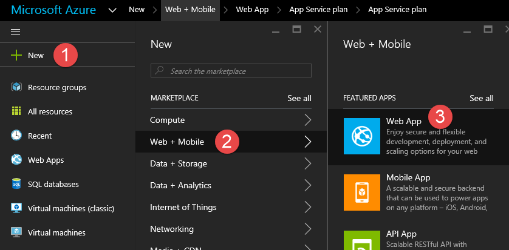
* Enter a unique name for the Web App.
* Select the subscription that you want to use.
* Enter a name for a new Resource Group.
> Once you've completed this lab, you can delete the entire Resource Group. This will delete all the resources
that you are creating - including service plans and web apps.
* For the App Service plan, you can select an existing Standard or Premium plan. You can also create a new service plan,
but it must be Standard or Premium in order to make use of Deployment slots.

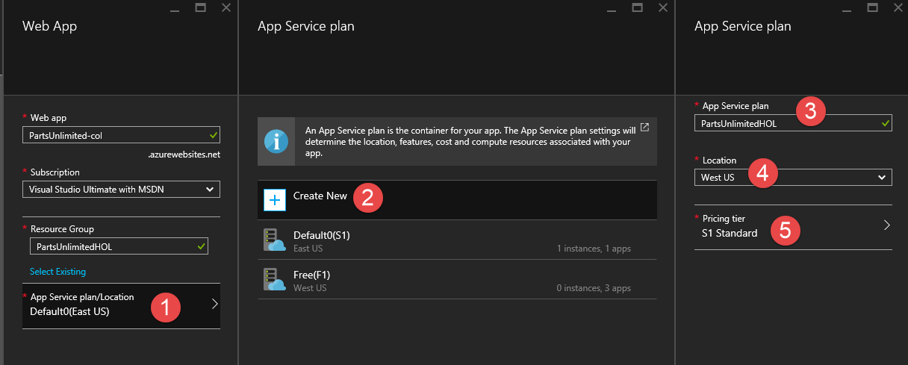
* Click Create to create the Web App. This will take a few moments.
3. Create Deployment slots
* Once the Web App has been created, click on the Web App tile from the Start screen or navigate to the Web App.
* Click on "All Settings" and then click "Deployment slots".

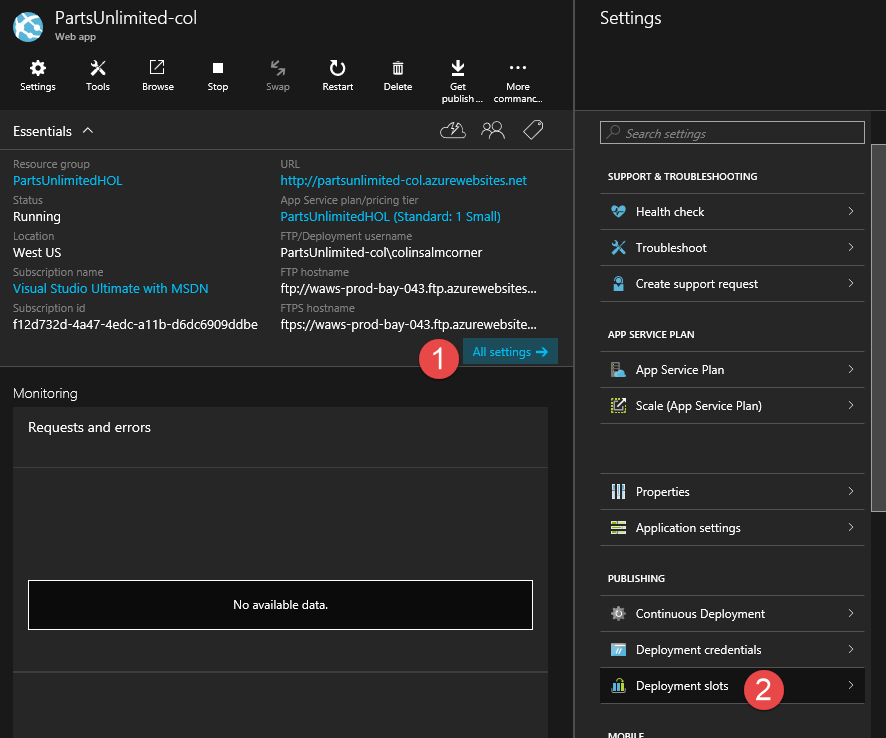
* Click the "Add Slot" button. Enter "dev" for the name and click OK.
* Click the "Add Slot" button. Enter "staging" for the name and click OK.

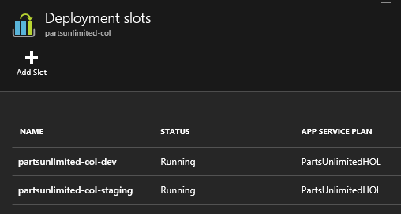

### 3: Create Azure SQL Databases
The PartsUnlimited Website access a database. In order for the site to work in Azure, you're going to need to
create a SQL Database in Azure for the site. And since there are also separate deployment slots for dev and staging,
you're going to create 3 databases in total. You can add them to any Resource Group in Azure, but it is recommended
that you add them to the Resource Group you created when you created the Azure Web App.
> **Note:** The code for the site includes logic to create the database and populate it with data if it does not exist.
Thus the first time you deploy the site, the site itself will create data in the database.

1. Log in to [https://portal.azure.com](https://portal.azure.com) if you are not still logged in.
* Make sure you select the subscription (in the upper right corner) that you want to host the PartsUnlimited site on.
2. Create a new SQL Database and SQL Server
* Click "+ New", then "Data + Storage", then "SQL Database" to create a new SQL Database.

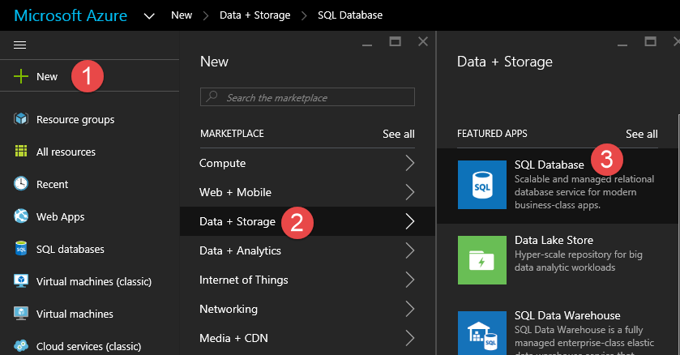
* Enter `PartsUnlimitedDB-Prod` as the database name.
* Click "Server _Configure required settings_" to configure the server settings.
	* Click "Create a new server"
	* Enter a unique name for the server
	* Enter an admin username and password. Make a note of these since you'll need them for the Release later.
	* Select a location for the server (it is recommended that you select the same location as the Web App).

	
* You can change the pricing tier to Basic.
* **Optional, but recommended:** Change the Resource Group to the Resource Group you created when creating the Web App.

	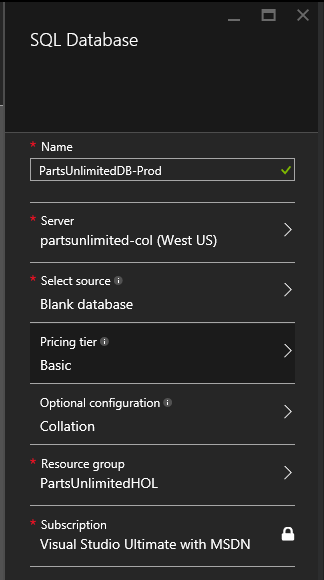	
* Click Create. This will take a few moments.
3. Create SQL Database for dev and staging in the new SQL Server
* Click "+ New", then "Data + Storage", then "SQL Database" to create a new SQL Database.
* Enter `PartsUnlimitedDB-Dev` as the database name.
* Click "Server _Configure required settings_" to configure the server settings.
	* Select the existing database server and click "Select"

	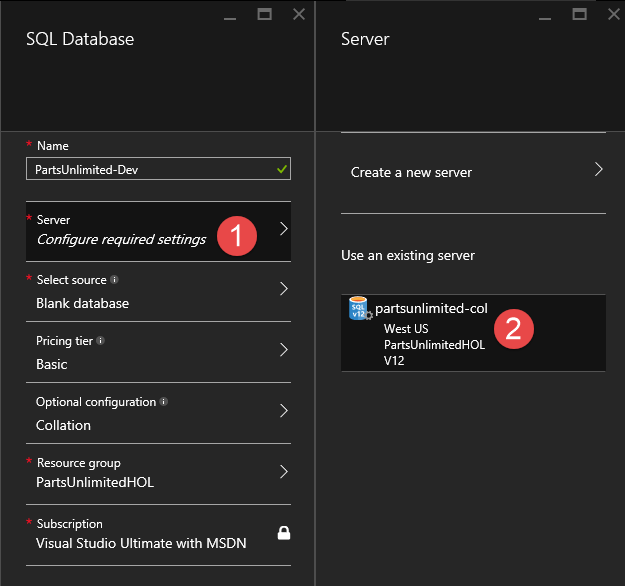
* You can change the pricing tier to Basic.
* Click Create.
4. Repeat step 3 to create a `PartsUnlimitedDB-Staging` database.	

### 4: Create a Service Link from Visual Studio Team Services to an Azure Account
In order to interact with Azure, you'll need to create a Service Endpoint in VSTS. This Endpoint includes the
authentication information required to deploy to Azure.

1. Download you Azure publish profile.
* Navigate to (https://manage.windowsazure.com/publishsettings)[https://manage.windowsazure.com/publishsettings]. 
If you have multiple subscriptions, select the subscription you want to use to host the PartsUnlimited Website. 
Save the file to a location on your machine.
2. Create an Azure Service Endpoint in Visual Studio Team Services
	* Log in to your VSTS account.
	* Open the project administration page by clicking the gear icon in the upper right.
	
		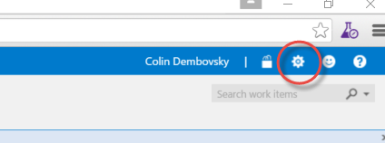
	* Click on the Services tab
	
		
	* Click on "New Service Endpoint" and select Azure from the list
	
		
	* Click on the "Certificate Based" radio button
		* Enter any name for the Connection Name - this is to identify this Service Endpoint in VSTS.
		* Copy the Subscription Id, Subscription Name and Management Certificate fields from your
		Azure publish profile (that you downloaded earlier) into the corresponding text boxes. Once
		you're done, click OK. 
	
		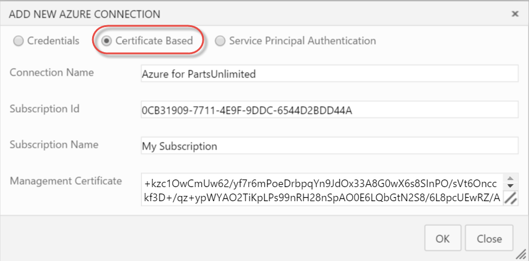
	* You should see a new Service Endpoint. You can close the project administration page.
	
	

### 5: Create a Release Definition
Now that you have an Azure Service Endpoint to deploy to, and a package to deploy (from your CI build),
you can create a Release Definition. The Release Definition defines how your application moves through
various Environments, including Tasks to deploy your application, run script or run tests. You can also
configure incoming or outgoing approvals for each Environment.

An Environment is simply a logical grouping of tasks - it should not be confused with a set of machines.

1. Create a Release Definition
	* In VSTS, click on the Release hub
	* Click on the green + button at the top of the left hand menu to create a new definition. This will
	launch a wizard prompting you to select a deployment template. Click on "Azure Website Deployment" and
	click OK.
	
	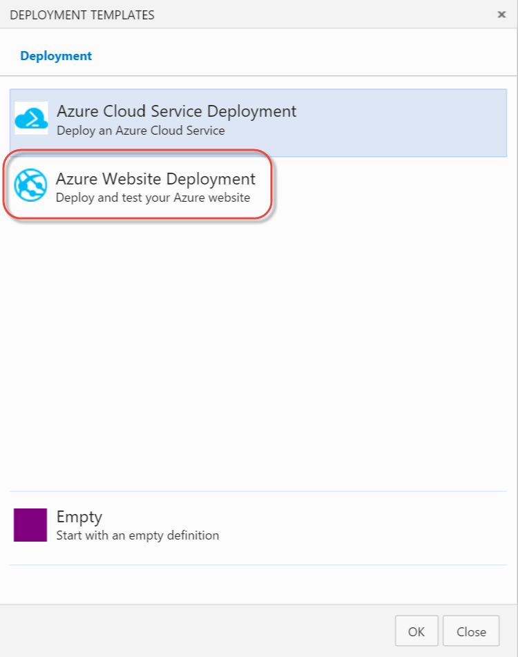
	* The template has created a single Environment (called Default Environment) with 2 deployment Tasks
	(Azure Web App Deployment and Visual Studio Test). Delete the Visual Studio Test task.
	* Enter "PartsUnlimited" into the name field at the top to name this Release Definition.
	* Before completing the "Azure Web App Deployment" task, you'll need to configure the source package. Click on 
	the "Artifacts" link.
	
	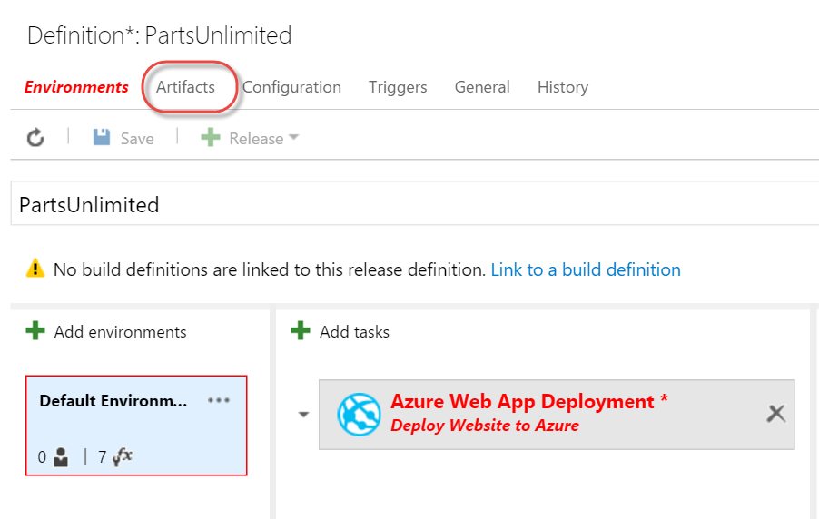
	* Click the "Link to a build definition" link.
	
	
	* You'll now link this Release Definition to the CI build. Select the Project and Build from the dropdowns and click Link.
	
	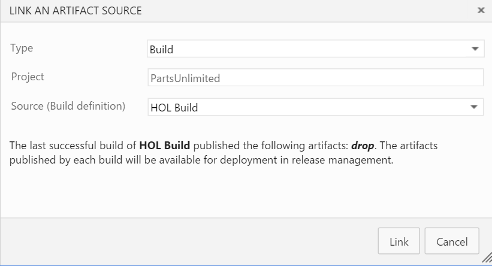
	> **Note:** It is possible to Link other package sources, but you only need the CI build for this Release.
	
	* Click on the Environments link to go back to the Environments page. Clik on the "Azure Web App Deployment" Task.
		* Select the Azure Service Endpoint you created earlier in the Azure Subscription dropdown.
		* For Web App Name, enter the name of the Web App you created earlier in Azure.
		* Select a region for your Web App.
		* Enter "dev" for the Slot. This will deploy the site to the "dev" deployment slot. This allows you
		to deploy the site to Azure without affecting the Production site.
		* Click the elipsis (...) button to set the Web Deploy Package location. Browse to the PartsUnlimitedWebsite.zip file and click OK.
	
		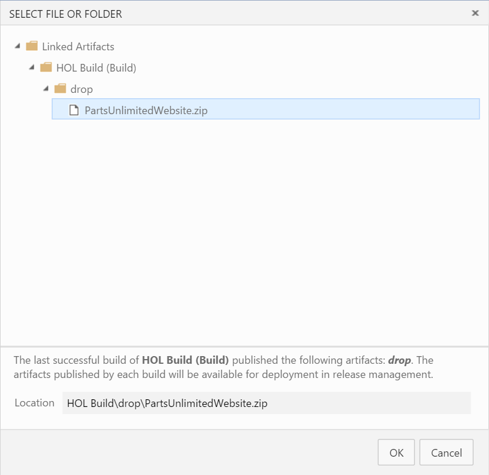
		* The Task should look like this:
	
		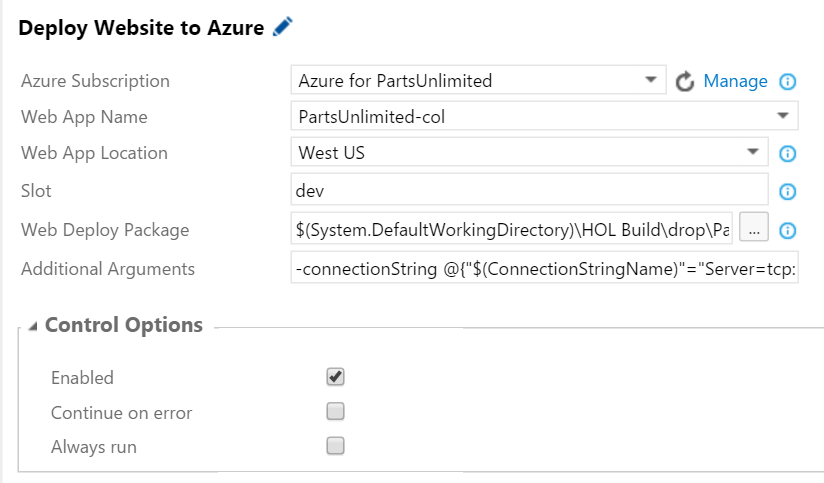
	* Click the name label on the Default Environment card and change the name to "Dev".
	
		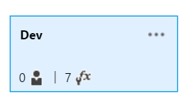
	
	* Click on the elipsis (...) button next to the Environment and select "Configure variables..."
	
		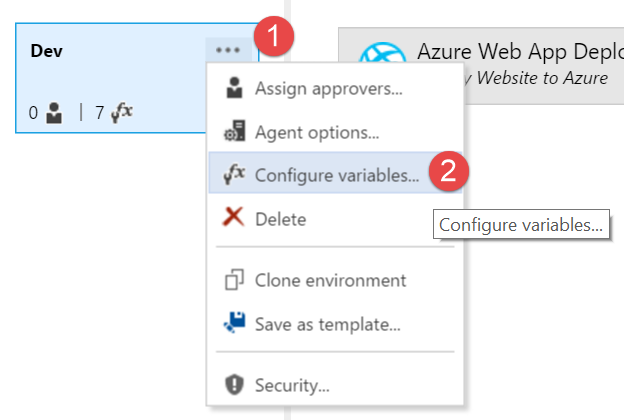
		* These variables allow you to configure values for the Dev environment. Most of these variables are used to
		set the database connection string in the "Additional Arguments" property of the Deploy Website to Azure Task.
		Enter the values (these are the values you used to create the databases in Azure earlier) and click OK.
		
		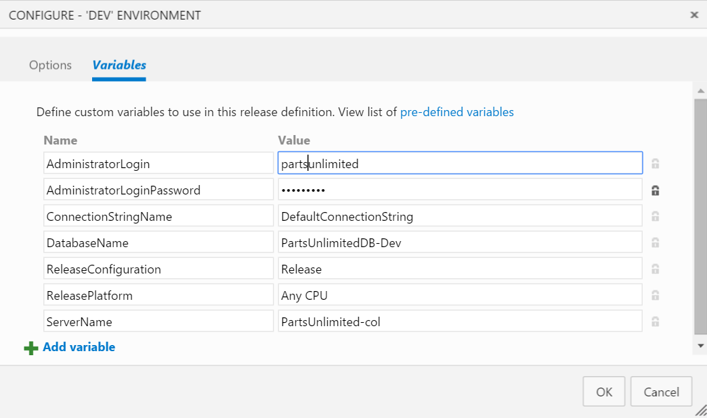
		> The password is masked by setting it as a "secret" variable. To change the value, click the padlock icon 
		to unlock the textbox, enter the password and then click the padlock to lock and mask the password again.
		> The ConnectionStringName is `DefaultConnectionString`. You can see this if you open the web.config of the website.
	* Click Save to save the Release Definition.

2. Test the Dev Environment

	You will shortly clone the Dev Environment into both Staging and Prod environments. However, before you do that
	it's a good idea to test that the Dev Environment is correctly configured by creating a new Release.

	* Click on the "+ Release" button and select Create Release.
	
	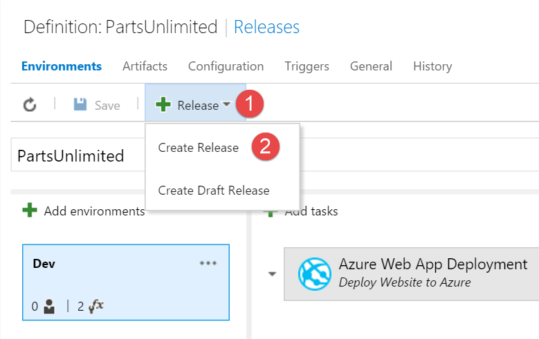
	* You can enter a Release Description if you want to.
	* Select the latest build from the HOL Build dropdown.
	* Click on the Dev Environment to set it as the target environment for this Release. Click Create.

	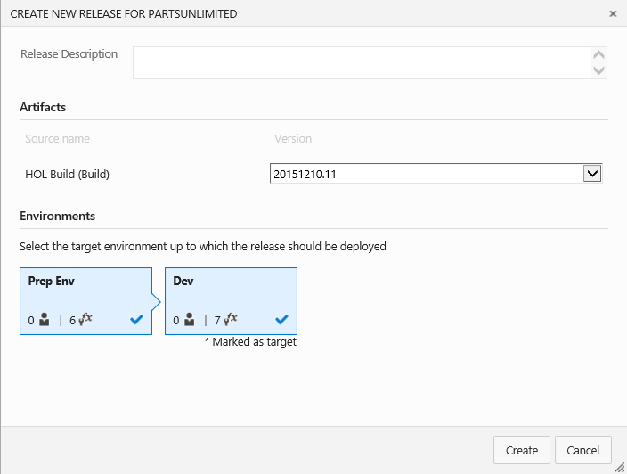
	* Click the Release link to open the Release.
	
	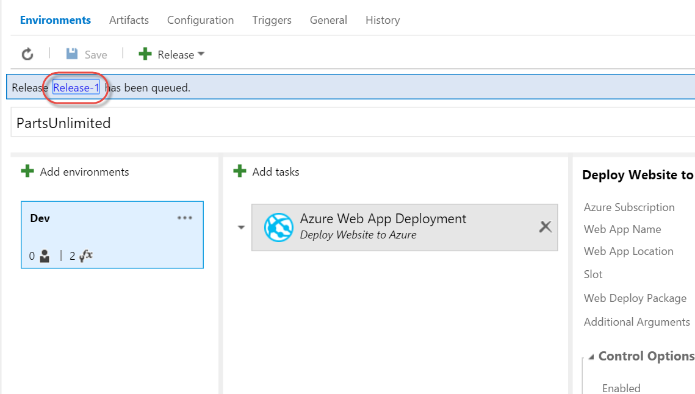
	* Click on the Logs link to open the deployment logs.
	
	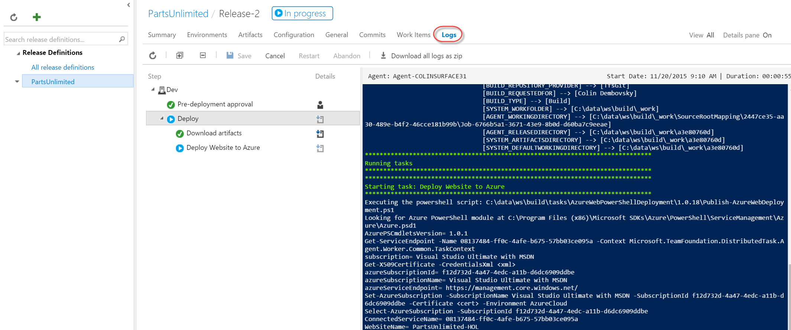
	* Once the deployment completes, you can check that the site was in fact deployed successfully by navigating to the
	site url.
	> Since you deployed to the dev slot, you will need to navigate to `http://{siteName}-dev.azurewebsites.net` where siteName 
	is the name of your Web App in Azure.
	
	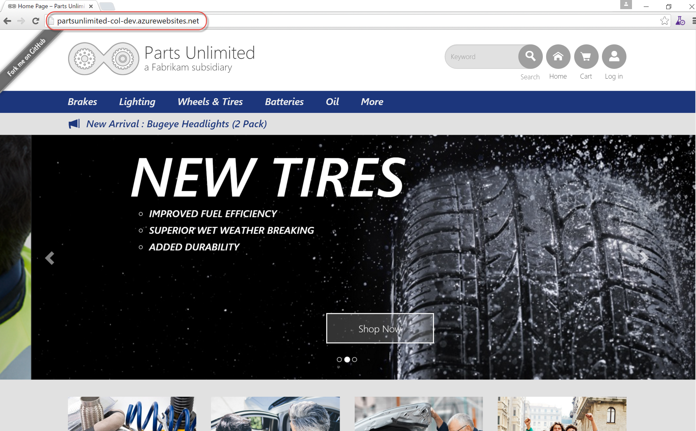
	* You will also have received an email confirmation that the Release to the Dev environment completed successfully. This
	is because you are the owner of the Dev environment.
		
	3. Clone the Dev environment to Staging
	Now that you have verified that the Dev Environment is configured correctly, you can clone it to Staging.
	
	* Click on the PartsUnlimited link and then the Edit link to open the Release Definition.
	> **Note:** It is possible to change the definition for a Release without changing the Release Definition (i.e. the Release is an instance of the Release Definition that you can edit). You want to make sure that you are editing the Release Definition, not a Release.
	
	* Click the elipsis (...) on the Dev Environment card and select "Clone environment"
	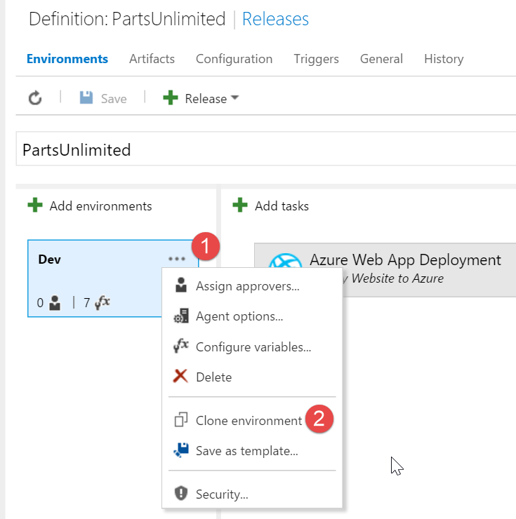
	* A new Environment is created. Enter "Staging" for the name.
	* On the Azure Web App Deployment task, set the Slot to `staging`.
	
	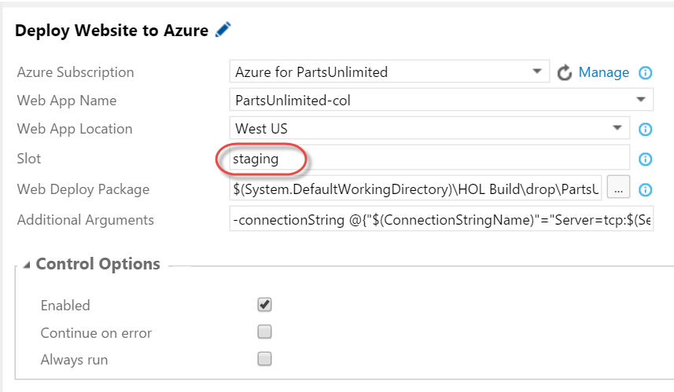
	* Click the elipsis (...) on the Staging Environment card and select "Configure variables..."
		* Even though the `AdministratorLoginPassword` parameter shows a masked value, this is currently
		a bug. You will need to re-enter the password since it is actually emptied after the clone operation.
		* Change the DatabaseName variable to the Staging database you created earlier and click OK.
		
		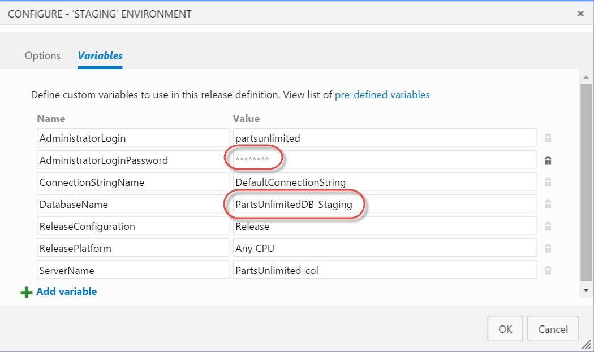

	> **Note:** If you want to see the variables for all the environments in a single place,
	click the Configuration link on the Release Definition. Then click the Release variables
	link on the upper right and select "Environment variables".
	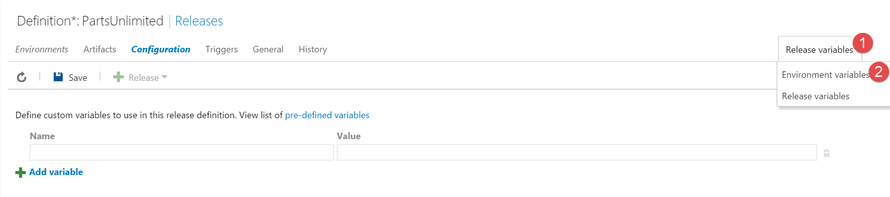
	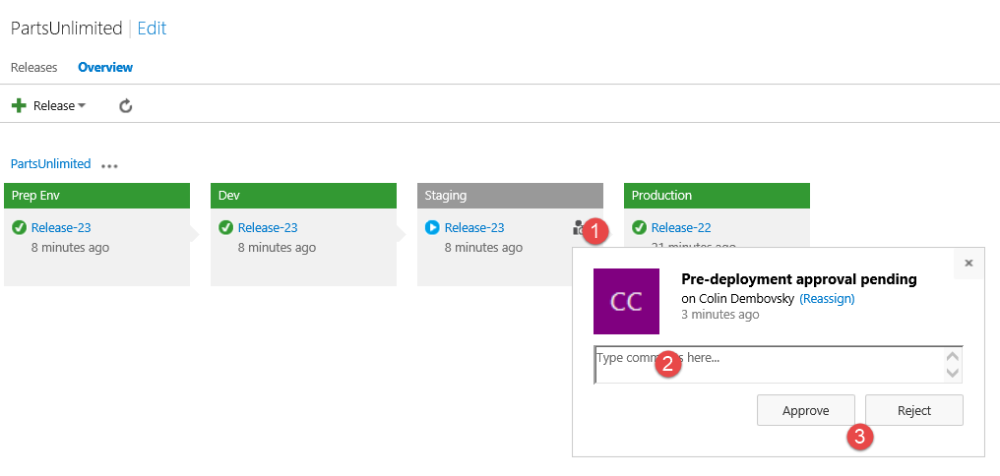
	
	* In the Dev Environment, you did not define any approvers. For Staging, however, you should
	configure approvers. For this HOL, you can be both the incoming and outgoing approver.
	> **Pre-deployment approvers** must approve a deployment coming _into_ the environment.
	**Post-deployment approvers** approve deployments so that the _next_ Environment can begin.
	Approvers can be individuals or groups.
	
	* Configure approvers for the Staging environment
	
	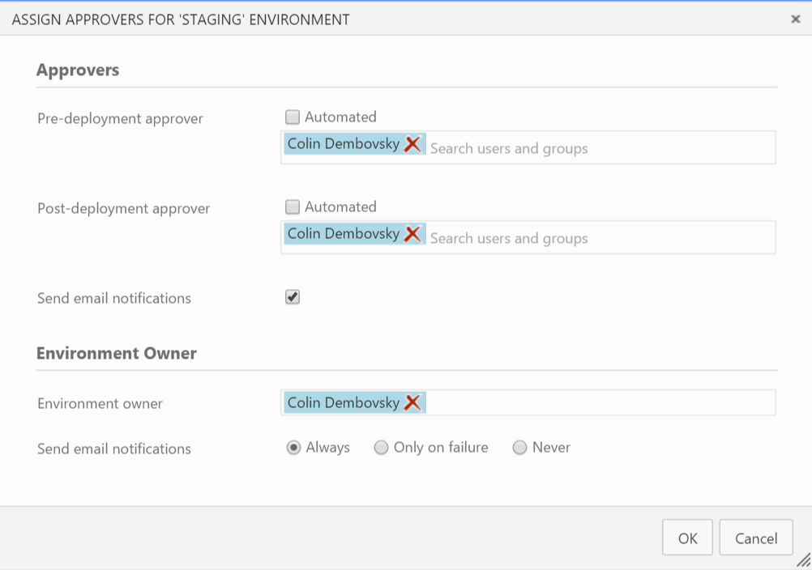
	
	* Save the Release Definition.

3. Clone the Staging environment to Production
	* Clone the Staging environment to a new Environment called Production.
	* Update the Slot parameter to be empty (i.e. the site will deploy to the production slot)
	* Update the database name in the Environment variables.
	* Update the approvers.
	* Save the Release Definition.
	
	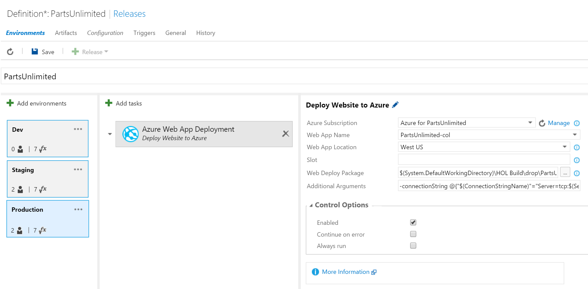

4. Configure Continous Deployment for this Release Definition
	* Click on the Triggers link of the Release Definition.
	* Check the "Continuous Deployment" checkbox.
	* Set the Source Label and Target environment.
	> Selecting the build as the trigger means that any time the artifact build
	completes, a new release will automatically start using the latest build.
	
	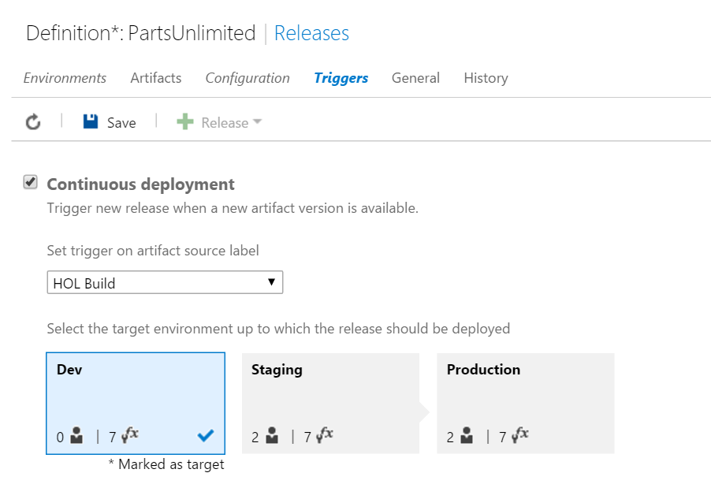
	
	> **Note:** Since the incoming build for this release is a CI build, you probably
	don't want to deploy the build all the way to Production. Setting the Release to
	stop at Dev means that you will need to create a new Release with Production as 
	the target environment if you want to deploy to Production. This is of course 
	configurable according to your own preference.

### 6: Create a Release
Now that you have configured the Release Pipeline, you are ready to trigger a complete
release.
	
* Click on "+ Release" to create a new Release.
* Select the latest build, set Production as the target Environment and click Create.
	
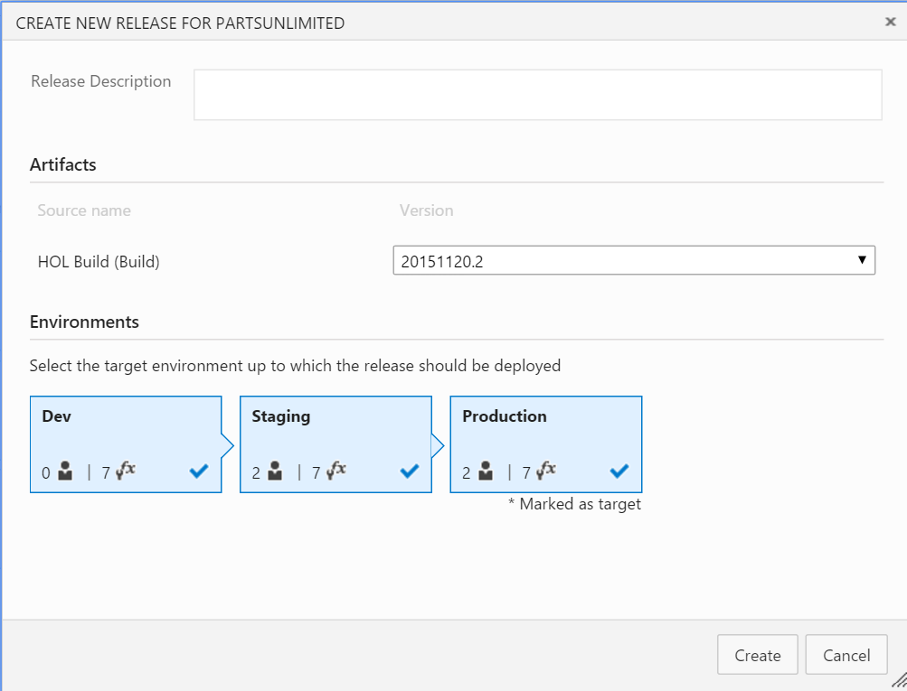
	
* Once the Dev stage has completed deployment, you will see a notification that
an approval is pending (you will also have received an email to this effect).
Check the dev slot of the PartsUnlimited site in Azure to ensure that the Dev
environment is good, and then click Approve.
	
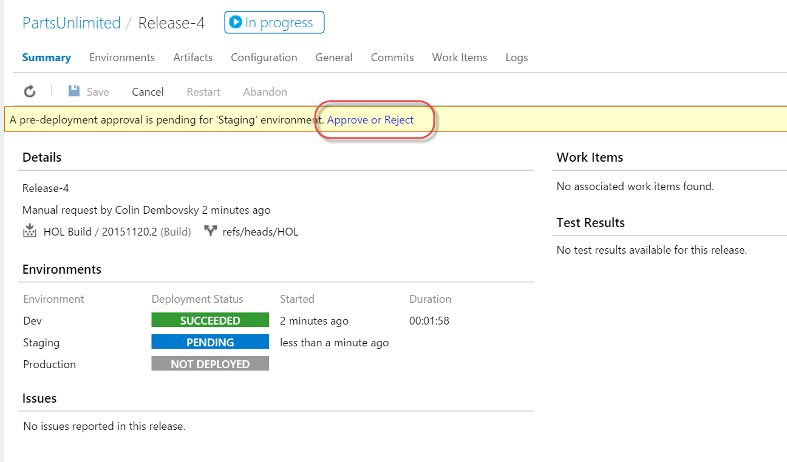

* Optionally enter a comment and click the Approve button.

	

	* This will trigger the release into the Staging environment.
* Once the Staging deployment has completed, you will need to approve that
staging is OK.
* This will then trigger the pre-approval for Production. Once you've approved
that, deployment into the Production environment will begin.

> To see all your releases and where they are in their respective pipelines,
click on All Releases and then click the Overview link.

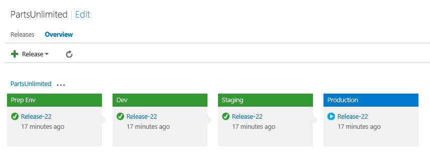

## Congratulations!
You've completed this HOL

## Further Reading
1. [Release Management for Visual Studio Team Services](https://msdn.microsoft.com/Library/vs/alm/release/overview-rmpreview)

The following more PartsUnlimited Hands on Labs:
1. [User Telemetry with Application Insights](https://github.com/Microsoft/PartsUnlimited/blob/hands-on-labs/docs/HOL_PartsUnlimited_HDD-User-Telemetry/HOL_PartsUnlimited_HDD-User-Telemetry.md)
2. [Testing in Production with Azure Websites - PartsUnlimited](https://github.com/Microsoft/PartsUnlimited/blob/hands-on-labs/docs/HOL_HDD_Testing_in_Production/HDD%20Testing%20in%20Production%20with%20Azure%20Websites%20HOL.md)
3. [Application Performance Monitoring - PartsUnlimited](https://github.com/Microsoft/PartsUnlimited/blob/hands-on-labs/docs/HOL_PartsUnlimited_Application_Performance_Monitoring/HOL_PartsUnlimited_Application_Performance_Monitoring.md)